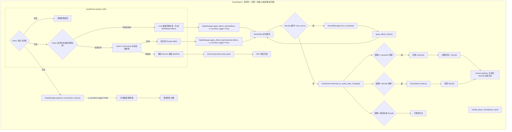

# 叙事核心架构重构设计方案

> **版本**：v2.0
> **日期**：2026-05-13
> **核心原则**：WorldState 变量变化驱动叙事流转，NarrativeOrchestrator 统一响应

---

## 一、设计目标

1. **状态驱动**：Landmark 与 Storylet 的触发严格依赖 WorldState 变化，而非回合数或 player_input 直接判断
2. **统一回调**：所有 WorldState 变化通过 StateManager 解耦 → NarrativeOrchestrator 集中检测，触发叙事流转
3. **对话历史隔离**：历史对话记录在 WorldState 中但**不触发**叙事检测（仅用于 GameLog 生成和 GoalTracker 上下文）
4. **三层门控**：InputParser 对玩家输入进行串联门控检测，Gate1(合法性) → Gate2(叙事目标判断) → Gate3(GoalTracker 目标达成检测)
5. **回合定义**：每一回合 = 玩家的**一次输入**（包含说话、移动到新位置、沉默/跳过等所有交互动作）
6. **闲聊兜底**：玩家持续闲聊不改变 WorldState → max_turns 超时 → 同样应用 effect 推进叙事
7. **多智能体执行层**：Director + Actor 是 Storylet 的**执行单位**，通过 BeatPlan 推进每个当前 Storylet 的叙事目标，**与叙事骨骼层解耦**

---

## 二、整体架构图



---

## 三、模块详细设计

### 3.1 StateManager (`core/state_manager.py`)

**变更**：在现有 `StateManager` 基础上新增以下方法。

#### 3.1.1 新增属性
```python
class StateManager:
    def __init__(self, ...):
        ...
        self._narrative_orchestrator: Optional[Any] = None   # 绑定的叙事编排器
        self._conversation_history: List[str] = []           # 对话历史托管
```

#### 3.1.2 绑定协议
```python
def bind_narrative_orchestrator(self, orchestrator: 'NarrativeOrchestrator'):
    """绑定 NarrativeOrchestrator，WorldState 变化时触发回调"""
    self._narrative_orchestrator = orchestrator

def unbind_narrative_orchestrator(self):
    self._narrative_orchestrator = None
```

#### 3.1.3 批量应用效果（核心变更）
```python
def apply_effects_batch(self,
                       effects: List[Dict[str, Any]],
                       is_narrative_trigger: bool = True,
                       hint: str = "",
                       turn: int = 0) -> Optional[NarrativeResult]:
    """
    批量应用 effects 到 WorldState。

    Args:
        effects: 效果列表，每项格式同 apply_effect
        is_narrative_trigger: True=触发 NarrativeOrchestrator 检测；
                             False=静默修改（对话历史写入等场景使用）
        hint: 变更说明
        turn: 当前回合号（由 GameEngine 传入，不依赖内部状态推算）

    Returns:
        NarrativeResult 或 None（无变化或未触发时）
    """
    if not effects:
        return None

    # 1. 收集所有变更的 key
    delta_keys = set()
    for effect in effects:
        key = effect.get("key")
        if key:
            delta_keys.add(key)

    # 2. 应用所有 effects
    for effect in effects:
        self.apply_effect(effect, hint)

    # 3. 仅在 is_narrative_trigger=True 时触发叙事检测，返回结果
    if is_narrative_trigger and self._narrative_orchestrator and delta_keys:
        return self._narrative_orchestrator.on_world_state_changed(
            delta_keys=delta_keys,
            world_state=self.world_state,
            turn=turn
        )
    return None
```

#### 3.1.4 对话历史管理
```python
def append_conversation_history(self, line: str):
    """
    追加对话历史到 WorldState。

    重要：此方法设置 is_narrative_trigger=False，
    历史对话写入不触发叙事检测。
    """
    self._conversation_history.append(line)
    # 可选：将历史同步到 world_state.flags["conversation_history"] = self._conversation_history

def get_conversation_history(self) -> List[str]:
    return self._conversation_history.copy()
```

#### 3.1.5 现有方法保留
- `apply_effect(effect, hint)` — 保持现有签名，内部调用 `_notify_listeners`
- `_notify_listeners` — 现有 change_listener 机制不变
- `transaction()` — 事务机制不变

---

### 3.2 NarrativeOrchestrator (`core/narrative_orchestrator.py`)

**新增文件**：`core/narrative_orchestrator.py`

#### 3.2.1 NarrativeResult 数据结构
```python
from dataclasses import dataclass
from typing import Optional, List
from enum import Enum

class NarrativeEventType(Enum):
    LANDMARK_SWITCH = "landmark_switch"      # 结果A：切换 Landmark
    STORYLET_SWITCH = "storylet_switch"        # 结果B：切换 Storylet
    CONTINUE = "continue"                      # 结果C：继续当前

@dataclass
class NarrativeResult:
    """叙事流转结果"""
    type: NarrativeEventType
    new_landmark_id: Optional[str] = None      # type=LANDMARK_SWITCH 时
    new_storylet_id: Optional[str] = None      # type=STORYLET_SWITCH 时
    is_goal_achieved: bool = False             # 叙事目标是否达成
    goal_assessment: str = ""                  # 目标评估描述
    game_log_entry: Optional['GameLogEntry'] = None
```

#### 3.2.2 核心回调
```python
class NarrativeOrchestrator:
    """
    叙事编排器。

    职责：
      - 监听 WorldState 变化（通过 StateManager 绑定）
      - 决策叙事流转：Landmark 切换 / Storylet 切换 / 继续当前
      - 协调 StorySelector、LandmarkManager、Director、GameLogWriter
    """

    def __init__(self,
                 landmark_manager: LandmarkManager,
                 storylet_manager: StoryletManager,
                 story_selector: StorySelector,
                 director: DirectorAgent,
                 state_manager: StateManager,
                 game_log_writer: 'GameLogWriter' = None):
        self.landmark_manager = landmark_manager
        self.storylet_manager = storylet_manager
        self.story_selector = story_selector
        self.director = director
        self.state_manager = state_manager
        self.game_log_writer = game_log_writer

        self._current_landmark_id: Optional[str] = None
        self._current_storylet_id: Optional[str] = None

    def bind(self):
        """绑定到 StateManager"""
        self.state_manager.bind_narrative_orchestrator(self)

    def on_world_state_changed(self,
                                delta_keys: set,
                                world_state: WorldState,
                                turn: int) -> NarrativeResult:
        """
        WorldState 变化时的统一回调入口。

        三路决策（按优先级，仅当 WorldState 确实变化时才触发）：
          A. check_progression_by_state() — Landmark 切换 → 首个 Storylet → GameLog
          B. story_selector.select() — 检测是否有更优 Storylet → 切换 → GameLog
          C. 继续当前 Storylet — 不更新 GameLog

        重要：仅 Landmark/Storylet 切换时才调用 GameLogWriter，结果C不产生日志。
             这是通过 StateManager.apply_effects_batch(is_narrative_trigger=True)
             解耦触发的 —— 任何模块修改 WorldState 并传 is_narrative_trigger=True
             都会经过此回调。
        """
        # 获取当前上下文
        current_landmark = self.landmark_manager.get_current()
        current_storylet = self.storylet_manager.get(self._current_storylet_id)

        # ── 结果A：检查 Landmark 切换 ──
        next_landmark_id = self.landmark_manager.check_progression_by_state(
            world_state, delta_keys
        )
        if next_landmark_id:
            return self._handle_landmark_switch(
                next_landmark_id, current_storylet, turn
            )

        # ── 结果B：检查 Storylet 切换 ──
        if current_landmark:
            new_storylet = self.story_selector.select(
                world_state, turn, delta_keys,
                current_storylet_id=self._current_storylet_id
            )
            if new_storylet and new_storylet.id != self._current_storylet_id:
                return self._handle_storylet_switch(
                    new_storylet, current_storylet, turn
                )

        # ── 结果C：继续当前 ──
        return NarrativeResult(type=NarrativeEventType.CONTINUE)

    def _handle_landmark_switch(self,
                                 new_landmark_id: str,
                                 old_storylet,
                                 turn: int) -> NarrativeResult:
        """处理 Landmark 切换"""
        # 1. 记录旧 Storylet 完成日志（基于历史对话生成）
        if self.game_log_writer and old_storylet:
            log_entry = self.game_log_writer.generate_on_storylet_switch(
                old_storylet, turn,
                conversation_history=self.state_manager.get_conversation_history(),
                is_landmark_switch=True
            )

        # 2. 切换 Landmark
        old_landmark = self.landmark_manager.get_current()
        self.landmark_manager.set_current(new_landmark_id, self.state_manager.world_state)
        self._current_landmark_id = new_landmark_id

        # 3. 选入首个 Storylet
        new_storylet = self.story_selector.select(
            self.state_manager.world_state, turn
        )
        if new_storylet:
            self._current_storylet_id = new_storylet.id
            self.storylet_manager.mark_triggered(new_storylet.id, turn)
            self.director.set_current_goal(new_storylet.narrative_goal)

        # 4. 通知 Director（Goal 已在步骤3 set_current_goal 中更新）

        result = NarrativeResult(
            type=NarrativeEventType.LANDMARK_SWITCH,
            new_landmark_id=new_landmark_id,
            new_storylet_id=new_storylet.id if new_storylet else None,
        )
        if self.game_log_writer:
            result.game_log_entry = self.game_log_writer.generate_on_landmark_switch(
                old_landmark_title=old_landmark.title if old_landmark else "",
                new_landmark_title=new_landmark_id,
                turn=turn
            )
        return result

    def _handle_storylet_switch(self,
                                 new_storylet,
                                 old_storylet,
                                 turn: int) -> NarrativeResult:
        """处理 Storylet 切换"""
        # 1. 强制完成旧 Storylet（应用 effects）
        if old_storylet:
            self.storylet_manager.force_complete(
                old_storylet, self.state_manager, turn=turn
            )
            # 生成旧 Storylet 完成日志（基于历史对话）
            if self.game_log_writer:
                log_entry = self.game_log_writer.generate_on_storylet_switch(
                    old_storylet, turn,
                    conversation_history=self.state_manager.get_conversation_history(),
                    is_landmark_switch=False
                )

        # 2. 切换到新 Storylet
        self._current_storylet_id = new_storylet.id
        self.storylet_manager.mark_triggered(new_storylet.id, turn)
        self.director.set_current_goal(new_storylet.narrative_goal)

        # 3. 通知 Director（Goal 已在步骤2 set_current_goal 中更新）

        result = NarrativeResult(
            type=NarrativeEventType.STORYLET_SWITCH,
            new_storylet_id=new_storylet.id
        )
        # 注意：不再生成 on_storylet_start 日志，GameLog 仅记录旧 Storylet 完成状况
        if self.game_log_writer and log_entry:
            result.game_log_entry = log_entry
        return result
```

---

### 3.3 InputParser — 三层门控检测 (`agents/input_parser.py`)

**变更**：重构 `analyze()` 方法，实现串联门控结构。

#### 3.3.1 三层门控语义

```
Gate1 (输入合法性) ──[合法]──► Gate2 (叙事目标判断)
                                        │
                          [不在目标内] ◄─┘ [在目标内]
                               │                │
                               ▼                ▼
                    ┌──────────────────┐  Gate3 (GoalTracker)
                    │ ①收集landmark所有│       │
                    │   storylet+过渡标签│  [达成]    [未达成]
                    │ ②LLM批量匹配标签  │   │         │
                    │ ③生成worldstate   │   ▼         ▼
                    │   修改值          │ 应用effect  通知Director
                    └────────┬─────────┘   │      继续BeatPlan
                             │             ▼
                             ▼         WorldState改变
                    StateManager.apply_     └─►叙事流转
                    effects_batch()
                             │
                             ▼
                    叙事流转（Landmark
                    切换/Storylet切换/
                    继续当前）
```

> **核心原则**：
> - **Gate2** 判断输入是否在当前 Storylet 的叙事目标范围内。
> - **不在目标内**的输入：LLM 遍历当前 landmark 内所有 Storylet 的标签 + 当前 landmark 出边 transition 的条件标签，基于标签描述进行批量统一的状态修改 → 可能触发 landmark 或 storylet 切换。
> - **在目标内**的输入：进入 Gate3，由 GoalTracker 检测叙事目标达成情况 → 达成则应用 effect 改变世界状态，未达成则通知 Director 继续推进。

#### 3.3.2 InputAnalysisResult 数据结构
```python
from dataclasses import dataclass
from typing import List, Dict, Any, Optional

@dataclass
class InputAnalysisResult:
    """
    InputParser 三层检测的统一结果。

    字段说明：
      - valid: 输入是否合法
      - severity: 非法严重程度（soft/hard）
      - response_mode: 拒绝模式（ignore/confused/deflect）
      - reason: 拒绝原因描述
      - gate2_opened: Gate2 通过（输入合法）
      - is_in_narrative_goal: Gate2 判定：输入是否在当前 Storylet 叙事目标内
      - matched_ids: LLM 判定命中的条件 ID 列表（仅在 is_in_narrative_goal=False 时有值）
      - world_state_effects: 命中条件对应的 effect 汇总（Gate2 不在目标内时产生）
      - gate3_opened: 第三层门控是否打开（仅在 is_in_narrative_goal=True 时进入）
      - goal_assessment: 叙事目标评估（Gate3 结果）
      - should_apply_goal_effects: Gate3 判定目标达成，需应用 Storylet effect
    """
    valid: bool
    severity: str = "soft"
    response_mode: Optional[str] = None
    reason: Optional[str] = None

    gate2_opened: bool = False
    is_in_narrative_goal: bool = True        # Gate2 核心判断
    matched_ids: List[str] = None            # 不在目标内时，LLM 命中的条件 ID 列表
    world_state_effects: List[Dict] = None   # 不在目标内时，待批量应用的 effects

    gate3_opened: bool = False
    goal_assessment: str = ""                # "complete" / "in_progress"
    should_apply_goal_effects: bool = False  # GoalTracker 判定目标达成
```

#### 3.3.3 入口方法 `analyze_full()`
```python
def analyze_full(self,
                 player_input: str,
                 current_landmark: Landmark,
                 current_storylet: Optional[Storylet],
                 conversation_history: List[str]) -> InputAnalysisResult:
    """
    三层门控检测的统一入口。

    控制流（串联，前层阻断则不进入后层）：
        Gate1(合法性) ─[合法]─► Gate2(叙事目标判断)
                                      │
                        [不在目标内] ◄─┘ [在目标内]
                             │                │
                             ▼                ▼
                    (批量标签匹配         Gate3(GoalTracker
                     + 修改WorldState)        目标达成检测)
    """
    # ── Gate 1：输入合法性检测 ──
    gate1_result = self.validate_input(player_input, context={
        "situation": current_landmark.description if current_landmark else "叙事场景",
        "storylet_title": current_storylet.title if current_storylet else ""
    })

    if not gate1_result.get("valid") and gate1_result.get("severity") == "hard":
        return InputAnalysisResult(
            valid=False, severity="hard", response_mode="ignore",
            reason=gate1_result.get("reason"),
            gate2_opened=False, gate3_opened=False,
            is_in_narrative_goal=False
        )

    # ── Gate 2：判断输入是否在当前叙事目标内 ──
    is_in_goal = self._is_input_in_narrative_goal(
        player_input, current_storylet, conversation_history
    )
    result = InputAnalysisResult(
        valid=True, gate2_opened=True, is_in_narrative_goal=is_in_goal
    )

    if not is_in_goal:
        # 不在叙事目标内 → 检索条件 + LLM 批量判断
        conditions = self._collect_conditions_for_landmark(current_landmark)
        gate2_result = self._llm_match_conditions(
            player_input, conditions, current_landmark, conversation_history
        )
        result.matched_ids = gate2_result.get("matched_ids", [])
        result.world_state_effects = gate2_result.get("effects", [])
        # Gate3 不需要打开（不在目标内）
        result.gate3_opened = False
        return result

    # 在叙事目标内 → 进入 Gate3
    # ── Gate 3：GoalTracker 检测叙事目标达成 ──
    goal_assessment = self._assess_narrative_goal(
        player_input, current_storylet, conversation_history
    )
    result.gate3_opened = True
    result.goal_assessment = goal_assessment["status"]
    result.should_apply_goal_effects = (goal_assessment["status"] == "complete")

    return result
```

#### 3.3.4 Gate 2 内部实现

##### 3.3.4a 叙事目标判断
```python
def _is_input_in_narrative_goal(self,
                                 player_input: str,
                                 current_storylet: Storylet,
                                 conversation_history: List[str]) -> bool:
    """
    判断玩家输入是否在当前 Storylet 的叙事目标范围内。

    前提：当前 Storylet 及其 narrative_goal 一定非空（由 StoryletManager 保证）。
    LLM 检测为必须项，失败直接报错，不允许静默回退。
    """
    # Storylet 及其叙事目标为必须存在的上下文
    if not current_storylet.narrative_goal:
        raise ValueError(
            f"当前 Storylet[{current_storylet.id}] 缺少 narrative_goal，"
            f"无法进行 Gate2 叙事目标判断"
        )

    return self._llm_judge_goal_relevance(
        player_input, current_storylet.narrative_goal, conversation_history
    )

def _llm_judge_goal_relevance(self,
                               player_input: str,
                               narrative_goal: str,
                               conversation_history: List[str]) -> bool:
    """LLM 判断玩家输入是否与当前叙事目标相关"""
    recent = "\\n".join(conversation_history[-7:]) if conversation_history else "(无)"
    prompt = f"""你是叙事相关度判断器。

当前叙事目标：{narrative_goal}

最近对话：
{recent}

玩家最新输入：「{player_input}」

判断：玩家这段输入是否在「当前叙事目标」的推进范围内？
- 回答 YES：输入与目标直接/间接相关，是在沿着当前故事线推进
- 回答 NO：输入偏离了当前叙事目标（纯闲聊、完全无关话题、或试图跳转其他故事线）

只回答 YES 或 NO："""

    try:
        response = self.llm_client.call_llm(prompt, max_tokens=5, temperature=0.0)
        resp = response.strip().upper()
        if "YES" not in resp and "NO" not in resp:
            raise ValueError(f"LLM 叙事目标判断返回非预期结果: {resp}")
        return "YES" in resp
    except Exception as e:
        raise RuntimeError(
            f"Gate2 叙事目标判断 LLM 调用失败: {e}"
        ) from e
```

##### 3.3.4b 条件收集与匹配（仅在「不在叙事目标内」时执行）

> 核心逻辑：从数据库中检索所有相关条件 → LLM 批量判断命中 → 生成 WorldState 修改值 → 走架构图后续流程。
> 不做 Storylet/Landmark 分类——统一命中 conditions，统一修改 WorldState。

```python
def _collect_conditions_for_landmark(self, landmark: Landmark) -> List[Dict]:
    """
    检索当前 Landmark 下所有可匹配条件：
      - 各 Storylet 的 conditions（语义条件）
      - Landmark transition 的 conditions（语义条件）

    返回：[{"id": "st_accuse", "desc": "玩家指责了 Trip", "effect": {...}}, ...]
    """
    collected = []
    if not landmark:
        return collected

    storylet_manager = self._storylet_manager

    for storylet in storylet_manager.get_storylets_by_landmark(landmark.id):
        for cond in storylet.conditions:
            cond_id = cond.get("id", "")
            if cond_id:
                collected.append({
                    "id": cond_id,
                    "desc": cond.get("desc", storylet.title),
                    "effect": cond.get("effect", {})
                })

    for transition in landmark.transitions:
        for cond in transition.conditions:
            cond_id = cond.get("id", "")
            if cond_id:
                collected.append({
                    "id": cond_id,
                    "desc": cond.get("desc", f"Landmark 转场: {cond_id}"),
                    "effect": cond.get("effect", {})
                })

    return collected

def _llm_match_conditions(self,
                           player_input: str,
                           conditions: List[Dict],
                           landmark: Landmark,
                           conversation_history: List[str]) -> Dict:
    """
    LLM 批量判断玩家输入命中了哪些条件。
    返回：{"has_match": bool, "matched_ids": [...], "effects": [...]}
    —— effects 直接交给 StateManager 修改 WorldState。
    """
    if not conditions:
        return {"has_match": False, "matched_ids": [], "effects": []}

    cond_lines = [f"  {i}. [{c['id']}] {c['desc']}" for i, c in enumerate(conditions)]
    recent = "\n".join(conversation_history[-10:]) if conversation_history else "(无)"

    prompt = f"""你是叙事条件判断器。

当前叙事阶段：{landmark.title if landmark else '未知'}
场景：{landmark.description if landmark else ''}

最近对话：
{recent}

玩家最新输入：「{player_input}」

请判断玩家输入触发了以下哪些条件？

条件列表：
{chr(10).join(cond_lines)}

返回 JSON：
{{"matched": [编号列表], "reason": "简短说明"}}

只返回 JSON。"""

    try:
        response = self.llm_client.call_llm(prompt, max_tokens=80, temperature=0.0)
        result = json.loads(response.strip())

        indices = result.get("matched", [])
        matched_ids = []
        all_effects = []

        for idx in indices:
            if isinstance(idx, int) and 0 <= idx < len(conditions):
                c = conditions[idx]
                matched_ids.append(c["id"])
                if c.get("effect"):
                    all_effects.append(c["effect"])

        return {
            "has_match": len(matched_ids) > 0,
            "matched_ids": matched_ids,
            "effects": all_effects
        }
    except Exception as e:
        raise RuntimeError(
            f"[InputParser] Gate2 条件匹配 LLM 调用失败: {e}"
        ) from e
```

#### 3.3.5 Gate 3 内部实现（GoalTracker）

```python
def _assess_narrative_goal(self,
                           player_input: str,
                           current_storylet: Optional[Storylet],
                           conversation_history: List[str]) -> Dict:
    """
    Gate 3：GoalTracker 叙事目标达成检测。

    仅在 Gate2 判定「输入在叙事目标内」时进入此层。

    两种结果：
      - status="complete"：目标达成 → 上层应调用 apply_effects_batch() 应用
        Storylet 的 effect，改变 WorldState → 触发叙事流转
      - status="in_progress"：目标未达成 → 上层通知 Director 继续生成 BeatPlan
    """
    if not current_storylet or not current_storylet.narrative_goal:
        return {"status": "in_progress"}

    # 调用 GoalTracker 评估（由 Director.goal_tracker 提供）
    # 评估依据：对话历史上下文 + 叙事目标描述
    if self._goal_tracker:
        status, reason = self._goal_tracker.check_completion(
            world_state={},
            dialogue_history=conversation_history,
            llm_client=self.llm_client
        )
        return {
            "status": "complete" if status == GoalStatus.COMPLETE else "in_progress",
            "reason": reason
        }

    return {"status": "in_progress", "reason": "GoalTracker 未绑定"}
```

> **注意**：Gate3 判定目标「达成」时，**不在此处直接修改 WorldState**，而是由上层（GameEngine）调用 `StateManager.apply_effects_batch()` 应用当前 Storylet 的 effect，再触发叙事流转。这样保证了 WorldState 修改→叙事流转的链路统一。


---

### 3.4 LandmarkManager — 纯 WorldState 检测 (`core/landmark.py`)

**变更**：新增 `check_progression_by_state()` 方法。

> **设计原则**：Landmark 切换通过 `check_progression_by_state()` 完成，**仅依赖 WorldState 中的 flag/quality 值**。原本在 transition 上的 `llm_semantic` 条件已被 InputParser 的标签匹配提前转换为 WorldState flags，因此 LandmarkManager 只需检查 flag_check/quality_check 条件即可。

具体迁移链路：
1. InputParser 的 `_collect_conditions_for_landmark()` 会将 Landmark transition 上的条件一并收集（见 3.3.4b）
2. LLM 匹配命中后，InputParser 在 `world_state_effects` 中自动生成对应 flag（例如命中 `lm1_doubt` → 加入 `{"key": "lm1_doubt", "op": "set", "value": true}`）
3. `StateManager.apply_effects_batch()` 执行后，WorldState 中 `lm1_doubt = true`
4. LandmarkManager 的 `check_progression_by_state()` 检查 transition 上的 `flag_check` 条件即可完成判断

#### 3.4.1 新增方法
```python
class LandmarkManager:
    def check_progression_by_state(self,
                                    world_state: WorldState,
                                    delta_keys: set = None) -> Optional[str]:
        """
        仅基于 WorldState 变化检测 Landmark 切换。

        与 check_progression() 的区别：
          - check_progression()：依赖 player_input 和 matched_semantic_ids（旧版）
          - check_progression_by_state()：纯状态驱动，仅依赖 WorldState flags/qualities

        注意：原 transition 上的 llm_semantic 条件应重构为 flag_check 条件，
              其 flag 值由 InputParser（Gate2 标签匹配）自动写入 WorldState。
              这样 Landmark 切换完全由 WorldState 变化驱动，无需显式传入 LLM 结果。

        Args:
            world_state: 当前世界状态
            delta_keys: 本轮 WorldState 变化的 key 集合（可选，为 None 时检查所有条件）

        Returns:
            目标 Landmark id 或 None
        """
        current = self.get_current()
        if not current or current.is_ending:
            return None

        for transition in current.transitions:
            if self._check_conditions_by_state(transition.conditions, world_state):
                return transition.target_id

        return None

    def _check_conditions_by_state(self,
                                     conditions: List[Dict],
                                     world_state: WorldState) -> bool:
        """检查 WorldState 相关的条件（flag_check 和 quality_check）"""
        for cond in conditions:
            cond_type = cond.get("type")
            if cond_type in ("flag_check", "quality_check"):
                if not world_state.check_condition(cond):
                    return False
        return True
```

> **迁移指南**：将 `llm_semantic` 条件从 LandmarkTransition 迁移到 InputParser 的标签集合：
> ```
> # 旧：transition 上的 llm_semantic 条件
> {"type": "llm_semantic", "id": "lm1_doubt"}
>
> # 新：LandmarkTransition 上的 flag_check 条件
> {"type": "flag_check", "key": "lm1_doubt", "op": "==", "value": true}
>
> # InputParser._collect_conditions_for_landmark() 收集 "lm1_doubt" 条件
> # LLM 命中后 → WorldState["lm1_doubt"] = true
> ```

---

### 3.5 StoryletManager — 超时机制与闲聊闭环 (`core/storylet.py`)

**变更**：新增超时检测和强制完成方法。

> **关键设计意图**：当玩家一直闲聊，输入不改变任何 WorldState 时（Gate2 判定"不在叙事目标内"但标签也未命中），叙事不会自然推进。此时 `max_turns` 充当兜底机制：达到最大回合数后，**同样应用 Storylet 的 effect 改变 WorldState**，从而推动叙事流转。

#### 3.5.1 Storylet 数据结构变更
```python
@dataclass
class Storylet:
    # ... 现有字段 ...

    # 【新增】最大交互回合数（移入本体）
    max_turns: int = 8

    # 【新增】语义标签列表 — Gate2 不在叙事目标内时，InputParser 的 LLM
    #   通过匹配这些标签来判断玩家输入应该触发哪些世界状态变化
    #   格式：["accuse_trip", "doubt_trip", "praise_grace"]
    tags: List[str] = field(default_factory=list)

    # 以下为现有字段，无需修改：
    # effects: List[Dict] — 后置效果，GoalTracker 判定达成 / max_turns 超时 → 应用此字段

    # 【废弃】
    # conditional_effects: List[Dict] — 旧条件后置效果。
    #   在新架构中，条件逻辑已由 Gate2 标签匹配 + WorldState 驱动层统一处理：
    #   不存在"满足条件才生效"的 effect——任何 conditional_effect 应拆分为：
    #     ① 对应的标签/flag，由 InputParser Gate2 收集匹配
    #     ② WorldState.flag 作为触发条件，驱动 Storylet 切换
    #     ③ 新 Storylet 的 effects 自然生效

    # 【废弃，职责合并到 max_turns】
    # completion_trigger: Optional[Dict[str, Any]] = None
    # force_wrap_up: Optional[Dict[str, Any]] = None
```

#### 3.5.2 闲聊闭环流程
```
玩家输入(闲聊) → Gate2: 不在叙事目标内 → LLM标签匹配: 无命中
    → WorldState 无变化 → NarrativeOrchestrator 不触发
    → Storylet turn_count += 1
    → ...
    → turn_count >= max_turns
    → StoryletManager.force_complete()
    → apply_effects_batch(storylet.effects, is_narrative_trigger=True)
    → WorldState 改变 → NarrativeOrchestrator 触发 → 叙事推进
```

#### 3.5.3 新增方法
```python
class StoryletManager:
    def check_timeout(self, storylet: Storylet, turn_count: int) -> bool:
        """
        检查 Storylet 是否达到最大交互回合数。

        Args:
            storylet: 当前 Storylet
            turn_count: 当前回合计数

        Returns:
            True = 达到上限，应强制完成
        """
        return turn_count >= storylet.max_turns

    def force_complete(self,
                        storylet: Storylet,
                        state_manager: StateManager,
                        turn: int = 0) -> Optional[NarrativeResult]:
        """
        强制完成 Storylet：应用 effects，触发叙事流转。

        Args:
            turn: 当前回合号（透传给 apply_effects_batch）

        Returns:
            NarrativeOrchestrator 返回的 NarrativeResult 或 None
        """
        # 1. 应用 storylet.effects（无条件后置效果）
        if storylet.effects:
            result = state_manager.apply_effects_batch(
                storylet.effects,
                is_narrative_trigger=True,
                hint=f"Storylet[{storylet.id}] 强制完成",
                turn=turn
            )

        # 2. 记录完成
        self._completed_storylets.append(storylet.id)
        return result if storylet.effects else None

    def mark_triggered(self, storylet_id: str, turn: int):
        """标记 Storylet 已触发"""
        storylet = self.storylets.get(storylet_id)
        if storylet:
            storylet.mark_triggered(turn)

    def get_storylets_by_landmark(self, landmark_id: str) -> List[Storylet]:
        """获取属于指定 Landmark 的所有 Storylet"""
        # 需要通过 phase_tag 或其他标记关联
        return [
            s for s in self.storylets.values()
            if landmark_id in s.phase_tags
        ]
```

---

### 3.6 GameLogWriter (`core/game_log_writer.py`)

**新增文件**：生成面向玩家的叙事摘要，供前端右栏展示。

> **核心触发时机（严格遵守）**：仅在 Storylet 切换时生成 GameLog，内容为**上一 Storylet 的完成状况**（以面向玩家的游戏日志形式呈现）。玩家在当前 Storylet 内的多轮对话不会触发日志更新。

#### 3.6.1 GameLogEntry 数据结构
```python
from dataclasses import dataclass
from typing import Optional, List, Dict, Any
from datetime import datetime

@dataclass
class GameLogEntry:
    """
    单条游戏日志条目（面向玩家展示）。

    用于前端右栏 GameLog 展示。
    """
    title: str                              # 日志标题，如"指责 Trip"
    completion_status: str                 # "completed" | "failed" | "abandoned" | "landmark_switch"
    summary: str                            # 50 字以内的叙事摘要
    turn: int                               # 发生时的回合数
    storylet_id: str = ""                   # 所属 Storylet ID（用于追溯）
    snapshot: Optional[Dict[str, Any]] = None  # 可选：关键状态快照
    timestamp: str = ""                     # ISO 格式时间戳

    def __post_init__(self):
        if not self.timestamp:
            self.timestamp = datetime.now().isoformat()
```

#### 3.6.2 GameLogWriter 实现
```python
class GameLogWriter:
    """
    生成面向玩家的叙事摘要。

    职责：
      - 在 Storylet 切换时，根据历史对话生成旧 Storylet 的完成总结
      - 在 Landmark 切换时，生成对应的阶段转换日志
      - 推送前端右栏展示

    触发时机：
      ✓ Storylet 切换时 ── 生成旧 Storylet 完成日志
      ✓ Landmark 切换时 ── 生成阶段切换日志
      ✗ 玩家在当前 Storylet 内多轮对话 ── 不更新日志
    """

    def __init__(self, llm_client=None):
        self.llm_client = llm_client
        self._log_entries: List[GameLogEntry] = []

    def generate_on_storylet_switch(self,
                                     old_storylet: Storylet,
                                     turn: int,
                                     conversation_history: List[str],
                                     is_landmark_switch: bool = False) -> GameLogEntry:
        """
        生成 Storylet 切换时的日志（旧 Storylet 完成状况）。

        这是 GameLog 最主要的生成入口。每次当前 Storylet 被替换时调用，
        根据对话历史生成旧 Storylet 的完成总结。
        """
        status = "landmark_switch" if is_landmark_switch else "completed"
        title = old_storylet.title

        summary = self._llm_generate_summary(
            storylet_title=title,
            narrative_goal=old_storylet.narrative_goal,
            status=status,
            conversation_history=conversation_history
        )

        entry = GameLogEntry(
            title=title,
            completion_status=status,
            summary=summary,
            turn=turn,
            storylet_id=old_storylet.id
        )
        self._add_entry(entry)
        return entry

    def generate_on_landmark_switch(self,
                                     old_landmark_title: str,
                                     new_landmark_title: str,
                                     turn: int) -> GameLogEntry:
        """生成 Landmark 切换时的日志"""
        entry = GameLogEntry(
            title=f"阶段切换: {old_landmark_title} → {new_landmark_title}",
            completion_status="landmark_switch",
            summary=f"叙事阶段从「{old_landmark_title}」推进至「{new_landmark_title}」",
            turn=turn
        )
        self._add_entry(entry)
        return entry

    def _llm_generate_summary(self,
                                storylet_title: str,
                                narrative_goal: str,
                                status: str,
                                conversation_history: List[str]) -> str:
        """LLM 根据历史对话生成 50 字以内的叙事摘要"""
        if not self.llm_client:
            return f"{storylet_title} 已结束"

        status_desc = {
            "completed": "顺利完成",
            "failed": "未能完成",
            "abandoned": "被迫中断",
            "landmark_switch": "因阶段切换而结束"
        }.get(status, "已结束")

        recent = "\\n".join(conversation_history[-10:]) if conversation_history else "(无)"

        prompt = f"""你是一个叙事摘要生成器。

请用 30~50 字概括以下叙事段落的结果：

段落：「{storylet_title}」
叙事目标：{narrative_goal}
状态：{status_desc}

最近对话：
{recent}

要求：
- 面向普通玩家，语言简洁
- 描述关键事件或角色反应，像游戏日志
- 不要使用游戏术语

只返回摘要文字，不要其他内容。"""

        try:
            response = self.llm_client.call_llm(prompt, max_tokens=60, temperature=0.3)
            return response.strip()[:50]
        except Exception:
            return f"{storylet_title} {status_desc}"

    def _add_entry(self, entry: GameLogEntry):
        """添加日志条目"""
        self._log_entries.append(entry)

    def get_recent_entries(self, limit: int = 10) -> List[GameLogEntry]:
        """获取最近的日志条目"""
        return self._log_entries[-limit:]

    def to_dict_list(self) -> List[Dict]:
        """序列化为字典列表（供 JSON 序列化）"""
        return [
            {
                "title": e.title,
                "completion_status": e.completion_status,
                "summary": e.summary,
                "turn": e.turn,
                "storylet_id": e.storylet_id,
                "timestamp": e.timestamp
            }
            for e in self._log_entries
        ]
```

#### 3.6.3 前端对接

GameLog 通过 WebSocket 推送到前端 Play 界面的右栏展示。

##### 推送时机
```
每回合 handle_player_input() 末尾调用 _emit_game_log()
    → 仅在当前回合发生了 Storylet/Landmark 切换时才产生新条目
    → 无切换时 GameLogWriter._log_entries 无变化，前端无需更新
```

##### WebSocket 事件格式
```json
// 事件名: "game_log"
{
  "entries": [
    {
      "title": "指责 Trip",
      "completion_status": "completed",
      "summary": "玩家对 Trip 的谎言表达了怀疑，气氛开始紧张。",
      "turn": 5,
      "storylet_id": "sl_accuse_trip",
      "timestamp": "2026-05-13T20:30:00"
    },
    {
      "title": "阶段切换: 初次相遇 → 真相浮现",
      "completion_status": "landmark_switch",
      "summary": "叙事阶段从「初次相遇」推进至「真相浮现」",
      "turn": 5,
      "storylet_id": "",
      "timestamp": "2026-05-13T20:30:00"
    }
  ]
}
```

##### 前端展示映射
| 字段 | 前端位置 | 展示形式 |
|------|---------|---------|
| `title` | 条目标题行 | 粗体，如 **指责 Trip** |
| `completion_status` | 标题旁标记 | `completed` → ✓ 绿标 / `failed` → ✗ 红标 / `landmark_switch` → → 蓝标 |
| `summary` | 条目正文 | 常规字体，30~50 字叙事摘要 |
| `turn` | 条目右上方 | 灰色小字 `第5回合` |
| `timestamp` | 条目右下方 | 灰色小字相对时间 `3分钟前` |
| `storylet_id` | 不直接展示 | 前端点击条目可展开详情（调试用） |

##### 条目生命周期
```
NarrativeOrchestrator 触发切换
    → GameLogWriter.generate_*() 生成 GameLogEntry
    → _add_entry() 追加到 _log_entries（全量保留）
    → _emit_game_log() 通过 WebSocket 推送全量 entries
    → 前端渲染右栏，新条目顶部插入，带入入场动画
```

##### 前端右栏交互
- 默认展示最近 8 条日志，可展开查看全部
- 条目默认高度 ~60px（一行标题 + 两行摘要），展开后显示完整内容
- Landmark 切换日志（`landmark_switch`）以分隔线样式呈现，视觉上区别于普通 Storylet 日志
- 日志不可选中、不可编辑，纯展示用途

---

### 3.7 GameEngine 主循环重构 (`engine/game_engine.py`)

**变更**：简化主循环，叙事流转完全委托给 NarrativeOrchestrator。

#### 3.7.1 新增组件初始化
```python
class GameEngine:
    def __init__(self, ...):
        # ... 现有初始化 ...

        # NarrativeOrchestrator（新增）
        from core.narrative_orchestrator import NarrativeOrchestrator
        from core.game_log_writer import GameLogWriter

        self.game_log_writer = GameLogWriter(llm_client=self.llm_client)
        self.narrative_orchestrator = NarrativeOrchestrator(
            landmark_manager=self.landmark_manager,
            storylet_manager=self.storylet_manager,
            story_selector=self.story_selector,
            director=self.director,
            state_manager=self.state_manager,
            game_log_writer=self.game_log_writer
        )
        self.narrative_orchestrator.bind()

        # 对话历史迁移到 StateManager
        self.state_manager.append_conversation_history  # 暴露方法
```

#### 3.7.2 重构后的 handle_player_input()
```python
def handle_player_input(self, player_input: str):
    """
    重构后的主输入处理流程。

    一回合 = 玩家一次输入（含说话、移动、沉默/跳过）。
    单次调用可触发 0 或 1 次 WorldState 变化（通过 apply_effects_batch），
    每次 WorldState 变化自动触发 NarrativeOrchestrator.on_world_state_changed()。
    """
    if self.event_loop and self.event_loop.pending_beat_task:
        if not self.event_loop.pending_beat_task.done():
            self.event_loop.pending_beat_task.cancel()

    self._player_turn_active = False

    # ── 第一步：三层门控分析 ──
    analysis = self.input_parser.analyze_full(
        player_input,
        current_landmark=self.landmark_manager.get_current(),
        current_storylet=self.current_storylet,
        conversation_history=self.state_manager.get_conversation_history()
    )

    # Gate1 阻断：非法输入 → 直接拒绝，不计入回合
    if not analysis.valid and analysis.severity == "hard":
        input_rejected(analysis.reason or "输入不可接受")
        self._player_turn_active = True
        return

    # ── 第二轮：更新回合计数 ──
    self.current_turn += 1
    self.storylet_turn_count += 1
    self.director.advance_turn()
    self.landmark_manager.increment_turn_count()

    # ── 第三步：追加对话历史（is_narrative_trigger=False，不触发叙事）──
    if player_input and player_input.strip():
        self.state_manager.append_conversation_history(f"玩家: {player_input}")

    # 跟踪本轮是否触发了叙事切换（用于第八步判断是否刷新 BeatPlan）
    narrative_result = None

    # ── 第四步：Gate2 处理 ──
    if analysis.gate2_opened and not analysis.is_in_narrative_goal:
        # 命中条件的 effect → 修改 WorldState → 触发叙事流转
        if analysis.world_state_effects:
            narrative_result = self.state_manager.apply_effects_batch(
                effects=analysis.world_state_effects,
                is_narrative_trigger=True,
                hint="玩家偏离目标输入 → Landmark 条件触发",
                turn=self.current_turn
            )

    # ── 第五步：Gate3 处理（仅在叙事目标内时进入）──
    if analysis.gate3_opened and analysis.should_apply_goal_effects:
        if self.current_storylet:
            result = self.storylet_manager.force_complete(
                self.current_storylet, self.state_manager,
                turn=self.current_turn
            )
            if result and not narrative_result:
                narrative_result = result

    # ── 第六步：闲聊兜底 → 检查 Storylet 超时 ──
    if self.current_storylet:
        if self.storylet_manager.check_timeout(
            self.current_storylet, self.storylet_turn_count
        ):
            result = self.storylet_manager.force_complete(
                self.current_storylet, self.state_manager,
                turn=self.current_turn
            )
            if result and not narrative_result:
                narrative_result = result

    # ── 第七步：推送 GameLog 到前端 ──
    # 仅当 NarrativeOrchestrator 在步骤 4/5/6 中触发了 Storylet 切换时才产生新日志
    self._emit_game_log()

    # ── 第八步：按需刷新 BeatPlan ──
    # 仅在 BeatPlan 耗尽或 Storylet/Landmark 切换时重新生成
    narrative_switched = (
        narrative_result is not None
        and narrative_result.type in (NarrativeEventType.LANDMARK_SWITCH, NarrativeEventType.STORYLET_SWITCH)
    )
    if narrative_switched or self.beat_index >= len(self.current_beat_plan):
        self.current_beat_plan = []
        self.beat_index = 0
        self.schedule_async(self._refresh_beat_plan())
    # 否则：继续消耗现有 BeatPlan，下一拍由 event_loop 自动推进

    self._player_turn_active = True

def _emit_game_log(self):
    """推送 GameLog 到前端右栏"""
    recent = self.game_log_writer.get_recent_entries(limit=8)
    if self.event_loop and recent:
        self.event_loop.emit("game_log", self.game_log_writer.to_dict_list())
```

#### 3.7.3 废弃方法（移入 NarrativeOrchestrator）
以下 GameEngine 方法**废弃**，职责移至 NarrativeOrchestrator：
- `_check_and_handle_transitions()` → `NarrativeOrchestrator.on_world_state_changed()`
- `_should_switch_storylet()` → `StoryletManager.check_timeout()`
- `_switch_to_storylet()` → `NarrativeOrchestrator._handle_storylet_switch()`

---

## 四、模块依赖关系图

### 4.1 叙事骨骼层 — WorldState 驱动链

```
                    ┌────────────────────────────┐
                    │        GameEngine           │
                    │  handle_player_input()      │
                    │  (回合入口 + 协调调度)        │
                    └────────────┬───────────────┘
                                 │
              ┌──────────────────┼──────────────────┐
              ▼                  ▼                  ▼
    ┌─────────────────┐  ┌──────────────┐  ┌──────────────────┐
    │   InputParser   │  │ StateManager │  │StoryletManager   │
    │ analyze_full()  │  │              │  │ check_timeout()  │
    │                 │  │apply_effects │  │ force_complete() │
    │ Gate1: 合法性   │  │_batch()      │  └────────┬─────────┘
    │ Gate2: 目标判断 │  └──────┬───────┘           │
    │ Gate3: GoalTracker│      │                   │
    └────────┬────────┘       │ (WorldState 变化)   │
             │                 │ is_narrative_trigger│
             │ world_state     │ =True 时回调       │
             │ effects────────►│                    │
             └────────────────►├────────────────────┘
                               │
                               ▼
    ┌──────────────────────────────────────────────────────┐
    │              NarrativeOrchestrator                    │
    │  on_world_state_changed(delta_keys, ws, turn)         │
    │                                                       │
    │  按优先级决策：                                        │
    │    A. LandmarkManager.check_progression_by_state()    │
    │       → Landmark 切换 → 首个 Storylet                 │
    │    B. StorySelector.select()                          │
    │       → Storylet 切换                                 │
    │    C. 继续当前                                         │
    │                                                       │
    │  切换时触发 GameLogWriter（旧 Storylet 完成日志）       │
    └──────────────────────────────────────────────────────┘
                               │
                               ▼
                    ┌──────────────────┐
                    │  GameLogWriter    │
                    │  生成旧Storylet   │
                    │  完成日志          │
                    │  → WebSocket 推送  │
                    │  → 前端右栏 GameLog│
                    └──────────────────┘
```

### 4.2 多智能体执行层 — Storylet 执行单位（与叙事骨骼解耦）

```
    StoryletManager 确定当前 Storylet
              │
              │ on_storylet_switched(new_storylet)
              ▼
    ┌──────────────────────────────────────────────────────┐
    │                   DirectorAgent                       │
    │                                                       │
    │  set_current_goal(narrative_goal)                     │
    │  generate_beat_plan(storylet, world_state, history)   │
    │  generate_instruction_for(character, ...)             │
    │                                                       │
    │  每回合：                                              │
    │    advance_turn()                                     │
    │    → GoalTracker 追踪目标进度                          │
    │    → InstructionGenerator 生成导演指导                 │
    │    → 角色 Actor 接收指导生成 NPC 响应                   │
    └──────────────────────────────────────────────────────┘
              │
              ▼
    ┌──────────────────┐     ┌──────────────────┐
    │   Actor (Trip)    │     │   Actor (Grace)   │
    │   角色记忆 + 响应  │     │   角色记忆 + 响应  │
    └──────────────────┘     └──────────────────┘
```

> **两层解耦说明**：
> - **叙事骨骼层**（上层）负责 WorldState 变化 → Landmark/Storylet 切换，是纯状态驱动的事件系统
> - **多智能体执行层**（下层）负责在当前 Storylet 确定后，通过 BeatPlan 推进叙事目标、生成 NPC 响应
> - 两层之间的唯一联系是：Storylet 切换时 DirectorAgent 收到通知刷新目标；叙事骨骼层不关心 BeatPlan 的具体执行细节

---

## 五、StorySelector 增量变更

**文件**：`agents/story_selector.py`

> `select()` 与 `select_if_better()` 合并为统一的 `select()`，通过 `current_storylet_id` 参数区分两种调用场景。

```python
class StorySelector:
    def select(self,
               world_state: WorldState,
               current_turn: int,
               delta_keys: set = None,
               current_storylet_id: Optional[str] = None) -> Optional[Storylet]:
        """
        统一 Storylet 选择入口。

        两种调用场景：
          - current_storylet_id=None ── 新 Landmark 进入，直接选最优（原 select()）
          - current_storylet_id 传入   ── WorldState 变化后，仅在更优时返回（原 select_if_better()）

        Args:
            world_state: 当前世界状态
            current_turn: 当前回合
            delta_keys: 本轮变化的 WorldState key 集合（可选）
            current_storylet_id: 当前 Storylet ID 或 None

        Returns:
            选中的 Storylet 或 None（当前 Storylet 已最优时）
        """
        current_landmark = self.landmark_manager.get_current()
        allowed_tags = current_landmark.get_allowed_tags() if current_landmark else []

        candidates = self.storylet_manager.get_candidates(
            world_state, current_turn, allowed_tags
        )

        if not candidates:
            return None

        # 评分
        scored = []
        for s in candidates:
            score = s.calculate_salience(world_state)
            if delta_keys and hasattr(s, 'tags'):
                for tag in s.tags:
                    if tag in delta_keys:
                        score += 5
            scored.append((s, score))

        scored.sort(key=lambda x: x[1], reverse=True)

        # 如果有当前 Storylet，仅当得分严格更高时才切换
        if current_storylet_id:
            current = self.storylet_manager.get(current_storylet_id)
            current_score = current.calculate_salience(world_state) if current else -999
            if scored[0][1] <= current_score:
                return None

        winner = scored[0][0]
        winner.mark_triggered(current_turn)
        return winner
```

---

## 六、数据流完整示例

### 场景A：玩家输入偏离叙事目标 → 触发标签匹配 → Landmark 切换

> 当前 Storylet: sl_casual_talk（叙事目标："让 Trip 自然地谈论 Grace"）
> 玩家输入："你是在骗我吧？"（偏离当前目标，但命中 sl_accuse_trip 标签）

```
1. handle_player_input("你是在骗我吧？")

2. InputParser.analyze_full()
   │
   ├── Gate1: validate_input() ──► valid=True (合法)
   │
   ├── Gate2: _is_input_in_narrative_goal()
   │          LLM 判断："你是在骗我吧？" 与当前目标"自然地谈论"偏离
   │          → is_in_narrative_goal = False
   │
   ├── _collect_conditions_for_landmark()
   │   收集：sl_accuse_trip(tag: accuse_trip), sl_accuse_trip(tag: doubt_trip)
   │         Landmark transition 条件: lm1_doubt
   │
   ├── _llm_match_conditions()
   │   LLM 批量判断：玩家输入命中了 "doubt_trip", "lm1_doubt"
   │   → matched_ids = ["doubt_trip", "lm1_doubt"]
   │   → effects = [{"key": "trip_trust", "op": "-", "value": 2},
   │                 {"key": "has_revealed_doubt", "op": "set", "value": true}]
   │
   └── gate3_opened = False (不在叙事目标内，无需 GoalTracker)

3. StateManager.append_conversation_history("玩家: 你是在骗我吧？")
   (is_narrative_trigger=False，不触发叙事检测)

4. StateManager.apply_effects_batch([
       {"key":"trip_trust","op":"-","value":2},
       {"key":"has_revealed_doubt","op":"set","value":true}
   ], is_narrative_trigger=True)
   │
   ├── WorldState: trip_trust -= 2, has_revealed_doubt = true
   │
   └── NarrativeOrchestrator.on_world_state_changed(
          delta_keys={"trip_trust","has_revealed_doubt"}, ws, turn=5)
              │

5. NarrativeOrchestrator.on_world_state_changed()
   │
   ├── 结果A: check_progression_by_state()
   │   → trip_trust < 3 满足 lm_1→lm_2 条件 ──► 切换 Landmark lm_1 → lm_2
   │   → 同时切换到新 Landmark 的首个 Storylet
   │   → GameLogWriter.generate_on_storylet_switch(sl_casual_talk, turn=5, history)
   │   → 生成旧 Storylet 完成日志 + Landmark 切换日志
   │   → 通知 DirectorAgent 刷新 BeatPlan
   │
   ├── GameLogWriter.generate_on_storylet_switch(old_storylet, turn, history)
   │   → "玩家对 Trip 产生了怀疑，气氛逐渐紧张。叙事阶段推进。"

6. WebSocket 推送 GameLog 到前端右栏

7. DirectorAgent.set_current_goal(new_storylet.narrative_goal)
   → generate_beat_plan() — 为新 Storylet 生成推进计划
```

### 场景B：玩家输入在叙事目标内 → GoalTracker 判定未达成

> 当前 Storylet: sl_confront_trip（叙事目标："让玩家面对 Trip 关于 Grace 的谎言"）
> 玩家输入："Trip，我倒想听听你怎么解释"（在目标内但目标未完成）

```
1. InputParser.analyze_full()
   ├── Gate1: valid=True
   ├── Gate2: _is_input_in_narrative_goal()
   │   → is_in_narrative_goal = True（在叙事目标内）
   ├── Gate3: _assess_narrative_goal()
   │   GoalTracker 检测：目标未达成 → status="in_progress"
   │   should_apply_goal_effects = False
   └── 不产生 world_state_effects

2. StateManager.append_conversation_history() (不触发叙事)
   → 无 WorldState 变化
   → NarrativeOrchestrator 不触发

3. DirectorAgent → 继续当前 BeatPlan 推进
   → generate_instruction_for("trip") — 生成导演指导
   → Actor 生成 Trip 的响应
```

### 场景C：玩家一直闲聊 → max_turns 超时

> 当前 Storylet: sl_casual_talk, max_turns=8, 已到第8回合

```
1. InputParser.analyze_full()
   ├── Gate1: valid=True
   ├── Gate2: is_in_narrative_goal = False
   ├── _llm_match_conditions() → 闲聊内容无命中
   └── world_state_effects = [] (空)

2. 无 WorldState 变化，但 storylet_turn_count >= max_turns
   → StoryletManager.check_timeout() = True

3. StoryletManager.force_complete(sl_casual_talk, state_manager)
   → apply_effects_batch(sl_casual_talk.effects, is_narrative_trigger=True)
   → WorldState 改变 → NarrativeOrchestrator 触发
   → Storylet 切换或 Landmark 切换
   → GameLogWriter 生成旧 Storylet 日志

4. 叙事推进，摆脱闲聊状态
```

---

## 七、实现顺序

| 顺序 | 模块 | 变更类型 |
|------|------|----------|
| 1 | `StateManager` | 增强 |
| 2 | `NarrativeOrchestrator` | 新增 |
| 3 | `StoryletManager` | 增强 |
| 4 | `LandmarkManager` | 增强 |
| 5 | `InputParser` | 重构 |
| 6 | `GameLogWriter` | 新增 |
| 7 | `StorySelector` | 增强 |
| 8 | `GameEngine` | 重构 |

---

## 八、后向兼容说明

1. **Storylet.max_turns**：默认值 8，若未设置则兼容使用旧的 `completion_trigger.max_turns` 或默认值
2. **StateManager.apply_effect()**：现有调用不受影响，仅 `apply_effects_batch` 新增 `is_narrative_trigger` 参数
3. **LandmarkManager.check_progression()**：保留，与 `check_progression_by_state()` 并存
4. **SemanticConditionStore**：保留，`_collect_conditions_for_landmark()` 可复用其索引结构
5. **LandmarkTransition 条件迁移**：原 `llm_semantic` 条件需重构为 `flag_check` 条件，其 flag 由 InputParser 标签匹配写入 WorldState
6. **InputParser 新增依赖**：需要注入 `GoalTracker`（用于 Gate3 目标达成检测）和 `storylet_manager`（用于收集标签）

---

## 九、关键设计决策记录

| 决策 | 说明 |
|------|------|
| WorldState 修改统一走 `apply_effects_batch()` | 所有写操作通过 StateManager，保证叙事检测触发的一致性 |
| 对话历史不触发叙事检测 | `append_conversation_history()` 中 `is_narrative_trigger=False` |
| GameLog 仅在 Storylet 切换时生成 | 记录的是旧 Storylet 的完成状况，而非新 Storylet 的预告 |
| Gate2 判断"是否在叙事目标内" | 在目标内的输入走 Gate3 GoalTracker，不在目标内的输入走批量标签匹配 |
| Landmark llm_semantic → flag_check | 语义条件由 InputParser 提前转换为 WorldState 可检查的 flag |
| 多智能体层与叙事骨骼解耦 | Director 作为 Storylet 执行单位，通过 Storylet 切换信号接收目标，不参与叙事流转决策 |
| 闲聊兜底 = max_turns | max_turns 超时 → force_complete → 应用 effect → WorldState 改变 → 叙事推进 |
| 一回合 = 玩家一次输入 | 包含说话、移动、沉默/跳过，但 Gate1 非法输入不计入回合 |
