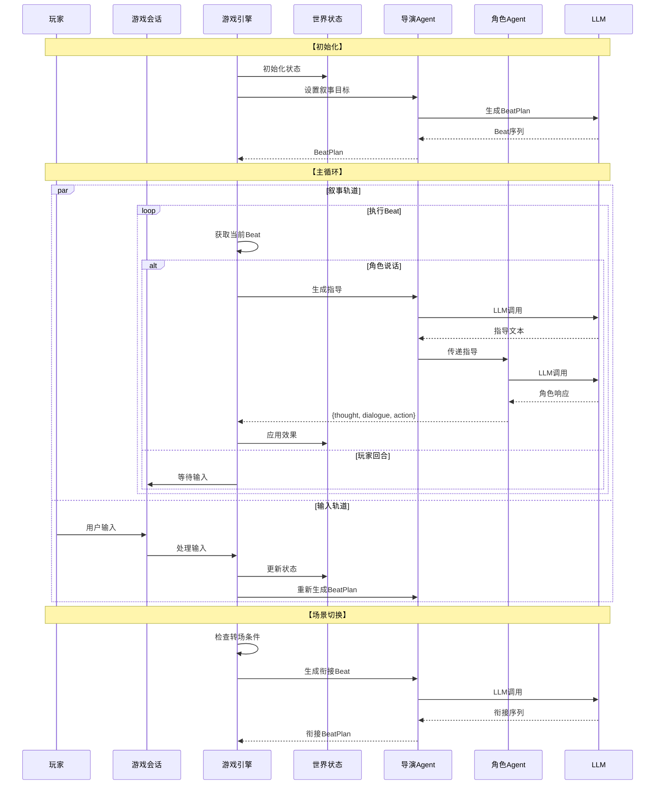
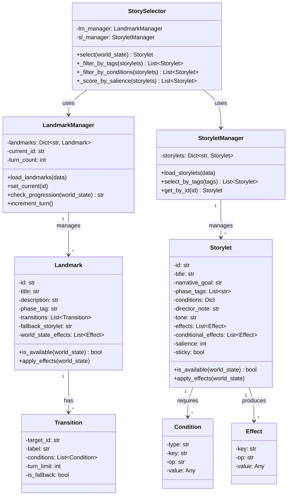
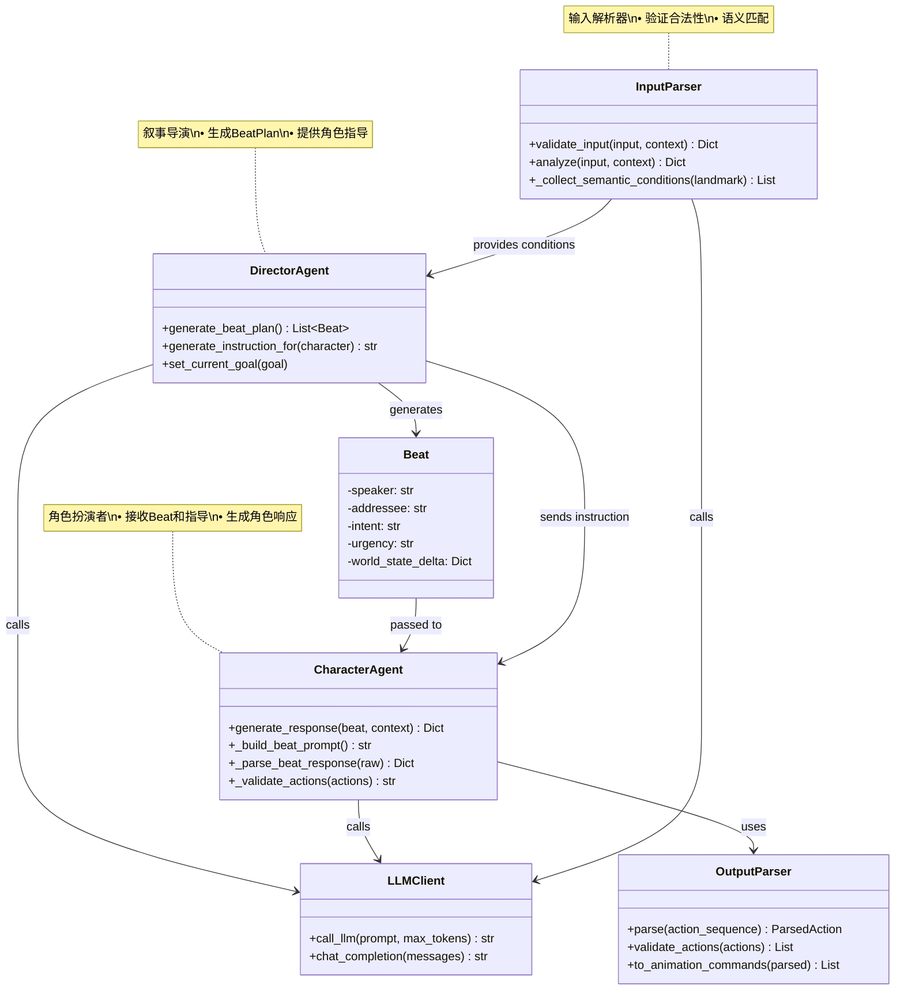
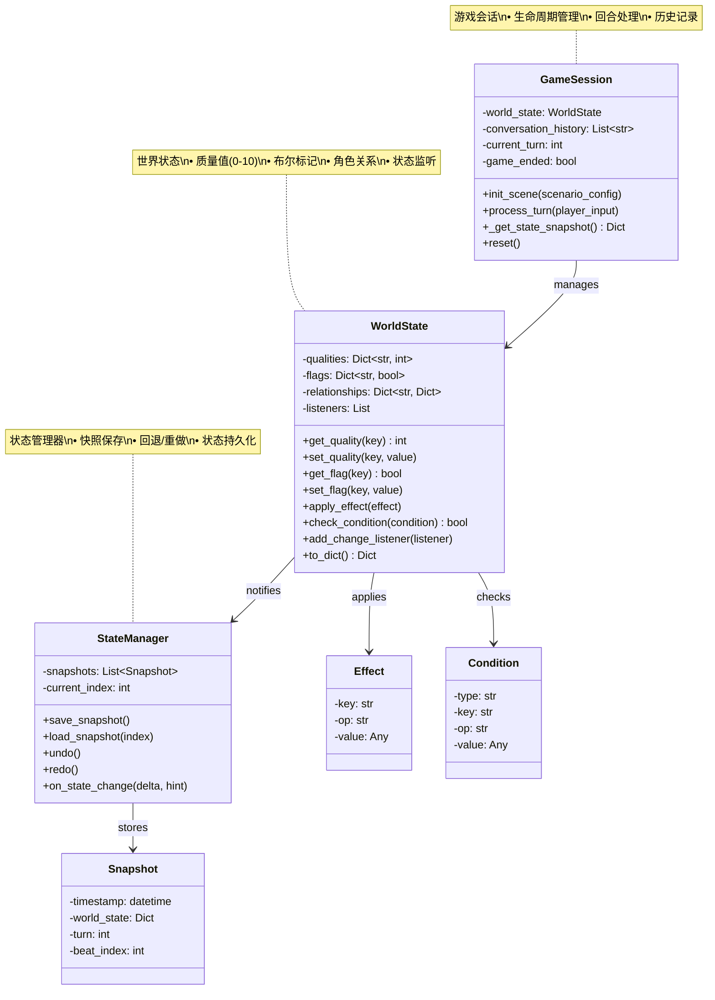
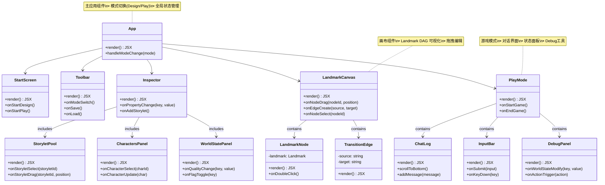
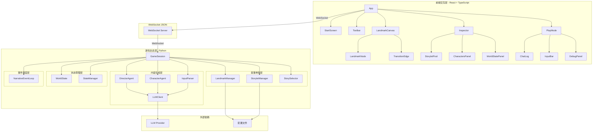
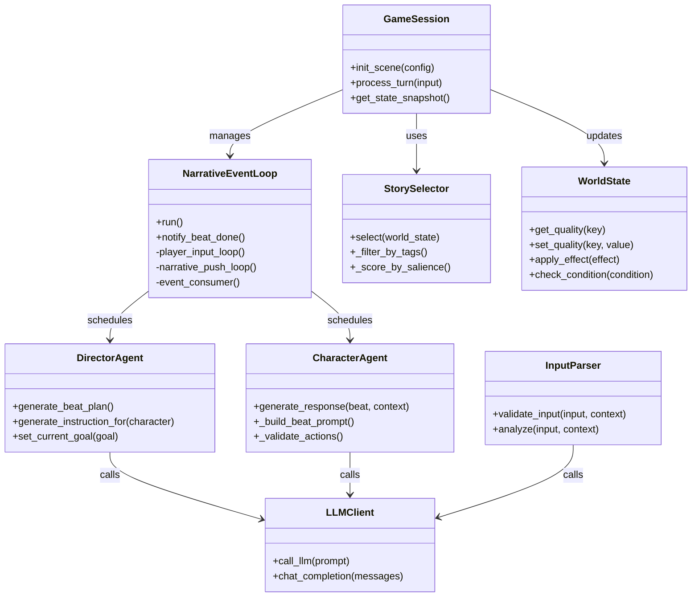
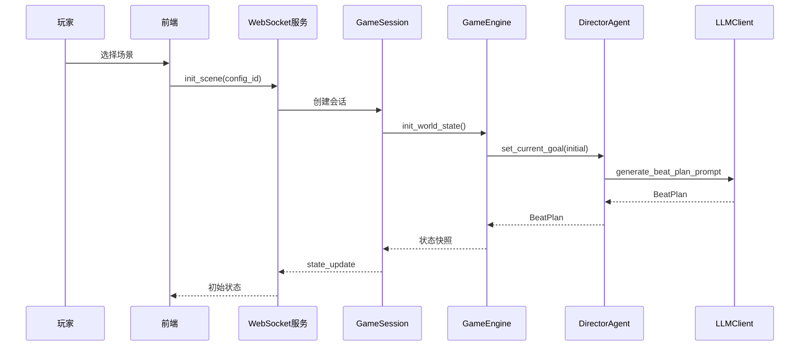
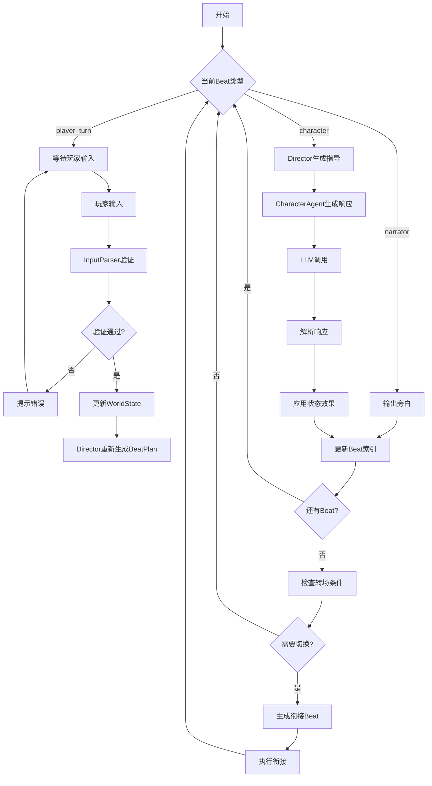
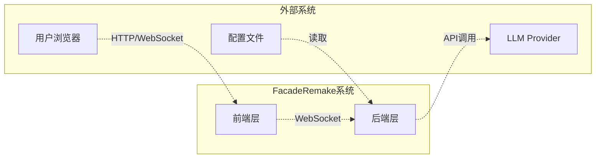

# 第三章 叙事骨架约束下的多智能体生成式互动叙事系统设计与实现

## 3.1 系统总体设计

### 3.1.1 设计思想

互动叙事系统的核心矛盾在于叙事连贯性与玩家行动自由之间的张力。传统分支叙事结构虽然能够保证叙事的可控性，但随着分支深度的增加，组合爆炸问题导致内容创作成本呈指数级增长，难以构建长篇幅的沉浸式体验。与此同时，纯涌现式叙事虽然赋予玩家充分的自由度，却容易出现叙事失控、情节跑偏等问题，导致整体故事失去核心张力。

本系统基于Triangle Framework理论，提出了一种预设计叙事骨架与运行时多智能体内容生成相结合的混合架构。叙事骨架负责定义“发生什么”，即故事的高层走向、关键节点和转折点，确保叙事始终沿着预设方向推进；而基于大语言模型的多智能体系统则负责实现“怎么发生”，即具体的对话生成、角色反应和情感细节，使叙事在骨架约束下保持足够的丰富性与动态性。这种设计既避免了分支树的组合爆炸，又确保了涌现式叙事的可控性，实现了叙事质量与玩家自由度的平衡。

### 3.1.2 系统总体架构设计

本系统采用分层架构设计，整体分为前端交互层和游戏会话层两个主要层次。前端交互层负责与用户进行直接交互，提供了叙事内容可视化编辑和实时游戏体验两种工作模式；游戏会话层则承担核心的游戏逻辑处理、状态管理和内容生成功能。

```
┌─────────────────────────────────────────────────────────────────┐
│                     前端交互层 (React + WebSocket)                │
├─────────────────────────────────────────────────────────────────┤
│  Design 模式：Landmark/Storylet/Character 可视化编辑               │
│  Play 模式：对话界面 + 状态面板 + Debug 工具                        │
└─────────────────────────────────────────────────────────────────┘
                                │
                         WebSocket JSON
                                │
┌─────────────────────────────────────────────────────────────────┐
│                     游戏会话层 (GameSession)                       │
│  - 管理单次游戏会话的生命周期                                      │
│  - 协调各模块间的数据流转                                          │
│  - 通过 asyncio 实现 LLM 调用的异步化                              │
├──────────────────────┬──────────────────────┬──────────────────┤
│   叙事骨架层(只读)    │   内容生成层(运行时)    │   状态管理层      │
│                      │                       │                  │
│  LandmarkManager     │  InputParser          │  WorldState      │
│  StoryletManager     │  DirectorAgent        │  - Flags         │
│  StorySelector       │  CharacterAgent × N  │  - Qualities     │
│                      │                       │  - Relationships │
│  [预设计,DAG结构]     │  [LLM驱动,多Agent协作]  │  [叙事黑板]       │
└──────────────────────┴──────────────────────┴──────────────────┘
```

架构的核心设计原则是“骨架管发生什么，Agent管怎么发生”。叙事骨架层维护只读的故事结构定义，包括阶段级的Landmark和有向无环图连接关系，以及场景级的Storylet集合；内容生成层在运行时由DirectorAgent和CharacterAgent协作，基于Landmark和Storylet的约束动态生成具体的对话内容；状态管理层以观察者模式维护世界状态的实时快照，并支持事务性更新与变更监听。

**架构说明：**

| 层级        | 组件              | 职责                                    |
| :-------- | :-------------- | :------------------------------------ |
| **前端交互层** | Design模式        | Landmark/Storylet/Character 可视化编辑     |
| <br />    | Play模式          | 对话界面 + 状态面板 + Debug工具                 |
| **游戏会话层** | GameSession     | 管理会话生命周期、协调数据流转、异步LLM调用               |
| **叙事骨架层** | LandmarkManager | 阶段级叙事控制（DAG结构）                        |
| <br />    | StoryletManager | 场景级叙事管理                               |
| <br />    | StorySelector   | 最佳场景选择                                |
| **内容生成层** | InputParser     | 输入验证与语义匹配                             |
| <br />    | DirectorAgent   | 叙事导演，生成BeatPlan                       |
| <br />    | CharacterAgent  | 角色扮演，LLM驱动响应生成                        |
| **状态管理层** | WorldState      | 世界状态存储（Flags/Qualities/Relationships） |

<br />

## 3.2 系统整体流程设计

系统的运行时流程遵循初始化阶段、主循环阶段和场景切换阶段三个主要阶段。在初始化阶段，游戏引擎首先根据场景配置初始化世界状态变量，并设置导演智能体的初始叙事目标；导演智能体随后生成首个节拍计划（Beat Plan），为后续的内容生成奠定基础。

在主循环阶段，系统并行运行叙事轨道和输入轨道两条执行路径。叙事轨道负责自动推进剧情：当当前节拍指定角色发言时，引擎调用导演智能体生成角色指导，然后传递给角色智能体进行具体对话生成，角色响应完成后引擎更新世界状态；当当前节拍为玩家回合时，引擎暂停自动推进，等待玩家输入。输入轨道则监听玩家输入并处理游戏状态：玩家输入经过验证后进入事件队列，引擎根据输入更新世界状态并可能触发叙事目标的重评估，进而重新生成节拍计划。

在场景切换阶段，系统持续检查转场条件是否满足。当转场条件触发时，引擎生成若干衔接节拍以实现平滑的场景过渡，这些衔接节拍通过导演智能体调用大语言模型生成，确保前后场景在叙事逻辑和情感氛围上的连贯性。



<br />

## 3.3 技术方案设计

### 3.3.1 后端技术栈

后端系统采用Python作为主要开发语言，提供了良好的异步编程支持和丰富的大语言模型生态。系统通过OpenAI API兼容格式调用大语言模型，支持GPT-4o、Claude等多种模型服务。异步框架选用FastAPI配合Uvicorn，实现了高效的HTTP和WebSocket通信能力。实时通信层面采用WebSocket协议实现全双工通信，支持游戏过程中实时的对话推送和状态同步。日志系统采用Python标准logging模块，实现了分级日志记录和文件分离存储。

### 3.3.2 前端技术栈

前端采用React框架配合TypeScript开发，提供了类型安全的组件化开发能力。状态管理使用React Hooks实现，通过Zustand库进行全局状态管理。实时通信同样基于WebSocket客户端实现与后端的双向通信。可视化层面，在设计模式中使用React Flow库实现Landmark和Storylet的有向无环图编辑功能，在游戏模式中采用自定义对话界面组件实现沉浸式叙事体验。

### 3.3.3 模块设计模式

系统采用多种设计模式确保代码的可维护性和可扩展性。依赖注入容器（DIContainer）统一管理各组件间的依赖关系，避免了组件间的直接耦合。策略模式应用于StorySelector组件，支持可插拔的评估器实现。观察者模式用于WorldState的状态变更通知，状态变更可自动触发相关回调函数。异步非阻塞设计通过asyncio.run\_in\_executor将LLM调用放入线程池执行，避免阻塞主事件循环。

### 3.4 系统实现

#### 3.4.1 叙事骨架模块

叙事骨架模块是系统的核心基础设施，负责维护故事的高层结构约束。该模块由LandmarkManager、StoryletManager和StorySelector三个核心组件构成，共同实现了从阶段级叙事控制到场景级叙事选择的完整功能链条。

Landmark作为叙事阶段节点，在系统中以有向无环图结构组织，定义了故事的高级走向和关键转折点。每个Landmark通过transitions列表声明向哪些后续阶段跳转及其跳转条件，支持基于世界状态条件、回合数上限、Storylet计数等多种转场触发机制。特别地，is\_ending标志将结局节点与普通阶段节点统一建模，无需额外的结局处理逻辑。LandmarkManager负责管理Landmark的加载、切换和转场检查，其check\_progression方法实现了多条件优先级的转场决策逻辑，确保叙事始终沿着预设方向推进。

Storylet作为场景级叙事单元，是对话生成的基本调度单位。每个Storylet包含前置条件、叙事目标、导演注释、情感基调和后置效果等元数据，以及可配置的条件效果和Salience评分机制。StoryletManager负责Storylet的注册、查询和候选筛选，其get\_candidates方法实现了多维度条件过滤，支持基于阶段标签匹配、结构性条件检查和语义条件匹配的三层筛选流程。

StorySelector负责从候选Storylet集合中选择最合适的场景执行，其select方法采用三层过滤策略：首先通过StoryletManager获取满足条件的候选集合，然后基于Salience评分进行排序，必要时调用大语言模型对Top候选进行二次评估，最终返回评分最高的Storylet。



**LandmarkManager**：管理Landmark的有向无环图加载和切换。set\_current方法用于设置当前Landmark，check\_progression方法检查转场条件并返回下一个Landmark标识，increment\_turn\_count和increment\_storylet\_count方法用于更新计数。

**StoryletManager**：管理Storylet池的加载和查询。select\_by\_tags方法按标签筛选候选Storylet，get\_by\_id和get\_all方法提供Storylet查询接口。

**StorySelector**：实现三层过滤选择最佳Storylet。Salience评分机制基于基础分和修正量计算，支持基于世界状态的动态调整。

#### 3.4.2 内容生成模块

内容生成模块采用多智能体协作架构，模拟戏剧制作中的导演与演员关系，实现了叙事指导与角色扮演的职责分离。该模块由DirectorAgent、CharacterAgent、InputParser和LLMClient四个核心组件构成。

DirectorAgent承担叙事导演的角色，负责生成BeatPlan和为角色提供动态指导。其内部的GoalTracker组件追踪当前叙事目标的进度，评估目标完成状态并在必要时进行干预。InstructionGenerator组件基于当前Storylet配置、对话历史和世界状态，通过大语言模型生成针对性的角色指导文本。在生成BeatPlan时，DirectorAgent调用大语言模型生成节拍序列，每个节拍包含发言人、目标听众、叙事意图、紧迫程度和世界状态变化预测等信息，并经过\_validate\_beat\_plan方法进行后处理校验，确保节拍序列满足叙事节奏要求。

CharacterAgent负责角色扮演和对话生成。每个角色拥有独立的CharacterAgent实例，维护角色配置文件，包括身份设定、人际关系、性格特征、背景故事和秘密知识等。CharacterAgent的generate\_response方法接收导演指导和当前上下文，生成包含内心独白（thought）、台词（dialogue）和动作序列（action）的角色响应。动作序列遵循结构化格式，支持地点移动、表情变化、物品交互等多种动作类型。

InputParser负责玩家输入的验证和语义分析。其validate\_input方法通过规则层快速过滤和语义层大语言模型判断，检测非法输入和破坏叙事的行为。analyze方法将输入合法性与语义条件匹配合并为单次大语言模型调用，提高了处理效率并降低了延迟。SemanticConditionStore组件维护当前场景的语义条件索引，支持条件的前缀过滤和向量检索扩展。

OutputParser负责动作序列解析和动画指令生成，将结构化的动作序列转换为可执行的动画命令。

LLMClient作为大语言模型调用的统一接口，封装了API调用、重试机制和响应解析等逻辑，支持多种大语言模型服务提供商。



**DirectorAgent**：负责规划叙事节拍和生成角色指导。其generate\_beat\_plan方法通过大语言模型生成节拍序列，generate\_instruction\_for方法为角色生成针对性指导。

**CharacterAgent**：负责角色对话和动作生成。generate\_response方法基于Beat指令和角色配置生成完整的角色响应，包括内心独白、台词和动作序列。

**InputParser**：负责输入验证和语义条件匹配。validate\_input方法进行合法性检查，analyze方法同时完成合法性和语义匹配。

**OutputParser**：负责动作序列解析和动画指令生成，将结构化的动作序列转换为可执行的动画命令。

#### 3.4.3 叙事推进模块

叙事推进模块基于异步事件循环实现，是系统运行时的核心调度中心。该模块协调叙事自动推进、玩家输入处理和事件消费三个并发执行路径，确保游戏体验的流畅性和响应性。

GameEventLoop类封装了所有asyncio逻辑，其start方法初始化事件队列和同步事件后，启动player\_input\_loop、narrative\_push\_loop和event\_consumer三个并发协程。player\_input\_loop协程持续监听玩家输入，支持普通文本输入、系统命令（quit、status）和沉默超时处理。narrative\_push\_loop协程负责按BeatPlan序列推进叙事，根据当前Beat类型执行不同逻辑：player\_turn类型触发玩家输入等待，narrator类型输出旁白文本，角色类型触发角色响应生成。event\_consumer协程作为事件队列的消费者，将事件分发给GameEngine的相应处理方法执行。

GameEngine类封装了游戏的核心业务逻辑，包括Storylet切换、Beat调度、状态更新等。handle\_player\_input方法处理玩家输入，流程包括：输入验证、回合计数更新、Beat增量应用、转场检查和BeatPlan刷新。handle\_auto\_beat方法处理自动节拍执行，调用角色智能体生成响应并应用状态变化。\_check\_and\_handle\_transitions方法检查是否满足Landmark或Storylet切换条件，必要时触发场景过渡。

状态更新采用双轨机制：Storylet级别的效果在场景切换时一次性应用，Beat级别的增量变化则在每次角色响应后累积计算。WorldState.compute\_beat\_delta方法根据Storylet效果趋势和玩家输入上下文计算即时状态变化，支持玩家缓解行为的逆趋势调整，增强了叙事的动态响应能力。

```
MODULE NarrativeEventLoop
    
    DEPENDENCIES:
        - GameEngine (业务逻辑引擎)
        - asyncio (异步框架)
        - Output (输出工具)
    
    STATE:
        engine: GameEngine          # 游戏引擎引用
        loop: EventLoop             # asyncio 事件循环
        event_queue: Queue          # 事件队列
        pending_task: Task          # 当前执行中的任务
        beat_done_event: Event      # Beat完成信号
    
    INIT(engine):
        self.engine = engine
        engine.event_loop = self
        self.event_queue = Queue()
        self.beat_done_event = Event()
    
    METHOD notify_beat_done():
        """通知Beat执行完成"""
        IF loop IS NOT None:
            loop.call_soon_threadsafe(beat_done_event.set)
    
    METHOD run():
        """启动事件循环"""
        asyncio.run(start())
    
    ASYNC METHOD start():
        """初始化并启动所有循环"""
        self.loop = asyncio.get_running_loop()
        engine._loop = self.loop
        
        # 初始化游戏
        engine._trigger_initial_storylet()
        
        # 并行启动三个核心循环
        AWAIT asyncio.gather(
            player_input_loop(),
            narrative_push_loop(),
            event_consumer()
        )
    
    ASYNC METHOD player_input_loop():
        """玩家输入监听循环"""
        WHILE NOT engine.game_ended:
            # 从线程池获取用户输入（不阻塞事件循环）
            input = AWAIT loop.run_in_executor(None, player_input_prompt)
            
            IF input IS EMPTY:
                IF engine._player_turn_active:
                    PUT event_queue {"type": "player_silence"}
                ELSE:
                    PUT event_queue {"type": "auto_beat"}
                CONTINUE
            
            SWITCH input:
                CASE "quit":
                    engine.game_ended = True
                    CANCEL pending_task
                    RETURN
                CASE "status":
                    engine._show_status()
                    CONTINUE
                DEFAULT:
                    PUT event_queue {"type": "player_input", "content": input}
    
    ASYNC METHOD narrative_push_loop():
        """叙事自动推进循环"""
        WHILE NOT engine.game_ended:
            # 等待BeatPlan就绪
            IF engine.current_beat_plan IS EMPTY:
                AWAIT asyncio.sleep(0.5)
                CONTINUE
            
            beat = engine.current_beat_plan[engine.beat_index]
            
            SWITCH beat.speaker:
                CASE "player_turn":
                    engine._player_turn_active = True
                    OUTPUT "等待玩家输入..."
                    
                    # 带超时的等待
                    TRY:
                        AWAIT asyncio.wait_for(
                            wait_for_player(),
                            timeout=PLAYER_TURN_TIMEOUT
                        )
                    EXCEPT TimeoutError:
                        OUTPUT "你怎么不说话了？"
                        # 延长等待时间
                        AWAIT asyncio.wait_for(wait_for_player(), timeout=30)
                    
                    engine._player_turn_active = False
                    engine.beat_index += 1
                
                CASE "narrator":
                    OUTPUT beat.content
                    engine.beat_index += 1
                
                CASE ELSE:  # trip/grace
                    # 触发角色Beat执行
                    beat_done_event.clear()
                    PUT event_queue {"type": "auto_beat"}
                    
                    # 等待Beat执行完成
                    AWAIT beat_done_event.wait()
                    
                    # 阅读延迟
                    delay = calc_reading_delay(engine.last_beat_char_count)
                    AWAIT asyncio.sleep(delay)
                    
                    engine.beat_index += 1
    
    ASYNC METHOD wait_for_player():
        """等待玩家输入的辅助方法"""
        WHILE engine._player_turn_active AND NOT engine.game_ended:
            AWAIT asyncio.sleep(0.3)
    
    ASYNC METHOD event_consumer():
        """事件消费循环"""
        WHILE NOT engine.game_ended:
            event = AWAIT event_queue.get()  # 阻塞等待
            
            TRY:
                SWITCH event.type:
                    CASE "player_input":
                        # 在线程池中执行同步逻辑
                        AWAIT loop.run_in_executor(
                            None,
                            engine.handle_player_input,
                            event.content
                        )
                    CASE "player_silence":
                        AWAIT loop.run_in_executor(
                            None,
                            engine.handle_player_silence
                        )
                    CASE "auto_beat":
                        AWAIT loop.run_in_executor(
                            None,
                            engine.handle_auto_beat
                        )
            EXCEPT Exception AS e:
                LOG ERROR "事件处理失败: " + e

END MODULE
```

```
┌─────────────────────────────────────────────────────────────┐
│                    叙事推进模块                              │
├─────────────────┬───────────────────────────────────────────┤
│   输入轨道      │              叙事轨道                      │
│                 │                                           │
│ player_input    │  narrative_push_loop                      │
│    loop         │     │                                     │
│       │         │     ├─→ player_turn → 等待输入           │
│       ▼         │     ├─→ narrator   → 输出旁白            │
│  event_queue ◄──┼─────├─→ character_agent → 自动执行Beat       │
│       │         │     │                                     │
│       ▼         │     ▼                                     │
│ event_consumer  │  阅读延迟等待                             │
│       │         │                                           │
│       ▼         │                                           │
│ GameEngine      │                                           │
│   (业务逻辑)    │                                           │
└─────────────────┴───────────────────────────────────────────┘
```

<br />

#### 3.4.4 状态与数据管理模块

状态与数据管理模块采用观察者模式和事务机制，确保世界状态的可靠性和一致性。该模块由WorldState、StateManager和GameSession三个核心组件构成。

WorldState作为世界状态的容器，管理qualities（数值型变量）、flags（布尔标记）和relationships（关系数值）三类状态变量。get\_quality、set\_quality、get\_flag、set\_flag等方法提供了状态读写接口，apply\_effect方法支持增量修改、极值限制等多种效果操作，check\_condition方法实现了条件判断逻辑。特别地，compute\_beat\_delta方法根据Storylet效果趋势和玩家行为上下文计算即时状态变化，实现了叙事节奏与状态的动态关联。

StateManager在WorldState基础上增加了事务支持和变更通知机制。其transaction上下文管理器支持状态更新的原子性操作和回滚能力。\_change\_listeners维护一组变更监听器，当状态发生变化时自动通知所有监听器，支持前端实时同步和日志记录等功能。\_history记录状态变更历史，支持回溯分析和调试功能。

GameSession管理单次游戏会话的生命周期，维护对话历史、当前回合数、游戏结束标志等会话状态，并协调各模块间的数据流转。



<br />

#### 3.4.5 前端交互模块

前端交互模块采用React组件化架构，支持叙事内容的可视化编辑和实时游戏体验两大功能模式。该模块由多个功能组件构成，通过Zustand进行状态管理，并通过WebSocket与后端实时通信。

Design模式提供叙事内容的可视化编辑能力。LandmarkCanvas组件基于React Flow库实现Landmark节点图的可视化编辑，支持节点的拖拽定位、多选操作、连线和右键删除等交互。LandmarkNode和TransitionEdge组件定义了自定义节点和边的渲染样式，通过颜色和动画区分不同类型的转场条件（条件转场、计数转场、回合限制转场、兜底转场）。Inspector组件作为属性编辑面板，包含StoryletPool（场景池管理）、CharactersPanel（角色配置）和WorldStatePanel（世界状态定义）三个子面板。useStore通过Zustand管理项目级数据，支持撤销/重做功能，最多保留50步历史记录。

Play模式提供沉浸式游戏体验。ChatLog组件展示对话历史流，支持自动滚动和新消息高亮。InputBar组件处理玩家文本输入，支持空输入识别为沉默行为。DebugPanel组件提供调试能力，包括世界状态实时查看、状态修改和LLM调试日志查看。usePlayStore管理游戏会话数据，通过WebSocket与后端通信，支持消息收发、状态同步和回退功能。

组件间通过props传递和Zustand store实现状态共享，确保了数据的一致性和组件的可复用性。



**前端组件结构说明：**

### 两大模式

| 模式            | 组件              | 职责                      |
| :------------ | :-------------- | :---------------------- |
| **Design 模式** | LandmarkCanvas  | Landmark/Storylet 可视化编辑 |
| <br />        | Inspector       | 属性面板（角色/场景/状态）          |
| <br />        | CharactersPanel | 角色配置管理                  |
| <br />        | WorldStatePanel | 世界状态定义                  |
| **Play 模式**   | ChatLog         | 对话历史展示                  |
| <br />        | InputBar        | 玩家输入框                   |
| <br />        | DebugPanel      | 调试工具面板                  |

### 核心组件关系

```
App
├── StartScreen (启动页)
├── Toolbar (工具栏)
│
├── Design模式组件
│   ├── LandmarkCanvas (画布)
│   │   ├── LandmarkNode (节点)
│   │   └── TransitionEdge (边)
│   └── Inspector (检查器)
│       ├── StoryletPool (场景池)
│       ├── CharactersPanel (角色面板)
│       └── WorldStatePanel (状态面板)
│
└── Play模式组件
    └── PlayMode
        ├── ChatLog (对话日志)
        ├── InputBar (输入框)
        └── DebugPanel (调试面板)
```

### 状态管理

| Store             | 职责                                 |
| :---------------- | :--------------------------------- |
| useProjectStore   | 项目级数据（Landmark/Storylet/Character） |
| usePlayStore      | 游戏会话数据（对话历史/当前状态）                  |
| cascadeWorldState | 世界状态管理                             |

润色版：

## Part 1 \[Refined Text]

### 3.1 系统总体设计

#### 3.1.1 设计思想

互动叙事系统的核心挑战在于平衡叙事连贯性与玩家行动自由之间的内在张力。传统分支叙事结构通过预定义所有可能路径来保证叙事可控性，但随着叙事复杂度的提升，分支树的组合爆炸问题导致内容创作成本呈指数级增长，难以构建具有深度和广度的沉浸式体验。与此相对，纯涌现式叙事虽然赋予玩家充分的行动自由度，却容易出现叙事失控、情节偏离主线等问题，导致整体故事失去核心戏剧张力。

本研究基于Triangle Framework理论框架，提出一种融合预设计叙事骨架与运行时多智能体内容生成的混合架构。其中，叙事骨架层负责定义故事的"发生什么"，即故事的高层走向、关键节点和转折点，确保叙事始终沿着预设的戏剧性弧线推进；而基于大语言模型的多智能体系统则负责实现"如何发生"，即具体的对话生成、角色反应和情感细节，使叙事在骨架约束下保持足够的丰富性与动态性。这种设计既避免了分支树的组合爆炸问题，又确保了涌现式叙事的可控性，从而实现叙事质量与玩家自由度之间的有效平衡。

#### 3.1.2 系统总体架构设计

本系统采用分层架构设计，整体分为前端交互层与游戏会话层两个主要层次。前端交互层负责与用户的直接交互，提供叙事内容可视化编辑和实时游戏体验两种工作模式；游戏会话层则承担核心的游戏逻辑处理、状态管理和内容生成功能。

架构的核心设计原则是"骨架管发生什么，Agent管怎么发生"。叙事骨架层维护只读的故事结构定义，包括阶段级的Landmark及其有向无环图连接关系，以及场景级的Storylet集合；内容生成层在运行时由DirectorAgent和CharacterAgent协作，基于Landmark和Storylet的约束动态生成具体的对话内容；状态管理层以观察者模式维护世界状态的实时快照，并支持事务性更新与变更监听。

#### 3.2 系统整体流程设计

系统的运行时流程遵循初始化阶段、主循环阶段和场景切换阶段三个主要阶段。在初始化阶段，游戏引擎首先根据场景配置初始化世界状态变量，并设置导演智能体的初始叙事目标；导演智能体随后生成首个节拍计划（Beat Plan），为后续的内容生成奠定基础。

在主循环阶段，系统并行运行叙事轨道和输入轨道两条执行路径。叙事轨道负责自动推进剧情：当当前节拍指定角色发言时，引擎调用导演智能体生成角色指导，然后传递给角色智能体进行具体对话生成，角色响应完成后引擎更新世界状态；当当前节拍为玩家回合时，引擎暂停自动推进，等待玩家输入。输入轨道则监听玩家输入并处理游戏状态：玩家输入经过验证后进入事件队列，引擎根据输入更新世界状态并可能触发叙事目标的重评估，进而重新生成节拍计划。

在场景切换阶段，系统持续检查转场条件是否满足。当转场条件触发时，引擎生成若干衔接节拍以实现平滑的场景过渡，这些衔接节拍通过导演智能体调用大语言模型生成，确保前后场景在叙事逻辑和情感氛围上的连贯性。

#### 3.3 技术方案设计

后端系统采用Python作为主要开发语言，提供良好的异步编程支持和丰富的大语言模型生态。系统通过OpenAI API兼容格式调用大语言模型，支持GPT-4o、Claude等多种模型服务。异步框架选用FastAPI配合Uvicorn，实现高效的HTTP和WebSocket通信能力。实时通信层面采用WebSocket协议实现全双工通信，支持游戏过程中实时的对话推送和状态同步。日志系统采用Python标准logging模块，实现分级日志记录和文件分离存储。

前端采用React框架配合TypeScript开发，提供类型安全的组件化开发能力。状态管理使用React Hooks实现，通过Zustand库进行全局状态管理。实时通信同样基于WebSocket客户端实现与后端的双向通信。可视化层面，在设计模式中使用React Flow库实现Landmark和Storylet的有向无环图编辑功能，在游戏模式中采用自定义对话界面组件实现沉浸式叙事体验。

系统采用多种设计模式确保代码的可维护性和可扩展性。依赖注入容器统一管理各组件间的依赖关系，避免组件间的直接耦合。策略模式应用于StorySelector组件，支持可插拔的评估器实现。观察者模式用于WorldState的状态变更通知，状态变更可自动触发相关回调函数。异步非阻塞设计通过asyncio.run\_in\_executor将LLM调用放入线程池执行，避免阻塞主事件循环。

#### 3.4 系统实现

叙事骨架模块是系统的核心基础设施，负责维护故事的高层结构约束。该模块由LandmarkManager、StoryletManager和StorySelector三个核心组件构成，共同实现从阶段级叙事控制到场景级叙事选择的完整功能链条。Landmark作为叙事阶段节点，在系统中以有向无环图结构组织，定义故事的高级走向和关键转折点。Storylet作为场景级叙事单元，是对话生成的基本调度单位。StorySelector负责从候选Storylet集合中选择最合适的场景执行。

内容生成模块采用多智能体协作架构，模拟戏剧制作中的导演与演员关系，实现叙事指导与角色扮演的职责分离。DirectorAgent承担叙事导演的角色，负责生成BeatPlan和为角色提供动态指导。CharacterAgent负责角色扮演和对话生成。InputParser负责玩家输入的验证和语义分析。OutputParser负责动作序列解析和动画指令生成。LLMClient作为大语言模型调用的统一接口，封装API调用、重试机制和响应解析等逻辑。

叙事推进模块基于异步事件循环实现，是系统运行时的核心调度中心。该模块协调叙事自动推进、玩家输入处理和事件消费三个并发执行路径，确保游戏体验的流畅性和响应性。GameEventLoop类封装所有asyncio逻辑，GameEngine类封装游戏的核心业务逻辑。

状态与数据管理模块采用观察者模式和事务机制，确保世界状态的可靠性和一致性。WorldState作为世界状态的容器，管理qualities、flags和relationships三类状态变量。StateManager在WorldState基础上增加事务支持和变更通知机制。GameSession管理单次游戏会话的生命周期，维护对话历史、当前回合数、游戏结束标志等会话状态。

前端交互模块采用React组件化架构，支持叙事内容的可视化编辑和实时游戏体验两大功能模式。Design模式提供叙事内容的可视化编辑能力，Play模式提供沉浸式游戏体验。组件间通过props传递和Zustand store实现状态共享，确保数据的一致性和组件的可复用性。

## Part 2 \[Logic flow]

重构思路如下：首先，识别原始文本的逻辑主线，将零散的要点整合为连贯的段落结构，每个段落聚焦单一核心观点。其次，对口语化表达进行学术化转换，例如将"组合爆炸问题导致内容创作成本呈指数级增长"替代原有表述，同时确保技术术语的准确性和一致性。第三，调整叙述语序，遵循从概括到细节、从理论到实现的逻辑顺序，使段落间形成自然的语义衔接。第四，合并重复或冗余的描述，例如在介绍多智能体协作架构时，将分散在不同位置的组件职责描述整合到统一段落中。第五，规范标点符号和格式，统一使用中文全角标点，移除所有Markdown格式符号，确保输出文本可直接复制到Word中使用。最后，增强段落间的逻辑连接，通过明确的过渡句和逻辑标记（如"核心设计原则是""该模块由...构成"等）提升整体结构的清晰性和可读性。

# FacadeRemake 系统架构设计文档

***

## 一、架构概述与设计原则

### 1.1 项目定位

FacadeRemake 是一个基于 **LLM + Storylet + BeatPlan** 架构的互动叙事系统，旨在实现高质量的交互式戏剧体验。系统采用前后端分离架构，支持叙事内容的可视化编辑和实时游戏体验。

### 1.2 设计原则

| 原则        | 描述                   |
| :-------- | :------------------- |
| **分层架构**  | 清晰的职责分离（表示层/业务层/数据层） |
| **关注点分离** | 叙事骨架与内容生成解耦          |
| **异步非阻塞** | LLM 调用不阻塞主事件循环       |
| **可扩展性**  | 支持多场景配置、多 LLM 提供商    |
| **可观测性**  | 完整的日志记录和状态追踪         |

***

## 二、系统架构图

### 2.1 整体架构



### 2.2 模块关系图



***

## 三、核心模块详细说明

### 3.1 前端层模块

#### 3.1.1 设计模式模块

| 组件                 | 职责                 | 技术实现            |
| :----------------- | :----------------- | :-------------- |
| **LandmarkCanvas** | Landmark DAG 可视化编辑 | React Flow      |
| **LandmarkNode**   | 自定义节点渲染            | SVG + CSS       |
| **TransitionEdge** | 转场边渲染              | React Flow Edge |
| **Inspector**      | 属性编辑面板             | React Hooks     |
| **StoryletPool**   | 场景池管理              | 拖拽排序            |

#### 3.1.2 游戏模式模块

| 组件             | 职责     | 技术实现 |
| :------------- | :----- | :--- |
| **ChatLog**    | 对话历史展示 | 虚拟滚动 |
| **InputBar**   | 玩家输入处理 | 表单处理 |
| **DebugPanel** | 调试工具   | 状态修改 |
| **PlayMode**   | 游戏模式容器 | 状态管理 |

#### 3.1.3 状态管理

| Store                 | 职责     | 实现      |
| :-------------------- | :----- | :------ |
| **useProjectStore**   | 项目级数据  | Zustand |
| **usePlayStore**      | 游戏会话数据 | Zustand |
| **cascadeWorldState** | 世界状态   | 响应式更新   |

### 3.2 后端层模块

#### 3.2.1 叙事骨架层

**LandmarkManager**

- 职责：管理叙事阶段的 DAG 结构
- 关键方法：
  - `set_current(id)`: 设置当前阶段
  - `check_progression(world_state)`: 检查转场条件
  - `increment_turn_count()`: 更新回合计数

**StoryletManager**

- 职责：管理场景池的加载和查询
- 关键方法：
  - `load_storylets(data)`: 加载场景配置
  - `select_by_tags(tags)`: 按标签筛选
  - `get_candidates(world_state)`: 获取候选场景

**StorySelector**

- 职责：选择最佳场景执行
- 三层过滤：标签过滤 → 条件过滤 → Salience 评分

#### 3.2.2 内容生成层

**DirectorAgent**

- 职责：叙事导演，生成 BeatPlan 和角色指导
- 核心组件：
  - GoalTracker: 追踪叙事目标进度
  - BeatPlanGenerator: 生成对话节拍序列
- 关键方法：
  - `generate_beat_plan(storylet, world_state)`: 生成节拍计划
  - `generate_instruction_for(character)`: 为角色生成指导

**CharacterAgent**

- 职责：角色扮演，生成角色响应
- 关键方法：
  - `generate_response(beat, context)`: 生成角色响应
  - `_build_beat_prompt()`: 构建 LLM 提示词
  - `_validate_actions()`: 验证动作合法性

**InputParser**

- 职责：输入验证与语义匹配
- 双重验证：规则快速过滤 + LLM 语义判断
- 关键方法：
  - `validate_input(input, context)`: 合法性检查
  - `analyze(input, context)`: 合法性 + 语义匹配

**LLMClient**

- 职责：LLM 统一调用接口
- 支持多提供商：OpenAI、DeepSeek、Claude
- 关键方法：
  - `call_llm(prompt, max_tokens, temperature)`: 同步调用
  - `chat_completion(messages)`: 对话模式

#### 3.2.3 状态管理层

**WorldState**

- 职责：世界状态存储与管理
- 状态类型：
  - Qualities: 数值型状态（0-10）
  - Flags: 布尔标记
  - Relationships: 角色关系评分
- 关键方法：
  - `apply_effect(effect)`: 应用效果
  - `check_condition(condition)`: 条件检查
  - `add_change_listener(listener)`: 注册监听器

**StateManager**

- 职责：状态持久化与回滚
- 功能：
  - 快照保存/加载
  - 撤销/重做
  - 状态变更通知

#### 3.2.4 事件调度层

**NarrativeEventLoop**

- 职责：异步事件调度中心
- 三大循环：
  - `player_input_loop`: 玩家输入监听
  - `narrative_push_loop`: 叙事自动推进
  - `event_consumer`: 事件队列消费
- 关键机制：
  - 双轨道并行执行
  - Beat 完成信号同步
  - 超时处理与重试

***

## 四、完整数据流图

### 4.1 初始化流程



### 4.2 主循环流程



### 4.3 数据流转矩阵

| 数据流      | 来源             | 目标              | 数据格式        |
| :------- | :------------- | :-------------- | :---------- |
| 玩家输入     | InputBar       | WebSocket       | JSON        |
| 状态更新     | WorldState     | WebSocket       | JSON        |
| BeatPlan | DirectorAgent  | GameEngine      | List\[Beat] |
| 角色响应     | CharacterAgent | GameEngine      | Dict        |
| LLM 调用   | Agent          | LLMClient       | Prompt      |
| 场景配置     | 文件             | StoryletManager | JSON        |

***

## 五、系统边界与外部依赖

### 5.1 系统边界



### 5.2 外部依赖

| 依赖                   | 类型 | 用途      | 接口        |
| :------------------- | :- | :------ | :-------- |
| **LLM Provider**     | 服务 | 内容生成    | REST API  |
| **WebSocket Client** | 协议 | 实时通信    | WebSocket |
| **配置文件**             | 数据 | 场景定义    | JSON      |
| **React Flow**       | 库  | DAG 可视化 | React 组件  |
| **Zustand**          | 库  | 状态管理    | Hooks     |

***

## 六、性能与安全考量

### 6.1 性能优化

| 策略            | 实现                        | 效果           |
| :------------ | :------------------------ | :----------- |
| **异步 LLM 调用** | asyncio.run\_in\_executor | 非阻塞主循环       |
| **缓存机制**      | 重复 Prompt 缓存              | 减少 LLM 调用    |
| **对话历史截断**    | 保留最近 N 轮                  | 控制 Prompt 长度 |
| **线程池优化**     | 合理配置线程数                   | 平衡资源使用       |
| **状态变更监听**    | 增量更新推送                    | 减少数据传输       |

### 6.2 安全保障

| 风险         | 防范措施        | 实施位置                      |
| :--------- | :---------- | :------------------------ |
| **LLM 注入** | 输入清理 + 输出验证 | InputParser, OutputParser |
| **敏感信息泄露** | 日志脱敏        | logging 模块                |
| **资源耗尽**   | 请求频率限制      | LLMClient                 |
| **输入暴力破解** | 输入长度限制      | InputParser               |
| **数据完整性**  | 状态变更校验      | StateManager              |

### 6.3 可扩展性设计

| 扩展方向          | 设计考虑    |
| :------------ | :------ |
| **多场景支持**     | 配置化场景定义 |
| **多 LLM 提供商** | 统一接口抽象  |
| **多角色支持**     | 动态角色创建  |
| **分布式部署**     | 无状态设计   |

***

## 七、总结

FacadeRemake 采用分层架构设计，实现了叙事骨架与内容生成的有效分离。核心优势包括：

1. **架构清晰**：职责分离明确，便于维护和扩展
2. **性能优化**：异步非阻塞设计，保证流畅体验
3. **安全性强**：多层验证机制，防止注入攻击
4. **可扩展性好**：配置化设计，支持多场景多提供商

该架构为互动叙事系统提供了坚实的技术基础，能够支持复杂的叙事逻辑和丰富的玩家交互。
