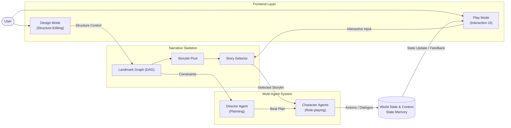
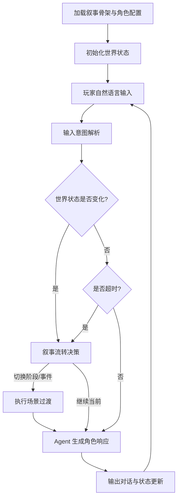
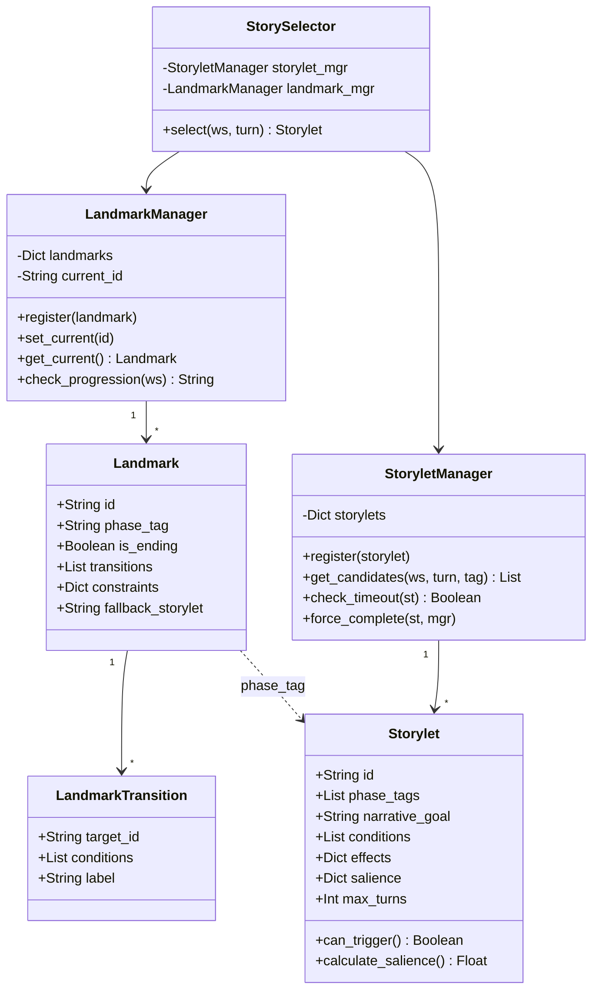
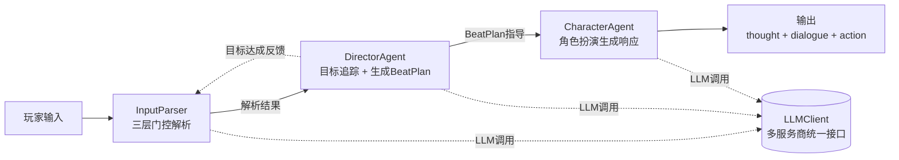
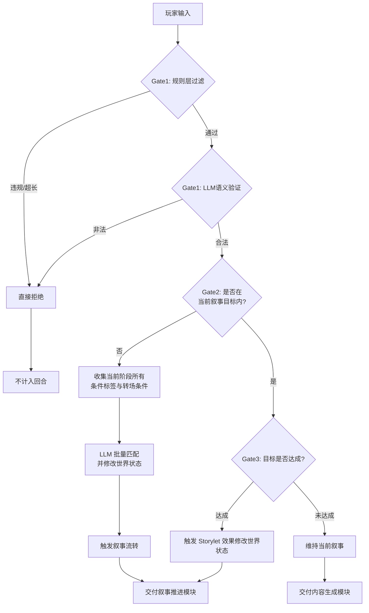
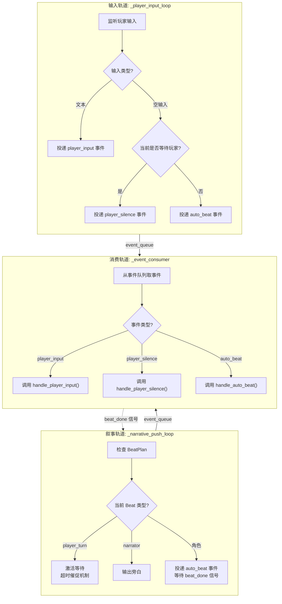
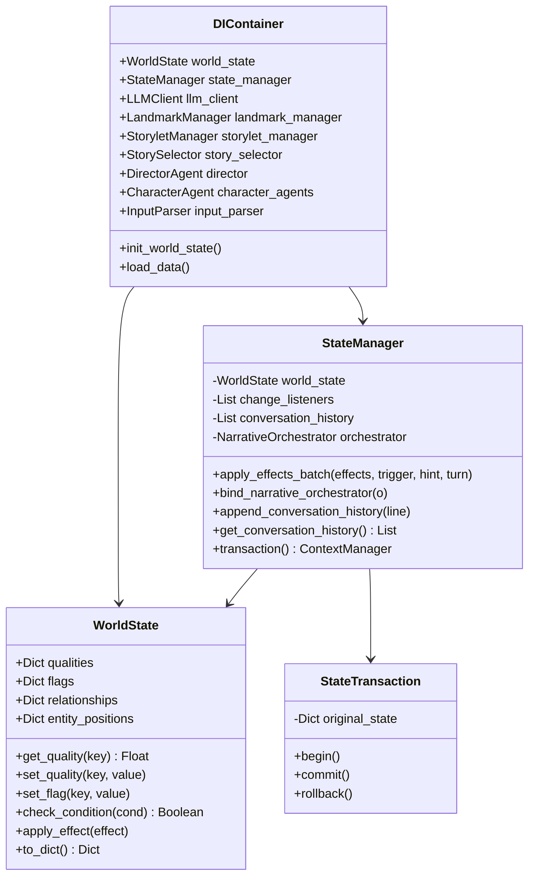

# 第三章 叙事骨架约束下的多智能体生成式互动叙事系统设计与实现

## 3.1 系统总体设计

### 3.1.1 设计思想

互动叙事系统面临一个根本性的设计矛盾：叙事连贯性要求故事沿着预设的因果链展开，而玩家能动性则要求系统对自由输入产生有意义的响应。这一矛盾在传统的分支叙事结构与纯涌现式叙事方法中各自呈现出不同的极端形态。传统分支叙事通过穷举所有可能的选择路径来保障叙事可控性，但随着叙事规模的增长，分支数量呈指数级膨胀，内容创作成本急剧上升，难以支撑具有足够深度的沉浸式体验。彼时的互动叙事研究大多停留在小规模场景验证，未能解决规模化与连贯性之间的结构性张力。

与此相对，纯涌现式叙事将情节生成完全交由系统规则与角色自主行为的交互驱动，赋予了玩家高度的行动自由度。该方法的核心优势在于每次游玩体验的独特性和不可预测性，叙事内容能够从角色交互中自发涌现，无需作者预先编写大量文本。然而，缺乏全局叙事约束的涌现过程容易出现叙事失控、情节偏离主线以及戏剧张力流失等问题。故事可能陷入无意义的循环，或在多次交互后偏离预设的戏剧性弧线，导致整体叙事体验失去核心凝聚力。这一局限在长篇叙事场景中尤为突出，因为大语言模型在长上下文下的逻辑一致性本身仍是一个未完全解决的问题。

针对上述问题，Senanayake在2025年提出的Triangle Framework将互动叙事系统的设计空间梳理为一个由三个相互制约又相互促进的维度构成的三角图谱。其一是作者控制（Authorial Control），代表叙事设计师对故事走向的预设约束，是确保叙事连贯性和戏剧性的基础。其二是玩家代理（Player Agency），体现玩家在叙事中的自由度与影响力，是互动叙事区别于线性叙事的核心特征。其三是系统涌现（System Emergence），指在系统规则驱动下自发产生的叙事内容，是实现叙事丰富性和重玩价值的关键机制。三者构成一个动态平衡的三角形，任意维度的过度强化都可能导致另外两个维度的削弱。例如，过度强化作者控制会使叙事沦为线性演示，玩家能动性被压缩；过度强化系统涌现则可能导致叙事失去方向感，作者意图无法得到有效传达；过度强化玩家代理则可能使故事陷入无序状态，缺乏内在的戏剧逻辑。

本研究基于Triangle Framework的理论定位与Kreminski和Wardrip-Fruin对Storylet叙事模型的系统分析，提出一种融合预设计叙事骨架与运行时多智能体内容生成的混合架构。该架构的核心设计思想是：将作者控制维度具象化为叙事骨架层，将系统涌现维度具象化为多智能体内容生成层，将玩家代理维度通过自然语言自由输入机制予以实现，三层之间通过共享世界状态实现松耦合协作，从而在理论层面实现三个维度的动态平衡。

叙事骨架层以Landmark（阶段级叙事节点）和Storylet（场景级叙事单元）的组合来定义故事的高层走向、关键节点和转折点。Landmark作为宏观叙事锚点，将整体故事划分为若干个有序的叙事阶段，每个阶段内部可以容纳多个Storylet事件单元并发或顺序触发。Storylet模型的核心思想是将叙事分解为离散的、可组合的叙事片段，每个片段具有明确的前置触发条件和后置效果，这种模块化设计使得叙事结构既保持足够的灵活性又维持可控性。作者在Design模式下构建Landmark有向无环图与Storylet事件池，这些数据在运行时对该层的只读访问特性确保了叙事骨架不被运行时智能体修改，从而为整个系统提供了稳定的叙事约束边界。

多智能体内容生成层在叙事骨架的约束边界内，通过DirectorAgent和CharacterAgent的分工协作动态生成具体的对话内容、角色反应和情感细节。DirectorAgent扮演叙事导演的角色，从当前Landmark阶段获取叙事约束（如允许的事件标签范围与禁止揭露的秘密信息），结合StorySelector选定的Storylet内容与当前世界状态快照，通过大语言模型生成逐拍对话计划（BeatPlan）。每个Beat指定发言角色、受话对象、叙事意图与紧迫程度，为后续角色表演提供高层调度框架。CharacterAgent扮演角色演员的角色，接收DirectorAgent发出的Beat指令与StorySelector选定的场景上下文，注入完整的角色档案（包括身份设定、性格特征、背景故事、秘密知识及禁忌词汇列表），通过单次大语言模型调用同步产出内心独白、口头台词与结构化动作序列三类输出。内心独白目前仅作为调试信息呈现，不向玩家展示；台词与动作则构成玩家实际感知的角色行为。这种导演规划与演员表演的分离设计，使得叙事意图的宏观控制与对话细节的微观生成解耦，既保证了叙事推进的方向性，又保留了角色表现的丰富性与不可预测性。

玩家代理维度通过自然语言自由输入机制实现。玩家可以不受预定义选项的限制，以自然语言形式自由表达意图。系统通过InputParser对玩家输入执行三层串联门控检测：规则过滤层以零大语言模型成本快速识别元对话内容、显式物理违规动作以及超长输入等异常情况；语义验证层由大语言模型结合当前场景描述与叙事上下文综合判断输入的合法性与可接受度；意图解析层则对通过验证的输入进行语义条件匹配，识别玩家输入所命中的结构化条件标识，并生成对应的世界状态变更指令。这一机制使得玩家的自由输入能够被有效转化为叙事系统可理解的结构化事件，从而在保障叙事连贯性的前提下最大限度地保留玩家的表达自由度。

本文构建的"叙事骨架+多智能体协作生成"双层架构在设计空间中的定位是：叙事骨架层负责定义故事的"What"（发生什么），确保叙事始终沿着预设的戏剧性弧线推进；多智能体内容生成层负责实现"How"（如何发生），使叙事在骨架约束下保持足够的丰富性与动态性。这种分工在理论层面具有两个关键优势。其一，骨架层仅定义关键节点而非全部路径，避免了传统分支叙事的组合爆炸问题——作者只需设计Landmark阶段拓扑与每个阶段内的Storylet事件池，无需穷举所有可能的对话路径。其二，所有涌现内容均在骨架约束的边界内生成，确保了纯涌现式叙事的可控性——DirectorAgent的BeatPlan生成受到当前Landmark阶段允许事件标签的范围约束，CharacterAgent的角色表演受到Storylet叙事目标与角色档案的双重约束。两个优势共同作用，使得系统能够在叙事质量与玩家自由度之间取得有效的平衡。

与现有的互动叙事系统相比，本文架构的创新之处在于两大理论框架的深度融合。Triangle Framework提供了宏观的设计空间定位，确保系统在作者控制、玩家代理和系统涌现三个维度之间保持动态平衡，避免任一维度的过度强化导致叙事体验的失衡。Storylet模型提供了微观的叙事结构组织方式，为作者控制维度提供了具体的实现载体，使得叙事设计从"编写路径"转变为"设计状态与条件"，降低了大规模叙事场景的创作复杂度。多智能体架构则为系统涌现维度提供了技术支撑，使得叙事内容能够在骨架约束下通过大语言模型动态生成，既保留了涌现式叙事的丰富性和重玩价值，又通过导演-演员的分工协作机制保障了生成内容的故事性和角色一致性。上述三个组成部分在WorldState共享叙事黑板的统一调度下协同工作，构成了一个完整的、可自驱推进的互动叙事系统。

### 3.1.2 系统总体架构设计

本系统采用分层架构设计，其核心设计原则为"叙事骨架界定故事的发生范畴，多智能体系统负责故事的具体呈现方式"。由预定义的Landmark有向无环图与Storylet事件池约束叙事的宏观走向与关键转折点，由DirectorAgent与CharacterAgent在骨架边界内通过大语言模型动态生成具体的对话内容与角色行为。系统整体可划分为前端交互层、叙事骨架层、多智能体内容生成层以及贯通各层的共享世界状态四个核心组成部分，各层之间职责边界清晰且通过明确的数据接口相互协作。

前端交互层面向终端用户提供两种互补的工作模式。Design模式服务于叙事设计师，提供叙事骨架的可视化编辑能力：用户通过图形界面构建Landmark阶段节点的有向无环图拓扑结构，定义各阶段所允许的Storylet类型标签与叙事约束条件（如禁止在此阶段揭露的叙事信息），并为每个Storylet配置触发前置条件、叙事目标、内容基调与后置效果。该模式下编辑产生的结构化数据构成系统的只读叙事骨架，在后续运行时不被任何智能体修改。Play模式则面向最终玩家，承载实时游戏交互体验：玩家以自然语言输入与虚拟角色进行对话，系统实时推送角色台词、动作描述与内心独白，同时通过状态面板同步展示世界状态变量的变化轨迹。两种模式通过WebSocket JSON协议与后端游戏会话层进行双向通信，实现了叙事内容编辑与实时游玩体验的无缝衔接。

叙事骨架层是系统叙事控制的核心基础设施，在运行时保持只读状态，确保故事始终沿预设的戏剧性弧线推进。该层以Landmark有向无环图定义故事的高层阶段走向：每个Landmark节点代表一个叙事阶段（如"做客初见""关系裂缝""摊牌与抉择"），通过出边声明向后续阶段的跳转条件——条件判定基于世界状态中的标记值与品质值，采用OR语义即任一条件满足便可触发阶段推进。结局节点通过与普通节点统一的is_ending字段进行建模，无需独立的结局处理逻辑。每个Landmark阶段下挂载若干Storylet构成该阶段的叙事事件池，Storylet作为最小可执行叙事单元，包含了触发前置条件（标记检查、品质阈值）、叙事目标描述、导演注释、情绪基调以及完成后的世界状态后置效果等元数据。StorySelector在叙事骨架中承担关键调度角色：在每个交互回合中，Selector同时接收来自Play模式的玩家输入与来自Design模式的骨架约束，对当前阶段的事件池执行候选筛选——首先依据阶段标签进行范围过滤，继而检查各Storylet的结构性前置条件是否满足，最后通过Salience动态评分机制（基础分结合世界状态修正量与优先级加成）选出最优事件。若无满足条件的候选事件，系统自动回落至当前阶段配置的兜底Storylet，确保叙事推进的连续性。

多智能体内容生成层模拟戏剧制作中的导演与演员协作关系，实现叙事规划与角色扮演的职责分离。DirectorAgent扮演叙事导演的角色：从Landmark层获取当前阶段的叙事约束（如允许的事件标签范围与禁止揭露的秘密信息），结合当前选定的Storylet内容与世界状态快照，通过大语言模型生成逐拍对话计划（BeatPlan）——每个Beat指定发言角色、受话对象、叙事意图与紧迫程度，为后续的角色表演提供高层调度框架。CharacterAgent扮演角色演员的角色：接收DirectorAgent发出的Beat指令与StorySelector选定的场景上下文，注入完整的角色档案（包括身份设定、性格特征、背景故事、秘密知识及禁忌词汇列表），通过单次大语言模型调用同步产出内心独白、口头台词与结构化动作序列三类输出。内心独白目前仅作为调试信息呈现，不向玩家展示；台词与动作则构成玩家实际感知的角色行为。这种导演规划与演员表演的分离设计，使得叙事意图的宏观控制与对话细节的微观生成解耦，既保证了叙事推进的方向性，又保留了角色表现的丰富性与不可预测性。

上述各层围绕WorldState与Context构成完整的数据闭环。WorldState作为系统的共享叙事黑板，统一管理数值型品质（如紧张度、角色信任值）、布尔型标记（如某秘密是否已被揭露）以及角色间关系数值三类状态变量。CharacterAgent产出的对话内容与行为结果实时写入世界状态；状态变更一方面触发NarrativeOrchestrator的叙事流转检测——检查Landmark转场条件是否满足或是否存在更优的Storylet，从而驱动叙事阶段的自然推进——另一方面通过WebSocket向Play模式推送状态更新快照，驱动前端界面的实时刷新。这一闭环机制使得系统能够在无人干预的情况下，自发地从初始场景逐步推进至结局节点，形成从叙事结构预定义到运行时内容涌现、再到状态持久化与界面反馈的完整自动化流水线。

图3-1展示了系统的核心分层架构。前端交互层包含Design模式与Play模式两种工作形态，分别服务于叙事编辑与实时交互需求。叙事骨架层维护只读的Landmark有向无环图与Storylet事件池，StorySelector负责在运行时执行事件调度。多智能体系统层包含DirectorAgent与CharacterAgents两类智能体，前者负责叙事规划，后者负责角色扮演，二者通过BeatPlan指令实现协同。WorldState与Context贯通各层作为共享叙事黑板，存储系统的所有运行时状态并驱动各模块间的数据流转。该架构体现了"骨架管发生什么，Agent管怎么发生"的核心设计原则：叙事骨架层通过Landmark拓扑与Storylet条件定义故事的发生范畴，多智能体层在骨架约束内通过大语言模型动态生成具体的对话与动作内容，两者各司其职、协同工作，共同支撑系统的完整叙事体验。

图3-1 系统分层架构图（见下方mermaid流程图）

图3-1展示系统核心架构，体现"骨架管发生什么，Agent管怎么发生"的分层设计原则——Narrative Skeleton维护只读的Landmark DAG + Storylet池定义故事走向，Multi-Agent System在骨架约束内动态生成具体对话内容，World State & Context贯通各层作为共享叙事黑板。

## 3.2 系统整体流程设计

系统运行时流程以回合制交互循环为基本调度单元，整体可划分为初始化阶段、主循环阶段与场景过渡阶段三个有机衔接的时空段落。每一完整回合以玩家的单次交互行为（文本输入、移动操作或沉默等待）为触发边界，系统在回合内依次执行输入解析、状态变更判定、叙事流转决策与内容生成四项核心任务，最终以角色对话输出与状态快照推送作为回合终结标志并自动进入下一轮循环。

初始化阶段承担从静态配置到运行时态的转换职责。系统启动时，前端将叙事设计师在Design模式中编辑的结构化场景数据——包含Landmark阶段节点的有向无环图拓扑、各阶段关联的Storylet事件池、角色身份档案与秘密知识配置、以及世界状态的初始变量定义——通过单次init_scene消息下发至后端游戏会话层。后端GameSession据此按序完成以下初始化动作：依据世界状态定义建立qualities、flags、relationships三类状态变量的初始赋值；加载Landmark注册表并设定起始阶段节点；加载全部Storylet至事件管理器并完成条件索引构建；依据角色配置为每个非玩家角色创建独立的CharacterAgent实例并注入其完整的身份、性格、背景与秘密知识档案；初始化DirectorAgent的叙事目标追踪器。待全部模块就绪后，系统通过StorySelector在起始阶段的候选事件池中执行首次选择——基于初始世界状态检查各Storylet的前置条件与可重复性约束，通过Salience评分机制选出最优事件作为当前执行单元，应用其进入效果以设定初始叙事基调，随后调用DirectorAgent生成首个BeatPlan作为后续内容生成的调度依据。初始化完成后，系统向后端推送首次state_update快照与开场消息至前端Play模式展示。

主循环阶段是系统运行的核心时序，每回合遵循"输入→解析→判定→决策→生成→输出"的六步流水线。回合起始于玩家自然语言输入的接收：InputParser作为输入守门人，对原始文本执行三层串联门控检测。第一层为规则过滤层，以零大语言模型成本快速识别元对话内容（如询问系统身份）、显式物理违规动作（如破坏场景物品）以及超长输入等异常情况，依据违规严重程度分别采用直接拒绝、偏转引导或困惑回应三种处置策略。通过规则层的合法输入进入第二层语义验证层，由大语言模型结合当前场景描述与叙事上下文综合判断输入的合法性与可接受度。合法性验证通过后进入第三层意图解析层：系统判断该输入是否处于当前Storylet的叙事目标推进范围内。若输入偏离叙事目标，InputParser收集当前Landmark阶段下全部Storylet的条件标签与转场条件描述，交由大语言模型执行批量语义匹配——识别玩家输入所命中的结构化条件标识，并生成对应的世界状态变更指令（如降低某角色的信任值、标记某秘密已被触及）。若输入在叙事目标内，系统进一步评估该回合是否达成了当前Storylet的叙事目标，达成时触发相应后置效果的应用。

意图解析完成后进入状态变更判定环节。StateManager接收InputParser产出的世界状态变更指令，通过批量效果应用接口将变更写入WorldState的三类变量。此处区分两种写入模式：驱动型变更（is_narrative_trigger置为True）在状态落盘后自动通知已绑定的NarrativeOrchestrator执行叙事流转检测；静默型变更（如对话历史的追加记录）则不触发叙事检测。叙事流转检测按优先级执行三路决策：首先检查当前Landmark的出边转场条件是否因状态变更而满足——若某转场的标记与品质条件全部成立，或当前阶段回合数已达兜底上限，则触发Landmark阶段切换，选定新阶段的首个Storylet并生成阶段过渡日志；若阶段无需切换，则检查当前阶段的事件池中是否存在Salience评分高于当前事件的更优Storylet，若存在则触发Storylet事件切换并应用旧事件的完成效果；若前两项均不满足，则维持当前叙事事件继续推进。系统设计了max_turns超时兜底机制作为防卡死保障：当玩家连续多轮回合的输入均未引发世界状态变化（如纯粹闲聊或刻意回避叙事主线），Storylet的回合计数在达到预设上限后，StoryletManager将强制完成当前事件并应用其后置效果，通过效果对世界状态的修改打破僵局，从而推动叙事流转决策的发生。

叙事流转决策完成后进入内容生成环节。若发生了阶段或事件切换，GameEngine首先同步更新当前Storylet引用与回合计数器，随后将新的叙事目标传递给DirectorAgent，DirectorAgent的GoalTracker重置目标进度状态并调用大语言模型生成新的BeatPlan对话节拍序列——每个节拍指定发言角色、受话对象、叙事意图与紧迫程度，为角色Agent的表演提供结构化调度框架。若叙事流转判定为继续当前事件且当前BeatPlan尚有未执行的节拍，则直接消耗当前BeatPlan的下一节拍。CharacterAgent接收当前Beat指令后，构建包含角色身份、性格特征、背景故事、秘密知识、导演指导、当前场景上下文及近期对话历史的完整提示词，单次调用大语言模型同步产出三个维度的响应：内心独白揭示角色的隐秘想法与情感张力，台词文本构成玩家直接感知的口头对话，结构化动作序列描述角色的肢体行为与空间位移。响应生成后通过NG词汇检测与重试机制保证输出质量，最终经由WebSocket将三类响应及更新后的世界状态快照推送至前端Play模式。

场景过渡阶段作为阶段切换的衔接缓冲，确保叙事在跨越Landmark边界时保持情感与逻辑的连续性。当NarrativeOrchestrator判定Landmark转场条件满足后，系统在正式进入新阶段之前调用DirectorAgent生成衔接BeatPlan——该过渡序列通常包含氛围变化、话题转移或环境叙事等类型的过渡节拍，通过角色的情绪反应、动作行为或旁白叙述自然弥合前后阶段的语境差异，避免生硬的阶段跳切。过渡序列执行完毕后，系统应用新Landmark的阶段进入效果以设定新阶段的初始叙事基调，随后切换到新阶段的首个Storylet并刷新BeatPlan，叙事正式进入新的篇章。整个运行时流程以此循环往复，从玩家输入的解析到世界状态的演变，从叙事阶段的推进到角色内容的生成，各环节通过WorldState这一共享叙事黑板实现状态的持久化与模块间的数据解耦，构成一个完整的、可自驱推进的交互叙事闭环。

图3-2展示了系统的完整运行时流程。系统启动后首先加载叙事骨架与角色配置，完成世界状态的初始化。随后进入主循环，每回合依次执行玩家输入接收、输入意图解析、世界状态变更判定与叙事流转决策。若判定需要切换叙事阶段或Storylet事件，则触发相应的切换逻辑并生成过渡内容；否则继续当前叙事推进。最终由多智能体系统生成角色对话与动作，完成回合输出并推送状态更新，循环往复直至玩家到达结局节点。

图3-2 系统整体运行时流程图（见下方mermaid流程图）

图3-2展示了系统的完整运行时流程，包括初始化、主循环与场景过渡三个阶段的完整执行路径。

## 3.3 技术方案设计

### 3.3.1 后端技术栈

后端系统以Python 3.x为主要开发语言。选择Python作为技术底座基于以下考量：其一，Python内建的asyncio异步编程框架为I/O密集型应用提供了高效的协程调度能力，使得系统能够在单线程事件循环中并行处理WebSocket长连接维护与多路大语言模型API调用；其二，openai等主流大语言模型SDK均以Python为第一支持语言，在prompt构建、响应解析、错误重试等环节具备最成熟的工具链支撑。系统通过python-dotenv管理环境变量，将API密钥、模型名称、服务商选择等敏感配置与代码逻辑分离，支持.env.local本地覆盖机制以适应开发与部署环境差异。

在语言模型调用层面，系统设计了统一的LLMClient封装层。该层基于OpenAI API兼容格式构建，通过Provider预设配置表支持GPT-4o、DeepSeek-Chat多模型服务商的透明切换——上层调用代码无需感知底层服务商差异，仅需修改LLM_PROVIDER环境变量即可完成迁移。LLMClient对外提供两种调用模式：chat_completion接口接收标准的role/content消息列表，适用于需要系统提示词注入的多轮对话场景；call_llm接口接收单段prompt文本，适用于简单的判断与评估类调用。每个LLM请求均携带组件标签（如InputParser/Gate1、Director/BeatPlan），内置的on_debug回调机制在WebSocket模式下将每次调用的请求参数、响应内容与耗时信息实时推送至前端DebugPanel，为开发者提供完整的调用链可观测性。考虑到大语言模型API调用的同步阻塞特性，系统统一通过asyncio.run_in_executor将LLM调用放入线程池执行，确保主事件循环不被阻塞，从而维持WebSocket消息处理与前端交互的实时响应。

异步通信层采用FastAPI框架配合uvicorn异步服务器构建。FastAPI基于Starlette的WebSocket原生支持与Pydantic的数据校验能力，为系统提供了HTTP健康检查端点与WebSocket全双工游戏通信通道两类服务接口。HTTP端点/api/health供运维监控使用，返回服务器运行状态与当前活跃会话数；WebSocket端点/ws/play承载前端与后端的实时双向通信，支持JSON格式的结构化消息协议，涵盖场景初始化、玩家输入、角色对话、状态快照、LLM调试日志、位置导航等十余种消息类型。每个WebSocket连接对应一个独立的GameSession实例，由GameSession管理该会话从初始化到结束的完整生命周期，协调各内部模块间的数据流转与异步任务调度。

在数据结构定义方面，系统采用Python dataclass作为核心数据模型的声明方式。WorldState以dataclass管理qualities、flags、relationships、entity_positions四类状态字典，通过get/set方法提供类型安全的读写接口。Storylet与Landmark同样以dataclass定义其字段结构与默认值，其中LandmarkTransition作为嵌套数据类描述Landmark的出边条件。Beat数据类封装导演指令的结构化表示，包含发言者、受话者、叙事意图、紧迫程度与状态变化预测等字段。系统通过Pydantic BaseModel（ScenarioConfig）对前端传入的init_scene数据进行全量结构化校验——包括Landmark的DAG拓扑合法性、Storylet的条件与效果字段完整性、Character档案的必填字段检查——在校验层拦截格式错误，避免运行时因数据不一致导致的异常。

日志系统通过core/logging.py模块统一配置，采用Python标准logging库的分级架构，将运行日志按模块来源与严重级别分流输出。正常运行信息（如回合计数、Storylet切换、BeatPlan生成）记录至主日志文件facaderemake.log；WebSocket连接与消息收发事件记录至ws_server.log；异常堆栈与错误信息单独输出至ws_server_err.log。分级分流的设计使得问题定位与性能分析可针对性地查阅对应日志文件，避免混合日志的信息淹没。项目依赖通过requirements.txt集中声明，涵盖openai（大语言模型SDK）、python-dotenv（环境变量管理）、fastapi与uvicorn（异步Web框架）四个核心依赖，安装即用，无需额外的系统级配置。

### 3.3.2 前端技术栈

前端系统基于React 19框架配合TypeScript语言构建。React 19的函数组件与Hooks机制为交互密集型的叙事编辑器与游戏界面提供了声明式、可组合的UI开发范式；TypeScript的静态类型检查则在全量数据结构与组件Props层面提供了编译期安全网——types.ts文件定义Landmark、Storylet、CharacterProfile、WorldStateDefinition、ChatMessage等所有核心类型，与后端Python dataclass一一对应，确保前后端数据契约的一致性。构建工具选用Vite 5.4，利用其基于esbuild的预构建与原生ES模块开发服务器实现秒级冷启动与模块热更新，显著提升开发迭代效率。

状态管理采用Zustand v5配合Immer middleware的架构。Zustand以其极简的API设计（单个create函数即完成Store定义）与基于选择器的细粒度订阅机制，在保持代码简洁的同时避免了传统Redux的模板代码冗余；Immer中间件允许以可变语法编写状态更新逻辑，自动生成不可变快照以支持状态变更追踪与调试。系统按职责划分三个独立Store：useProjectStore管理Design模式下叙事蓝图的编辑状态，包含Landmark列表、Storylet集合、角色配置数组与世界状态变量定义，支持基于快照栈的撤销与重做操作，历史深度上限为五十步；usePlayStore管理Play模式下的游戏运行时状态，包含对话消息列表、运行时世界状态、当前Landmark与Storylet标识、加载状态、游戏结束标志以及大语言模型调试日志，同时内置WebSocket连接管理逻辑；useStore提供项目级数据访问功能，作为Design模式各编辑面板的数据读写中枢。

可视化编辑能力由React Flow（@xyflow/react）v12库提供。React Flow为节点-边图编辑器提供了开箱即用的渲染引擎、拖拽交互、视口平移缩放与连线绘制等基础能力。系统在其上构建了三个自定义组件：LandmarkCanvas作为画布容器，管理节点与边的增删改查操作、多选批量拖拽的偏移量同步以及通过自定义PointerEvent实现的中键平移功能；LandmarkNode以差异化颜色方案区分普通阶段节点与结局节点（is_ending），在视觉上直观表征叙事阶段在故事弧线中的位置属性；TransitionEdge通过边标签、颜色编码与虚线动画区分四种转场条件类型——基于世界状态的条件转场、基于计数上限的计数转场、基于回合上限的回合限制转场以及无条件兜底转场，使叙事设计师得以在DAG拓扑图中一目了然地理解各阶段推进的逻辑语义。

实时通信层基于浏览器原生WebSocket API构建，封装了连接生命周期管理、消息收发与异常恢复三项核心能力。系统采用单例模式维护WebSocket连接实例，通过pendingMessages队列缓存连接建立前的待发送消息以防止消息丢失；连接断开时自动触发指数退避重连机制，最大重试次数设为五次，重连成功后优先发送缓存的pendingSceneData以恢复游戏状态。前后端通信采用结构化JSON消息协议，前端向后端发送的消息类型涵盖init_scene（场景初始化）、player_input（玩家文本输入）、move_location（位置移动）与debug_worldstate（调试状态修改）；后端向前端推送的消息类型涵盖chat（角色对话与旁白）、state_update（完整世界状态快照）、player_turn（等待玩家输入信号）、llm_debug（大语言模型调用详情）、location_update（位置变更通知）等十余种事件类型。

样式方案采用TailwindCSS v4原子化工具类配合CSS Variables自定义属性。全局设计语言借鉴Windows 90s Retro视觉美学——通过CSS Variables定义统一的bevel高光/阴影色值、像素化等宽字体栈、凹陷与凸起的box-shadow效果变量，组件通过组合原子类（如border-2、shadow-retro-in、font-mono）即可获得一致的复古视觉风格。系统的两大模式在UI风格上各有侧重：Design模式以功能性的属性面板布局为主，强调数据编辑的高效性；Play模式则营造沉浸式的戏剧体验，命令行风格的输入框、打字机效果的对话逐字呈现以及分段色块区分叙事阶段的设计，共同服务于互动叙事的氛围营造。开发辅助层面，项目配置ESLint代码规范检查与TypeScript严格模式以确保代码质量的一致性。

### 3.3.3 模块设计模式

系统在设计层面综合运用了多种经典软件设计模式，以在保持代码可维护性与可扩展性的同时支撑互动叙事场景的复杂逻辑需求。依赖注入模式应用于DIContainer模块。互动叙事系统涉及WorldState、LandmarkManager、StoryletManager、StorySelector、InputParser、DirectorAgent、CharacterAgent（每个角色一个实例）、LLMClient、StateManager、NarrativeOrchestrator、GameLogWriter等十余个模块实例，各模块间存在复杂的交叉依赖关系。若采用直接构造的方式管理这些依赖，模块间将形成强耦合的网状引用，任何模块的初始化顺序变更或接口修改都可能引发连锁的代码调整。DIContainer以惰性初始化（Property + lazy init）模式统一托管全部模块实例：每个实例的获取通过@property装饰器封装，首次访问时按正确的依赖顺序执行创建与注入，后续访问直接返回已缓存的实例引用。这一设计消除了模块间的直接构造依赖，使得各模块可以独立开发、独立测试，依赖关系的变更仅需在DIContainer中调整初始化顺序即可。

观察者模式贯穿于WorldState、StateManager与NarrativeOrchestrator的协作关系中。在叙事系统中，世界状态的变化是驱动叙事推进的根本动力——Landmark转场条件满足、Storylet切换判定、GameLog生成触发均依赖于状态变更事件。若采用轮询方式检测状态变化，将引入不可控的时延与资源浪费。系统通过StateManager的apply_effects_batch接口建立状态变更到叙事流转的解耦回调链：当任何模块通过StateManager修改WorldState变量时，若变更标记为驱动型（is_narrative_trigger=True），StateManager在完成状态落盘后自动通知已绑定的NarrativeOrchestrator，由后者执行三路叙事决策。当仅需追加对话历史等不触发叙事的操作时，将触发器标记置为False，状态变更静默执行。观察者模式的关键优势在于：状态变更的发起方（InputParser、StoryletManager、GameEngine）无需知晓叙事流转的具体检测逻辑，叙事流转的检测方（NarrativeOrchestrator）也无需关心状态变更的来源——两者通过StateManager这一中介实现松耦合，任何新增的状态变更来源均可自动纳入叙事流转体系。

策略模式集中体现在StorySelector的候选事件筛选流程中。叙事系统的核心调度需求是在每个交互回合从当前阶段的事件池中选出最适合当前叙事情境的Storylet执行，而选择的依据是多维度的——叙事阶段约束、世界状态条件、语义触发匹配、动态优先级评分——且不同叙事场景可能对不同维度的权重有差异化需求。StorySelector的select方法将筛选过程设计为可组合的策略链：第一步标签过滤策略依据当前Landmark阶段允许的Storylet标签范围进行候选集裁剪；第二步条件过滤策略逐一检查各候选Storylet的结构性前置条件（标记检查、品质阈值、冷却时间）是否满足；第三步Salience评分策略基于基础分结合世界状态驱动的修正量（modifiers）进行排序择优；第四步为可选的大语言模型评估策略，将前三步的前三名候选交由大语言模型进行语义层面的二次评估。各层策略独立封装，可单独测试与替换——例如当条件数量较少时关闭LLM评估层以降低延迟，当需要更精准的叙事控制时启用该层——策略组合的灵活性使得选择机制可适配不同复杂度的叙事场景与不同的性能约束。

工厂模式与模板方法模式共同应用于CharacterAgent的响应生成流程中。CharacterAgent的generate_response方法定义了标准的三步执行流程：第一步_generate_inner_thought()通过大语言模型生成角色内心独白，揭示角色当前未被口头表达的情感与想法；第二步_select_behavior()根据当前Beat指令的紧迫程度与角色状态，从候选行为库中选择最匹配的身体动作与表情反应；第三步_generate_dialogue()基于前两步的中间结果与角色档案，通过大语言模型生成角色的口头台词与旁白叙述。三步方法各自独立实现为大语言模型调用的原子单元，通过方法间的返回值传递共享上下文信息。这种设计模式的优势在于：每个步骤的实现可以独立修改、替换或扩展——例如替换台词生成的大语言模型prompt模板，或新增第四步音效描述生成——而无需改动其他步骤的代码，从而在保持接口稳定的同时支持功能的持续迭代。

## 3.4 系统实现

### 3.4.1 叙事骨架模块

叙事骨架模块是系统的结构性基础，以预设计、运行时只读的方式定义故事的阶段框架与事件池，确保叙事始终沿预设的戏剧性弧线推进而不会因玩家行为的不可预测性而偏离主线。该模块的核心设计理念在于将叙事控制的责任划分为两个互补的粒度层级：阶段级控制由Landmark有向无环图承担，定义故事从起始到结局的高层走向与关键转折点；事件级控制由Storylet事件池承担，定义每个阶段内可发生的具体叙事片段及其触发规则。这种分层控制策略使得叙事设计师可以在宏观层面保证故事结构的完整性，同时在微观层面为玩家交互留出充分的选择空间。

Landmark是叙事阶段节点的抽象表示，系统以有向无环图的形式组织全部Landmark节点。每个Landmark节点通过id字段建立唯一标识，通过title与description提供面向叙事设计师的可读描述，通过phase_tag字段标记其在故事弧线中所处的功能阶段——例如在Facade晚宴场景中，phase_tag取值为act1至act4，依次对应"做客初见""关系裂缝""摊牌与抉择"与"结局"四个戏剧阶段。节点通过transitions出边列表声明从当前阶段可跳转至哪些后续阶段，每条出边封装为一个LandmarkTransition对象，包含目标Landmark标识、转场条件列表与用于可视化展示的边标签。转场条件的判定基于世界状态中的标记值与品质值——检查某叙事事件是否已发生、某品质值是否跨越阈值、或当前阶段回合数是否达到兜底上限——采用OR语义，即任一条件的组合满足便可触发阶段推进。这一设计使得叙事设计师可以配置多条平行推进路径：既可通过自然的状态演变到达新阶段，也可通过回合上限作为防卡死兜底机制，保证叙事不会因条件永不满足而停滞。结局节点通过与普通节点统一的is_ending字段进行建模——当该字段为真时，Landmark额外携带ending_content字段存储结局叙事文本——无需独立的结局处理逻辑，简化了系统的结构复杂度。每个Landmark还维护narrative_constraints字典，声明该阶段允许的Storylet标签范围与禁止大语言模型提及的叙事信息列表，后者作为硬约束注入后续的内容生成层以防止叙事信息的不当提前揭露。

LandmarkManager作为Landmark注册表与管理器的合一体，承担三项核心职责。维护全部Landmark实例的注册映射，提供register方法供场景配置加载时批量导入Landmark节点。追踪当前所处的叙事阶段，通过set_current方法切换当前Landmark并触发该阶段的进入效果应用，通过get_current方法向其他模块提供当前阶段的只读引用。执行转场条件检测，check_progression方法遍历当前Landmark的出边列表，逐条检查每条出边的条件组合是否在给定世界状态下满足——若满足则返回目标Landmark标识以供叙事编排层执行阶段切换。此外，LandmarkManager还维护回合计数与Storylet执行计数，为基于计数的转场条件提供数据支撑。

Storylet是叙事事件的最小可执行单元，代表一个持续若干回合的叙事片段。每个Storylet包含六类结构化字段。身份标识类字段——id、title、narrative_goal——定义事件的基本描述与叙事目标，其中narrative_goal文本将在后续的内容生成环节注入DirectorAgent与CharacterAgent的提示词，作为角色表演的高层目标导向。前置条件类字段——conditions列表与phase_tags列表——定义事件的触发资格：phase_tags作为粗粒度标签与Landmark的allowed_storylet_tags进行交集匹配，确定该事件在当前阶段是否可见；conditions列表中的每个条件对象指定类型、检查键、比较操作符与期望值，Storylet的can_trigger方法在调用时逐一验证这些条件是否被当前世界状态满足，同时还检查可重复性约束与冷却时间限制。调度策略类字段——salience字典、priority_override与sticky标记——决定事件在选择器中的优先级：salience字典包含base基础分值与modifiers修正量列表，每个修正量指定一个world_state键、阈值与达阈/未达阈时的加分/扣分值，使得事件的优先级可随世界状态动态变化；priority_override为关键叙事节点提供绝对的优先级加成；sticky标记为真时事件一旦被选中便不会被自动切换，直至达到强制结束条件。内容配置类字段——content字典包含director_note导演注释与tone情绪基调——为本事件期间的Agent行为提供指导基调。后置效果类字段——effects列表——声明事件完成时需要应用的世界状态变更操作。结束条件类字段——max_turns设定事件的最大持续回合数——为叙事推进提供兜底保障。此外，Storylet还维护运行时状态字段以追踪事件的触发历史。

StoryletManager作为Storylet的注册表与生命周期管理器，承担四项核心职责。事件的注册与查询：register方法将Storylet实例存入内部字典，get方法按标识检索单个事件，get_storylets_by_landmark方法按Landmark标识分组查询关联事件。候选事件筛选：get_candidates方法接收当前世界状态、回合数与阶段标签作为参数，首先以phase_tag标签匹配进行粗筛，继而逐一调用每个Storylet的can_trigger方法进行细粒度条件验证，返回完整通过筛选的候选事件列表。超时检测：check_timeout方法对比当前Storylet的已执行回合数与max_turns阈值，判定是否达到强制切换时机。强制完成：force_complete方法在超时或叙事目标达成时调用，依次应用Storylet的effects后置效果列表中的每个效果至WorldState，并以驱动型触发器模式通知StateManager进而触发叙事流转检测。

StorySelector是叙事骨架层的调度中枢，在每个交互回合中承担从当前阶段候选事件池中选出最优事件的职责。其select方法接收当前世界状态快照与当前回合数作为输入，执行四步决策流程。首先，通过LandmarkManager获取当前阶段标识，进而获取该阶段允许的Storylet标签范围。其次，调用StoryletManager的get_candidates方法，以当前阶段标签为过滤参数获取通过结构性条件筛选的候选事件列表。再次，对候选列表中的每个事件调用其calculate_salience方法进行动态评分——该方法以事件的base基础分为起点，遍历modifiers修正量列表，对每个修正量检查指定的世界状态键的当前值是否达到阈值，达阈值则加bonus分、未达则扣penalty分，最后叠加priority_override的绝对优先级加成——按得分降序排列候选列表。最后，若候选列表非空，返回得分最高的事件作为选中结果；若候选列表为空，则返回当前Landmark配置的fallback_storylet兜底事件。StorySelector同时持有StoryletManager与LandmarkManager的引用，三者通过phase_tag标签机制实现Landmark与Storylet之间的松耦合关联——Landmark不直接持有Storylet引用，而是通过标签间接约束可见范围，使得同一Storylet可在不同Landmark阶段的标签交集下被复用，提升了叙事内容的组合灵活性。

图3-3展示了叙事骨架模块的核心类关系。Landmark类封装阶段节点的全部属性与转场逻辑，LandmarkTransition类描述阶段间的跳转条件，LandmarkManager负责Landmark实例的注册与阶段追踪。Storylet类封装叙事事件的触发条件、调度策略与效果应用逻辑，StoryletManager负责Storylet实例的注册、候选筛选与生命周期管理。StorySelector作为调度中枢，持有LandmarkManager与StoryletManager的引用，通过phase_tag标签机制协调两者的松耦合关联。

图3-3 叙事骨架模块核心类关系图（见下方mermaid类图）

### 3.4.2 内容生成模块

内容生成模块采用多智能体协作架构，模拟戏剧制作中编剧审阅、导演规划与演员表演的三级分工关系，将玩家以自然语言表达的自由输入转化为结构化的角色对话与动作表现。模块由四个核心组件按照InputParser、DirectorAgent、CharacterAgent、LLMClient的顺序串联构成完整的生成流水线。InputParser作为输入守门人承担玩家文本的合法性校验与语义意图解析职责；DirectorAgent作为叙事导演将解析结果转化为高层调度计划与针对性的角色指导；CharacterAgent作为角色演员在导演指导下完成具体的台词与动作生成；LLMClient作为模型调用抽象层为上述三个Agent提供统一的大语言模型访问能力。四者形成从输入到输出的闭合链路，其中DirectorAgent向InputParser反馈目标达成判定以驱动叙事流转决策的闭环。

InputParser是玩家输入进入系统的第一道关卡，以三层串联门控结构递进执行输入的合法性、叙事目标相关度与目标达成状态的逐级判定。第一层门控采用规则引擎实现零大语言模型成本的快速过滤：系统内置的元对话正则模式库检测"你是AI""这是什么游戏"等询问系统身份的非叙事输入，判定为软性违规并以偏转引导策略处理，即角色以自然的方式将话题拉回叙事语境而非生硬拒绝；物理违规正则模式库检测包含破坏场景物品或逃离场景等违反叙事空间约束的输入，判定为硬性违规并直接忽略；输入长度超过二百字符时判定为软性违规并以困惑反应策略处理。通过规则层的输入进入大语言模型语义验证环节，系统将当前场景描述、当前叙事事件标题与场景约束规则作为上下文注入验证提示词，由大语言模型结合语境综合判断输入的合法性与可接受度——相较于规则层的固定匹配，语义验证层具备理解上下文依赖与隐喻表达的能力。

第二层门控负责判断玩家输入是否处于当前Storylet叙事目标的推进范围内。系统将当前事件的narrative_goal文本与近期对话历史作为上下文，交由大语言模型以二元判定方式评估输入与叙事目标的相关度。该判定是后续路径分发的关键分叉点。当输入被判定为偏离叙事目标时，系统进入批量条件匹配路径：InputParser遍历当前Landmark阶段下全部Storylet的条件列表以及当前Landmark全部出边的转场条件，将所有条件对象的标识与自然语言描述汇总为一个条件索引，交由大语言模型执行单次批量匹配——大语言模型分析玩家输入语义后返回所命中的条件标识列表与对应的世界状态变更指令。批量匹配的设计将原本需要逐条件调用的多次大语言模型请求合并为一次，显著降低了偏离目标路径的响应延迟。当输入被判定为处于叙事目标内时，系统进入第三层门控。

第三层门控由GoalTracker执行叙事目标达成检测。GoalTracker是DirectorAgent内部维护的叙事目标状态追踪器，它记录当前Storylet的叙事目标描述、预期完成回合数与已推进回合数，按照"进行中→接近完成→已完成→失败"的四态状态机模型追踪目标进度。当已推进回合数达到预期完成回合数时，GoalTracker调用大语言模型结合对话历史评估叙事目标是否已实质达成——检查角色是否已做出了预期的反应、关键叙事信息是否已在对话中自然呈现——若判定已达成则触发Storylet的后置效果应用，若判定未达成则维持当前叙事继续推进。目标达成检测处于每一轮交互的最深层，仅在输入被认为既合法又在目标范围内时才执行，以此将大语言模型调用次数控制在必要的最小范围。

DirectorAgent作为叙事导演在多智能体协作架构中承担承上启下的枢纽角色。它接收上游InputParser的解析结果与StorySelector选定的当前Storylet，将叙事目标、场景约束与对话上下文转化为可供下游CharacterAgent直接消费的结构化调度计划。DirectorAgent的内部设计包含两个核心子组件：GoalTracker与InstructionGenerator。GoalTracker如前所述负责叙事目标的全程追踪——set_current_goal方法在Stage/Storylet切换时被调用以设定新目标，advance_turn方法在每个回合开始前被调用以推进目标计数器，check_completion方法在Gate3判定阶段被调用以评估目标达成状态。当目标的干预次数超过三次而仍未取得进展时，GoalTracker将该目标标记为失败状态，触发叙事干预机制以防止系统陷入僵局。

InstructionGenerator负责为指定角色生成导演指导文本。指导文本的生成基于当前Storylet的内容配置、世界状态快照、角色身份档案与近期对话历史的综合上下文，通过大语言模型产出一段面向角色演员的多维度指令，涵盖以下五个方面：本轮表演的主要目标，以一到两句话概述角色在本轮对话中应当达成的叙事意图；情绪基调指导，以具体情绪词汇描述角色应呈现的情感状态；叙事节奏标注，从推动、维持、释放三种节奏标签中选取以决定对话的张力走向；对话策略建议，提示角色如何有效回应玩家的当前输入以服务于叙事目标；以及禁忌事项列表，明确列出本阶段角色不得提及的秘密信息或不得执行的动作类型。InstructionGenerator在每次需要角色响应时被DirectorAgent调用，生成的指导文本作为附加上下文注入CharacterAgent的提示词构建过程，确保角色表演始终服务于叙事主线。

DirectorAgent的另一项核心职责是逐拍对话计划的生成。generate_beat_plan方法基于当前Storylet的叙事目标、导演注释与情绪基调，结合世界状态中的紧张度数值与位置分布信息，通过大语言模型生成一组对话节拍序列。每个Beat是一个结构化的对话调度单元，包含五个字段：speaker指定本拍的发言角色，addressee指定受话对象，intent以第三人称描述本拍的叙事意图以指导角色行为方向，urgency标记本拍的紧迫程度以影响前端的阅读延迟控制，world_state_delta预测本拍可能引发的世界状态变化趋势。生成的BeatPlan序列在经过后处理校验——包括连续三拍同一角色发言的自动插入纠偏、超过五拍无玩家回合的强制插入player_turn节点、以及末拍保证为player_turn的结构完整性约束——之后，被注入叙事推进模块的自动执行管线。在场景切换发生时，DirectorAgent还负责生成衔接BeatPlan：generate_transition_beat_plan方法基于新旧场景的标题、叙事目标与当前世界状态，生成携带transition_type类型标注的过渡节拍，类型涵盖氛围变化、话题转移、动作衔接与环境叙事四种，以确保叙事在跨越Landmark或Storylet边界时保持情感与逻辑的连续性。

CharacterAgent是内容生成的最终执行者，负责在导演指导与叙事上下文的双重约束下生成具体的角色对话与行为表现。每个非玩家角色拥有独立的CharacterAgent实例，该实例在初始化时接收完整的角色档案——包括身份设定、性格描述、背景故事列表、秘密知识梯度、禁忌词汇列表、内心独白模板集合以及行为模式库——这些档案由叙事设计师在前端配置并由后端加载，并非硬编码于代码中，使得角色个性可在不修改系统逻辑的前提下灵活调整。generate_response方法是CharacterAgent对外的核心接口，接收玩家输入文本、当前Storylet内容、世界状态快照、对话历史、导演指令与禁忌话题列表作为参数，通过单次大语言模型调用同步产出三个维度的响应：thought字段存储角色的内心独白，揭示其在当前叙事情境下的隐秘想法与情感张力，该内容仅作为调试信息呈现给开发者，不向玩家展示，以此实现角色的"心口不一"表现力；dialogue字段存储角色的口头台词文本；actions字段存储结构化的动作序列，采用"动作标识[参数]"的编码格式描述角色的肢体行为与空间位移。

提示词的构建是决定生成质量的关键环节。_build_beat_prompt方法按照固定结构组装系统提示词：首先注入角色的身份描述与性格特征以确立表演基调；其次注入背景故事与秘密知识以赋予角色深层动机；再次注入当前Beat的叙事意图与受话对象以明确本轮目标；然后注入动作库、表情库、地点库与物品库的可用元素列表，为角色提供具体的场景交互手段；最后注入近期对话历史以提供上下文连续性。提示词末尾规定严格的JSON输出格式并附带动画序列的编码规则，确保大语言模型的原始输出可被系统自动解析为结构化数据。角色响应生成后经过质量防护流程校验：NG词汇检测机制扫描输出文本中是否包含角色档案中标记的禁忌词汇，若命中则触发重试，最多重试三次；JSON格式校验确保输出可被正确解析，解析失败时尝试正则提取JSON子串，仍失败时回退至将全文视为纯台词；角色名前缀清理移除大语言模型偶尔附加的发言人标注以防止对话历史中出现格式干扰。

LLMClient作为大语言模型调用的统一抽象层，封装了OpenAI API兼容格式的全部交互逻辑。其构造过程从环境变量或参数中读取服务商标识、API密钥、模型名称与自定义端点地址，通过Provider预设配置表实现OpenAI、DeepSeek等多服务商的透明切换——每个服务商的默认模型、API端点模板与环境变量键名均在PROVIDER_PRESETS字典中注册，仅在首次实例化时解析并缓存。LLMClient对外暴露两种调用接口：chat_completion接口接收标准的role/content消息列表与温度、最大令牌数等控制参数，适用于需要系统提示词的复杂对话生成场景；call_llm接口为简化变体，内部将单段提示包装为用户消息后委托至chat_completion，适用于简单评估类调用。两种接口均携带debug_tag组件标签参数，每次调用的请求参数与响应内容通过内置的on_debug回调机制实时推送——在WebSocket模式下，GameSession在初始化时将回调函数注入LLMClient，此后前端DebugPanel即可在每次大语言模型调用时实时查看完整的请求体、响应体与组件标签，为开发调试与质量分析提供全链路的可观测性。

在异步化处理方面，LLMClient的API调用本身为同步阻塞操作，但系统在GameEngine与GameEventLoop层面统一通过asyncio.run_in_executor将调用放入线程池执行，确保阻塞仅发生在独立的工作线程中，主事件循环在此期间继续处理其他协程任务。此外，LLMClient配置了六十秒的请求超时限制以防止因服务无响应导致的无限等待，并在超时或异常时返回预设的兜底响应以保证系统的鲁棒性——例如BeatPlan生成失败时返回一个包含单条默认节拍的备用计划，使得叙事流程不至于因单次API故障而中断。

图3-4展示了内容生成模块中InputParser、DirectorAgent与CharacterAgent的协作关系。玩家输入首先经InputParser三层门控解析，解析结果传递给DirectorAgent生成BeatPlan，BeatPlan与导演指导共同注入CharacterAgent生成最终的角色响应。InputParser、DirectorAgent与CharacterAgent三类Agent均通过LLMClient调用大语言模型，DirectorAgent向InputParser反馈目标达成状态以驱动叙事流转决策。

图3-4 内容生成模块Agent协作关系图（见下方mermaid流程图）

图 3-5 InputParser 三层门控决策流程

### 3.4.3 叙事推进模块

叙事推进模块承担系统运行时的中央调度职责，将输入解析、叙事流转与内容生成三个独立子流程串联为逐回合递进的自驱游戏循环。模块由GameEngine、NarrativeOrchestrator与GameEventLoop三个核心组件构成，三者分别负责业务逻辑封装、叙事决策编排与并发任务调度，形成从事件产生到状态演进的完整执行闭环。

GameEngine作为整个互动叙事系统的业务逻辑中枢，通过DIContainer依赖注入容器持有全部功能模块的引用——包括WorldState、StateManager、LandmarkManager、StoryletManager、StorySelector、InputParser、DirectorAgent、CharacterAgent实例集合、LLMClient以及LocationManager——并封装了回合处理、Beat执行、BeatPlan刷新与位置移动等核心业务方法。其handle_player_input方法是每轮玩家交互的标准入口，内部以八个步骤的严格管线顺序处理玩家的自然语言输入。第一步执行输入的三层门控分析，调用InputParser的analyze_full方法获取合法性判定、叙事目标相关度与目标达成评估的综合结果。若判定为硬性非法输入，系统直接拒绝该输入并维持玩家回合等待重新输入，此轮不计入有效回合计数。

合法输入进入第二步：系统将当前回合计数递增一、Storylet回合计数递增一，并同步调用DirectorAgent的advance_turn方法推进叙事目标追踪器。第三步将玩家输入追加至对话历史——此操作通过StateManager的append_conversation_history方法执行且将叙事触发器标记设为静默模式，确保对话记录行为本身不引发叙事流转检测。第四步处理Gate2的判定结果：当InputParser判定输入偏离当前叙事目标并返回命中条件对应的世界状态变更指令时，GameEngine调用StateManager的apply_effects_batch方法以驱动型触发器模式批量应用这些效果——状态落盘后自动触发已绑定的NarrativeOrchestrator执行叙事流转检测，返回值记录本轮是否发生了阶段切换或事件切换。

第五步处理Gate3的判定结果：当GoalTracker判定叙事目标已达成且InputParser返回应应用效果标志时，GameEngine调用StoryletManager的force_complete方法强制完成当前Storylet并应用其后置效果，同样以驱动型触发叙事流转检测。第六步执行超时兜底检查：若当前Storylet的累积回合数已达到或超过其max_turns上限，系统同样调用force_complete方法打破僵局状态。第七步入队推送GameLog至前端右栏展示。第八步依据叙事切换结果与BeatPlan消耗状态决定是否重新生成BeatPlan：若发生了阶段切换、事件切换或当前BeatPlan已全部执行完毕，则清空当前BeatPlan并通过schedule_async将异步BeatPlan刷新任务提交至事件循环。handle_player_silence与handle_auto_beat方法分别处理玩家沉默与自动Beat执行的简化流程，遵循类似的步骤骨架但在输入验证环节有所精简。

NarrativeOrchestrator是系统叙事流转决策的统一调度者，通过StateManager的bind_narrative_orchestrator方法绑定为世界状态变更的回调接收方。其核心方法on_world_state_changed在每次世界状态发生驱动型变更时被自动调用，接收本轮变更的键集合、当前世界状态快照与当前回合数作为参数，按优先级执行三路决策。结果A——Landmark阶段切换检测：调用LandmarkManager的check_progression_by_state方法，仅依据世界状态中的标记值与品质值检查当前Landmark的全部出边转场条件，若任一条件的全部子条件均满足则判定阶段切换有效，随即执行Landmark切换、选定新阶段的首个Storylet并更新DirectorAgent的叙事目标。

结果B——Storylet事件切换检测：当阶段无需切换时，调用StorySelector的select方法在当前阶段候选池中搜索是否存在Salience评分高于当前事件的更优Storylet，若存在且非同一事件则触发事件切换并应用旧事件的效果。结果C——维持当前：当前两项均不满足时，叙事保持当前状态继续推进，不产生GameLog条目。GameLogWriter的写入严格遵循"仅在切换时触发"的原则——玩家的多轮对话若未引发Storylet或Landmark变更，则叙事日志不更新，以确保日志条目对应于具有叙事意义的转折点而非琐碎的对话回合。

GameEventLoop封装了CLI模式下所有asyncio并发逻辑，通过asyncio.gather将三条协程轨道并行启动。输入轨道持续以run_in_executor方式在线程池中调用阻塞式输入函数读取玩家键入，将得到的文本输入、空输入或quit命令分别封装为player_input、player_silence或auto_beat类型的事件字典并投递至共享的asyncio.Queue事件队列。

叙事推进轨道维护BeatPlan的索引指针，按序检查当前Beat的类型：若为player_turn类型则激活玩家等待状态并发射等待信号，随后进入超时等待——首次超时阈值为四十五秒，超时后由系统指定角色发出催促消息并再次等待三十秒，若再次超时则自动投递player_silence事件以防止无限等待阻塞叙事进程；若为narrator类型则直接输出旁白文本并递增索引；若为角色类型则投递auto_beat事件至事件队列并等待beat_done_event同步信号，收到信号后依据角色发言的文本长度与紧迫程度计算阅读延迟时长后继续处理下一拍。

事件消费轨道作为事件队列的唯一消费者，以阻塞方式从队列取出事件，依据事件类型分别在线程池中调用GameEngine的handle_player_input、handle_player_silence或handle_auto_beat方法。三条轨道通过事件队列与信号事件形成松耦合的协作关系：输入轨道与叙事推进轨道均为事件的生产者，消费轨道为事件的唯一消费者；消费轨道在auto_beat处理完成后通过线程安全回调通知叙事推进轨道继续推进，构成生产-消费-反馈的异步协作闭环。

图3-6展示了GameEventLoop的三轨并发架构。输入轨道持续监听玩家输入并投递事件至队列，叙事推进轨道按BeatPlan序列控制叙事节奏并在player_turn处等待，消费轨道作为事件队列的唯一消费者处理各类事件并在auto_beat完成后通知叙事推进轨道继续。三轨通过事件队列与信号事件实现松耦合的异步协作。

图3-6 GameEventLoop三轨并发架构图（见下方mermaid流程图）

### 3.4.4 状态与数据管理模块

状态管理模块承担系统运行时的全局数据托管职责，将分布于各智能体与各功能模块中的状态信息统一收纳至WorldState共享容器，并通过StateManager的事务性操作接口与变更通知机制实现对状态读写的一致性管控与解耦回调。该模块在系统架构中扮演叙事黑板的角色——所有模块的条件判定、效果触发与上下文获取均以WorldState为唯一数据来源，任何模块对状态的修改均统一经由StateManager的封装接口执行，从而避免了多模块直接操作状态字典所带来的数据竞争与不一致风险。

WorldState以Python dataclass定义为四类状态变量的结构化容器。第一类为qualities字典，以字符串键映射至浮点数值，用于存储叙事进程中的连续量——如紧张度tension、角色信任值grace_trust与trip_trust等——这类变量通过数值的增减操作反映叙事张力与角色关系的动态演变，其取值范围通常约束于零至十之间以保持叙事语境的可控性。第二类为flags字典，以字符串键映射至任意类型值，用于存储叙事事件的发生标记——如arrived（玩家已到达）、trip_confessed（Trip已坦白）、secrets_revealed（秘密已揭露）等——这类变量遵循单向写入原则，即仅从假向真或从未设置向已设置单向变化，不可逆转，以防止关键叙事信息的回溯矛盾。第三类为relationships字典，以字符串键映射至浮点数值，用于存储角色间的态度评分——如trip_to_player与grace_to_player分别表征两位非玩家角色对玩家的当前态度倾向，正值表示亲近信任，负值表示疏远怀疑，此类变量的累积变化间接影响StorySelector的Salience评分与DirectorAgent的情绪指导生成。第四类为entity_positions字典，以实体标识字符串映射至位置标识字符串，用于追踪玩家、各非玩家角色以及关键物品在当前场景中的空间分布，为位置系统的导航控制与同处一地角色的对话触发提供数据基础。

WorldState对外提供统一的读写接口：get_quality与set_quality方法管理数值型品质的访问，get_flag与set_flag方法管理标记型变量的访问，get_relationship与set_relationship方法管理关系数值的访问，get_entity_position与set_entity_position方法管理实体位置的访问。条件检查能力由check_condition方法统一封装，该方法接收一个条件字典——包含类型字段、键字段、比较操作符字段与期望值字段——根据条件类型将检查委托至对应的变量字典并应用操作符比较，支持等于、不等于、大于、小于、大于等于与小于等于六种比较运算。效果应用能力由apply_effect方法封装，该方法接收一个效果字典，根据操作符执行相应的状态修改：设值操作直接赋值，加法与减法操作用于品质值的增减，最大值与最小值操作用于品质值的范围钳制。WorldState通过to_dict与from_dict方法支持完整的状态序列化与反序列化，为前端的状态快照传输、存档持久化与快照回滚提供数据格式支持。

StateManager在WorldState的数据容器基础之上增加了操作封装层，为系统的其他模块提供三项增强能力。批量效果应用：apply_effects_batch方法接收一个效果字典列表作为参数，依次对每个效果调用WorldState的apply_effect方法执行状态修改，并通过is_narrative_trigger参数区分驱动型变更与静默型变更两种模式。当is_narrative_trigger为True时，效果应用完成后自动调用已绑定的NarrativeOrchestrator的on_world_state_changed方法，将本轮变更的键集合、当前世界状态快照与回合号作为参数传递，触发叙事流转的三路决策检测；当is_narrative_trigger为False时，效果应用静默执行，不触发叙事检测——对话历史的追加即以此模式执行，确保对话记录行为本身不会不慎触发阶段切换或事件切换。这一双模式设计是系统叙事驱动机制的关键：它使得InputParser的语义匹配效果、StoryletManager的事件完成效果与GameEngine的位置移动效果能够统一地通过状态变更触发叙事流转，而单纯的日志记录与上下文更新则独立于叙事流转逻辑之外。

事务支持能力由StateTransaction内部类提供。StateTransaction在事务开始时通过深拷贝WorldState的to_dict快照记录基线状态，事务过程中的每次操作通过apply_delta方法记录变更日志并立即执行实际的WorldState修改，commit方法在事务成功完成时归档变更日志并释放基线，rollback方法在事务异常时以基线快照完整回滚WorldState至事务开始前的状态。事务机制确保了一组关联状态修改的原子性——例如在一次玩家交互中同时修改多项品质值与多个标记时，若其中某项操作因异常而失败，整个事务回滚可避免WorldState停留在部分修改、部分未修改的中间不一致状态。变更监听能力由_change_listeners回调列表与add_change_listener方法提供，支持外部模块注册为WorldState变更的观察者，在每次状态变更时接收变更描述与提示信息。

DIContainer是系统全部模块实例的统一托管容器，采用惰性初始化模式管理十余个模块间的依赖关系。容器在构造时仅记录debug模式开关与Provider服务商参数，不执行任何实际的模块创建；每个模块实例的获取通过@property装饰器封装为一组惰性属性——首次访问时，属性方法按依赖顺序检查并创建所需的下游依赖实例，然后将创建完成的实例缓存于私有属性中以供后续访问直接返回。惰性初始化的设计使得模块创建的时机由实际使用方决定，而非由容器的初始化顺序强制执行，避免了因加载顺序不匹配导致的初始化异常，同时也使得循环依赖的模块组可通过延迟绑定的方式在构造完成后再执行引用注入。DIContainer还提供init_world_state与load_data两个便捷方法：前者依据场景配置中的初始值定义批量设置WorldState的品质与标记基准值；后者将场景配置中的Landmark与Storylet数据批量注册至相应的Manager实例，完成从静态配置到运行时态的转换。

图3-7展示了状态管理模块的核心类关系。WorldState类封装四类状态变量及统一读写接口，StateManager在WorldState基础上封装批量效果应用与事务支持能力，并通过变更监听机制与NarrativeOrchestrator等其他模块解耦交互。

图 3-7 状态管理模块核心类关系：

### 3.4.5 前端交互模块

前端交互模块以React 19框架结合TypeScript语言构建，面向叙事设计师与终端玩家分别提供Design模式与Play模式两套独立的用户界面。两种模式通过App.tsx根组件的模式路由实现无缝切换：StartScreen启动页提供项目列表浏览与新建项目入口，Toolbar工具栏置顶显示，提供模式切换按钮、项目保存与加载功能。

Design模式采用左侧画布区与右侧属性面板区的经典双栏布局，为叙事设计师提供叙事骨架的全可视化编辑环境。左侧画布区的主体为LandmarkCanvas组件，该组件基于React Flow（@xyflow/react）v12库构建，以有向无环图的形式呈现全部Landmark阶段节点及其互连关系。每个Landmark节点以自定义LandmarkNode组件渲染：普通阶段节点与结局节点采用差异化配色方案——普通节点以蓝色调边框标示叙事推进过程中的中间阶段，结局节点以金色调边框标示故事终局——使设计师得以在拓扑图中一目了然地识别各阶段在故事弧线中的位置属性。节点间连线以自定义TransitionEdge组件渲染，系统通过边标签文本、边线颜色与虚线动画三种视觉编码区分四种转场条件类型：基于世界状态条件触发的标准转场以实线连接，基于Storylet计数达限触发的计数转场以虚线表示，基于回合数达限触发的回合限制转场以点划线表示，无条件兜底转场以灰色低透明度线条表示。LandmarkCanvas支持节点拖拽定位、多选批量操作、右键菜单删除、中键平移视口等标准交互手势，其中中键平移通过自定义PointerEvent事件处理绕过React Flow的默认交互限制以实现与设计工具一致的操作体验。

右侧属性面板区由Inspector组件承载，依据当前选中的Landmark节点动态切换展示内容。Inspector内部包含三个功能标签页，以标签栏切换方式组织。第一标签页为属性编辑Tab：提供选中节点的ID编辑框、标题与描述文本域、Phase Tag标签输入以及结局开关——当结局开关激活时，面板展开结局内容编辑区供叙事设计师填写结局叙事文本。第二标签页为出边编辑Tab：以列表形式展示当前节点的全部出边，每条出边包含目标Landmark选择器、边标签文本输入以及条件编辑器——条件编辑器支持新增与删除条件条目，每个条件条目包含类型选择、键名输入、比较操作符选择与期望值输入四个字段，同时提供回合兜底限制与输入关键词触发两种备选推进方式。第三标签页为StoryletPool面板：以卡片列表形式展示当前阶段关联的全部Storylet事件，每条卡片显示事件标题、叙事目标摘要与Salience评分，支持点击展开StoryletModal详情编辑弹窗进行全字段编辑。

Design模式还包含三个独立的功能面板。CharactersPanel提供非玩家角色的档案配置界面：每个角色拥有身份描述、性格特征、背景故事列表、秘密知识梯度、NG词汇列表、内心独白模板集合与行为模式库等可编辑字段，这些配置将在运行时注入CharacterAgent的提示词构建过程以控制角色的言行风格。WorldStatePanel提供世界状态变量的定义界面：设计师可在此新增、编辑或删除qualities、flags与relationships三类初始变量，设定初始值并添加描述注解。LibraryPanel提供动作库、表情库、物品库与地点库四类资源的管理界面，允许设计师定义角色可执行的动作指令、可展现的面部表情、场景中的交互物品以及可探索的地点节点。

Play模式采用左-中-右三栏沉浸式布局，整体视觉语言借鉴Windows 90s Retro美学——通过bevel浮雕边框、像素化等宽字体与暗色调配色营造经典图形冒险游戏的氛围感。顶部连接状态横幅显示当前连接状态并以绿、黄、红三色圆点指示，同时展示当前所处的Landmark阶段名称与Storylet事件标题。

左栏由LeftPanel组件承载，自上而下布置三个信息模块。时钟模块以模拟表盘形式显示游戏内时间流逝。位置交互面板展示当前场景的全部可访问位置节点及其邻接关系拓扑图，玩家当前位置以高亮色标注。点击相邻位置节点触发move_location WebSocket消息发送至后端，后端处理完成后推送location_update消息通知前端更新角色分布与位置状态，实现玩家在叙事空间中的自由移动能力。世界状态仪表盘模块以可视化形式展示WorldState的实时数值：Qualities变量以进度条形式呈现，进度条填充比例对应品质值的百分比；Flags变量以开关指示灯形式呈现，已触发的标记以绿色点亮状态显示；Relationships变量以正负数值搭配红绿色调显示角色对玩家的态度倾向。

中栏为交互主舞台区，自上而下由SceneStage、NarrativeBox与CommandBar三个组件构成。SceneStage渲染场景背景图层与角色立绘图层，角色立绘的位置与姿态随WorldState中的位置分布与情绪状态动态切换。NarrativeBox以对话气泡形式展示角色台词与动作描述——每条气泡标注发言人姓名并以左右对齐区分发言角色，动作描述以斜体灰色文字附于台词下方，最新消息通过useTypewriter Hook实现打字机效果的逐字呈现以模拟自然对话节奏，角色内心独白默认为折叠状态、点击展开键后以半透明背景样式显示以供调试参考。CommandBar位于中栏最底部，以命令行风格的输入框接收玩家自然语言输入——输入框前缀显示">"提示符以强化复古终端体验，空输入被识别为沉默行为并以系统提示反馈。

右栏由RightPanel组件承载，包含GAME LOG与Debug Panel两个子面板。GAME LOG区域以时间倒序列表展示叙事日志条目——每条条目显示事件标题、完成状态标记、三十至五十字的叙事摘要以及发生的回合数，Landmark切换日志以分隔线样式呈现以在视觉上区分于普通Storylet完成日志。DebugPanel供开发者使用，包含三个功能区块：世界状态实时监控区以表格形式展示当前全部qualities、flags与relationships的名称与即时值，并提供直接修改输入框以支持开发调试时的状态手动干预；叙事状态信息区显示当前Landmark与Storylet的标识符、标题与叙事目标文本；大语言模型调试日志区以可折叠列表形式展示最近二百条大语言模型调用的完整请求体与响应体，每次调用的组件来源标签以颜色标签标注以便快速定位。

前后端数据同步采用单向配置下发与双向状态推送的混合机制。初始化同步阶段，Design模式下编辑的结构化数据通过usePlayStore的sendInitScene方法序列化为JSON对象，经WebSocket单次发送至后端的init_scene处理端点，后端GameSession据此重建全部运行时模块实例并返回ready确认消息。运行时同步阶段，后端作为状态变更的主动推送方，通过十二种WebSocket消息类型实时向前端更新游戏状态——其中chat消息携带角色发言与动作描述、state_update消息携带完整世界状态快照、player_turn消息触发前端输入框的激活状态。前端usePlayStore在WebSocket的onmessage处理器中按消息类型分发至对应的immer状态更新函数，更新后的状态自动驱动React组件树的重渲染。此外，前端实现了乐观更新与回退两项体验增强机制：玩家发送消息后，输入内容立即作为本地消息追加至对话列表显示，无需等待后端确认；若因网络异常或叙事逻辑需要回到先前状态，玩家可通过回退功能从快照栈中恢复上一回合的完整运行时状态，快照栈深度上限设为三十步。

## 3.5 本章小结

本章围绕基于多智能体协作的自适应游戏剧情分支系统的设计与实现进行了系统阐述。

在系统总体设计层面，本章分析了互动叙事系统面临的核心矛盾——叙事连贯性与玩家行动自由之间的内在张力——并在这一背景下阐述了本文所提出混合架构的设计动机与理论依据。通过引入Senanayake提出的Triangle Framework三维设计空间定位，本文将互动叙事系统的设计目标解构为作者控制、玩家代理与系统涌现三个相互制约的维度，并据此提出了"叙事骨架+多智能体协作生成"的双层架构来实现三者的协同平衡。叙事骨架层通过Landmark有向无环图与Storylet事件池的组合定义故事的高层走向与事件级触发规则，运行时保持只读特性以确保作者叙事意图不被侵蚀；多智能体内容生成层通过DirectorAgent与CharacterAgent的分工协作，在骨架约束边界内动态生成具体的对话与动作内容，实现叙事涌现与质量控制的有机统一。

在系统架构层面，本章详细描述了系统采用的分层架构设计，明确了前端交互层、叙事骨架层、多智能体内容生成层与共享世界状态四个核心组成部分的职责边界与协作关系。系统整体以"骨架管发生什么，Agent管怎么发生"为核心设计原则，通过WorldState共享叙事黑板贯通各层实现数据闭环。

在技术方案层面，本章介绍了后端Python技术栈（FastAPI、asyncio、dataclass、Pydantic）与前端React技术栈（React 19、TypeScript、Zustand、React Flow）的选型依据与实现细节，并阐述了依赖注入、观察者、策略、工厂与模板方法等多种设计模式在系统模块设计中的应用。

在系统实现层面，本章分别从叙事骨架模块（Landmark DAG、Storylet事件池、StorySelector调度器）、内容生成模块（InputParser三层门控、DirectorAgent导演规划、CharacterAgent角色扮演）、叙事推进模块（GameEngine业务逻辑、NarrativeOrchestrator叙事决策、GameEventLoop三轨并发）、状态与数据管理模块（WorldState四类变量容器、StateManager事务性变更、DIContainer依赖注入）以及前端交互模块（Design模式可视化编辑、Play模式沉浸式体验、前后端WebSocket双向同步）五个维度详细描述了各模块的核心数据结构、关键方法与实现机制。

本章的设计与实现为后续章节的系统测试与评估提供了完整的可运行系统基础，同时也为基于大语言模型的互动叙事系统设计提供了一个可复用的技术框架参考。
