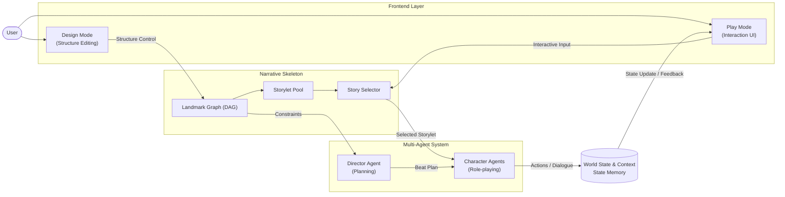
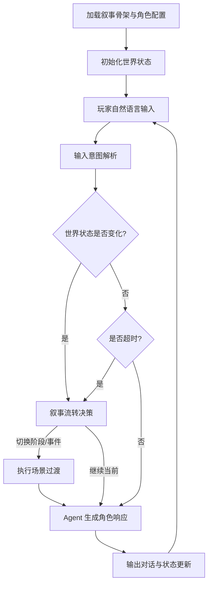
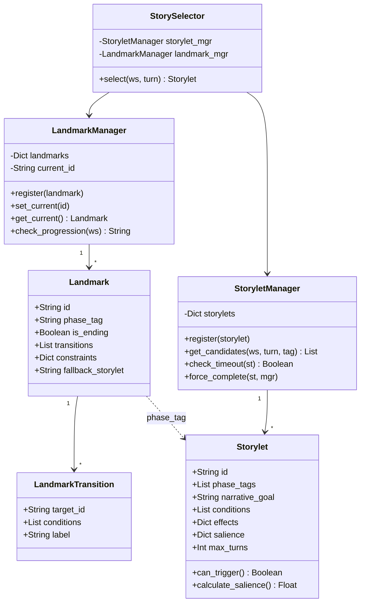
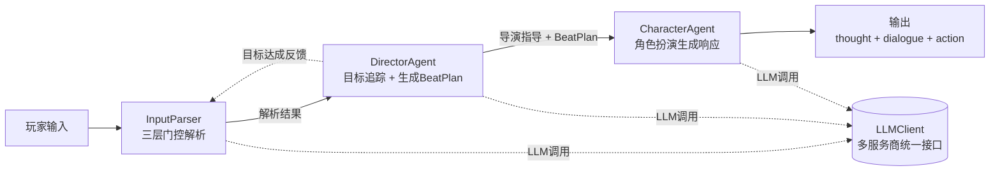
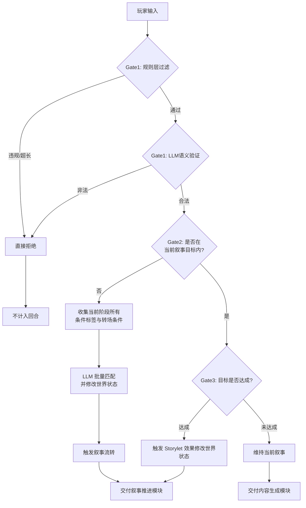
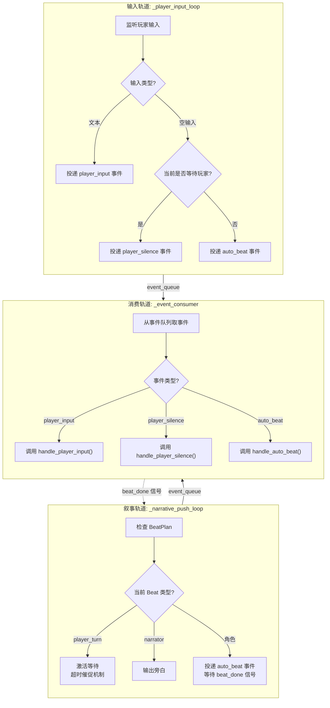
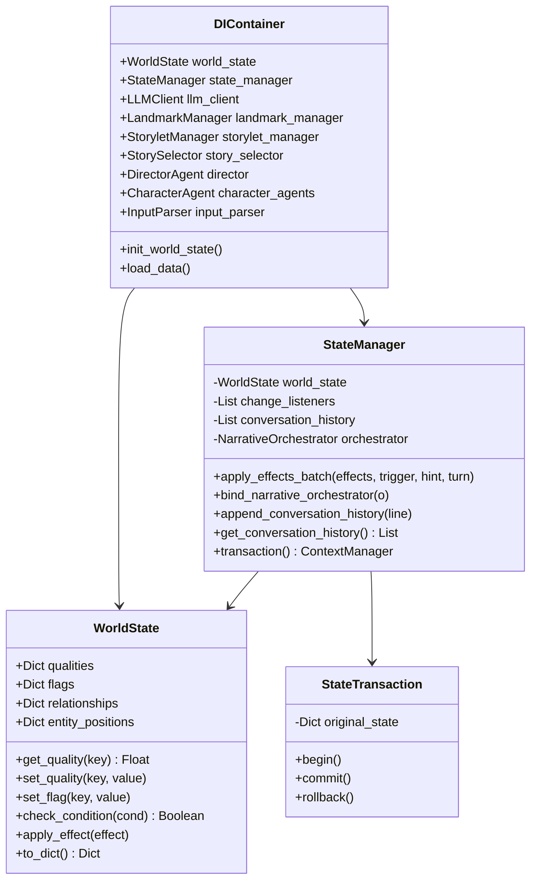

# 第三章 自适应剧情分支系统设计与实现

> **文档性质**：技术文档大纲
> **生成日期**：2026-05-15
> **基于代码版本**：prototype/ + frontend/ 当前代码库

***

## 3.1 系统总体设计 (4页)

### 3.1.1 设计思想 (2页)

- **内容描述**：阐述互动叙事系统的核心矛盾——叙事连贯性与玩家行动自由之间的张力；介绍"预设计叙事骨架 + 运行时多智能体内容生成"混合架构的设计动机，说明该架构如何避免分支树组合爆炸同时确保涌现式叙事的可控性。
详细内容描述：
  互动叙事系统的核心挑战在于平衡叙事连贯性与玩家行动自由之间的内在张力。传统分支叙事结构通过预定义所有可能路径来保证叙事可控性，但随着叙事复杂度的提升，分支树的组合爆炸问题导致内容创作成本呈指数级增长，难以构建具有深度和广度的沉浸式体验。与此相对，纯涌现式叙事虽然赋予玩家充分的行动自由度，却容易出现叙事失控、情节偏离主线等问题，导致整体故事失去核心戏剧张力。涌现式叙事依赖系统规则与角色行为的交互作用自发产生故事情节，其优势在于每次游玩体验的独特性和不可预测性，但缺乏对叙事整体走向的约束力，使得故事可能陷入无意义的循环或偏离预设的戏剧性弧线。
  本研究基于Senanayake提出的Triangle Framework理论框架与Kreminski和Wardrip-Fruin分析的Storylet叙事模型，提出一种融合预设计叙事骨架与运行时多智能体内容生成的混合架构。互动叙事系统的设计空间可划分为三个相互制约又相互促进的维度：作者控制（Authorial Control）、玩家代理（Player Agency）和系统涌现（System Emergence）。作者控制代表叙事设计师对故事走向的预设约束，是确保叙事连贯性和戏剧性的基础；玩家代理体现玩家在叙事中的自由度与影响力，是互动叙事区别于线性叙事的核心特征；系统涌现则指在系统规则驱动下自发产生的叙事内容，是实现叙事丰富性和重玩价值的关键机制。三者构成一个动态平衡的三角形，任意维度的过度强化都可能导致另外两个维度的削弱，因此互动叙事系统设计的核心挑战在于找到三者的平衡点。
  本文构建了"叙事骨架+多智能体协作生成"的双层架构来实现三个维度的协同：首先将作者控制维度具象化为叙事骨架层，该层通过Landmark（阶段级叙事节点）和Storylet（场景级叙事单元）的组合，定义故事的高层走向、关键节点和转折点。Storylet模型的核心思想是将叙事分解为离散的、可组合的叙事片段，每个片段具有明确的触发条件和效果，这种模块化设计使得叙事结构既具有灵活性又保持可控性。其次，将系统涌现维度具象化为多智能体内容生成层，通过DirectorAgent和CharacterAgent的协作，在Storylet约束下动态生成具体的对话内容、角色反应和情感细节。DirectorAgent作为"叙事导演"，负责生成BeatPlan（叙事节拍序列）和指导性指令；CharacterAgent作为"角色扮演者"，在导演指导下生成符合角色设定的台词和动作。最后，玩家代理维度通过自然语言自由输入机制予以实现，玩家可以不受预定义选项限制，以自然语言形式自由表达意图，系统通过InputParser进行合法性验证和语义条件匹配，将玩家输入与叙事骨架进行关联。
  这种设计的创新之处在于两大理论框架的深度融合：Triangle Framework提供了宏观的设计空间定位，确保系统在作者控制、玩家代理和系统涌现之间保持平衡；Storylet模型提供了微观的叙事结构组织方式，为作者控制提供了具体的实现载体；而多智能体架构则为系统涌现提供了技术支撑，使得叙事内容能够在骨架约束下动态生成。叙事骨架层负责定义故事的"发生什么"（What），确保叙事始终沿着预设的戏剧性弧线推进；多智能体内容生成层负责实现"如何发生"（How），使叙事在骨架约束下保持足够的丰富性与动态性。这种分工既避免了传统分支叙事的组合爆炸问题——因为骨架层仅定义关键节点而非全部路径，又确保了纯涌现式叙事的可控性——因为所有涌现内容均在骨架约束的边界内生成，从而在理论层面实现了叙事质量与玩家自由度之间的有效平衡。

***

### 3.1.2 系统总体架构设计 (2页)

- **内容描述**：以分层架构图（前端交互层 / WebSocket 通信层 / 游戏会话层 / 叙事骨架层 / 内容生成层 / 状态管理层 / 叙事推进引擎）展示系统全貌。明确各层职责边界：前端交互层负责可视化编辑（Design 模式）与实时游戏体验（Play 模式），通过 WebSocket JSON 协议与后端通信；游戏会话层（GameSession）管理单次会话生命周期并协调模块间数据流转；叙事骨架层维护只读的 Landmark DAG 结构 + Storylet 池；内容生成层由 InputParser → DirectorAgent → CharacterAgent 三级 Agent 协作完成动态对话生成；状态管理层以 WorldState 为叙事黑板驱动条件判断与效果触发；叙事推进引擎（GameEngine + GameEventLoop）协调三轨并发调度。点明核心设计原则"骨架管发生什么，Agent 管怎么发生"。
- **详细内容描述**：
  本系统采用分层架构设计，其核心设计原则为"叙事骨架界定故事的发生范畴，多智能体系统负责故事的具体呈现方式"——即由预定义的 Landmark 有向无环图与 Storylet 事件池约束叙事的宏观走向与关键转折点，由 Director Agent 与 Character Agent 在骨架边界内通过大语言模型动态生成具体的对话内容与角色行为。系统整体可划分为前端交互层、叙事骨架层、多智能体内容生成层以及贯通各层的共享世界状态四个核心组成部分，各层之间职责边界清晰且通过明确的数据接口相互协作。

  前端交互层面向终端用户提供两种互补的工作模式。Design 模式服务于叙事设计师，提供叙事骨架的可视化编辑能力：用户通过图形界面构建 Landmark 阶段节点的有向无环图拓扑结构，定义各阶段所允许的 Storylet 类型标签与叙事约束条件（如禁止在此阶段揭露的叙事信息），并为每个 Storylet 配置触发前置条件、叙事目标、内容基调与后置效果。该模式下编辑产生的结构化数据构成系统的只读叙事骨架，在后续运行时不被任何智能体修改。Play 模式则面向最终玩家，承载实时游戏交互体验：玩家以自然语言输入与虚拟角色进行对话，系统实时推送角色台词、动作描述与内心独白，同时通过状态面板同步展示世界状态变量的变化轨迹。两种模式通过 WebSocket JSON 协议与后端游戏会话层进行双向通信，实现了叙事内容编辑与实时游玩体验的无缝衔接。

  叙事骨架层是系统叙事控制的核心基础设施，在运行时保持只读状态，确保故事始终沿预设的戏剧性弧线推进。该层以 Landmark 有向无环图定义故事的高层阶段走向：每个 Landmark 节点代表一个叙事阶段（如"做客初见""关系裂缝""摊牌与抉择"），通过出边声明向后续阶段的跳转条件——条件判定基于世界状态中的标记值与品质值，采用 OR 语义即任一条件满足便可触发阶段推进。结局节点通过与普通节点统一的 is\_ending 字段进行建模，无需独立的结局处理逻辑。每个 Landmark 阶段下挂载若干 Storylet 构成该阶段的叙事事件池，Storylet 作为最小可执行叙事单元，包含了触发前置条件（标记检查、品质阈值）、叙事目标描述、导演注释、情绪基调以及完成后的世界状态后置效果等元数据。Story Selector 在叙事骨架中承担关键调度角色：在每个交互回合中，Selector 同时接收来自 Play 模式的玩家输入与来自 Design 模式的骨架约束，对当前阶段的事件池执行候选筛选——首先依据阶段标签进行范围过滤，继而检查各 Storylet 的结构性前置条件是否满足，最后通过 Salience 动态评分机制（基础分结合世界状态修正量与优先级加成）选出最优事件。若无满足条件的候选事件，系统自动回落至当前阶段配置的兜底 Storylet，确保叙事推进的连续性。

  多智能体内容生成层模拟戏剧制作中的导演与演员协作关系，实现叙事规划与角色扮演的职责分离。Director Agent 扮演叙事导演的角色：从 Landmark 层获取当前阶段的叙事约束（如允许的事件标签范围与禁止揭露的秘密信息），结合当前选定的 Storylet 内容与世界状态快照，通过大语言模型生成逐拍对话计划（Beat Plan）——每个 Beat 指定发言者、受话者、叙事意图与紧迫程度，为后续的角色表演提供高层调度框架。Character Agent 扮演角色演员的角色：接收 Director Agent 发出的 Beat 指令与 Story Selector 选定的场景上下文，注入完整的角色档案（包括身份设定、性格特征、背景故事、秘密知识及禁忌词汇列表），通过单次大语言模型调用同步产出内心独白、口头台词与结构化动作序列三类输出。内心独白目前仅作为调试信息呈现，不向玩家展示；台词与动作则构成玩家实际感知的角色行为。这种导演规划与演员表演的分离设计，使得叙事意图的宏观控制与对话细节的微观生成解耦，既保证了叙事推进的方向性，又保留了角色表现的丰富性与不可预测性。

  上述各层围绕 World State 与 Context 构成完整的数据闭环。World State 作为系统的共享叙事黑板，统一管理数值型品质（如紧张度、角色信任值）、布尔型标记（如某秘密是否已被揭露）以及角色间关系数值三类状态变量。Character Agent 产出的对话内容与行为结果实时写入世界状态；状态变更一方面触发 Narrative Orchestrator 的叙事流转检测——检查 Landmark 转场条件是否满足或是否存在更优的 Storylet，从而驱动叙事阶段的自然推进——另一方面通过 WebSocket 向 Play 模式推送状态更新快照，驱动前端界面的实时刷新。这一闭环机制使得系统能够在无人干预的情况下，自发地从初始场景逐步推进至结局节点，形成从叙事结构预定义到运行时内容涌现、再到状态持久化与界面反馈的完整自动化流水线。
- **图 3-1 系统分层架构总图**：

> **图表说明**：图 3-1 展示系统核心架构，体现"骨架管发生什么，Agent 管怎么发生"的分层设计原则——Narrative Skeleton 维护只读的 Landmark DAG + Storylet 池定义故事走向，Multi-Agent System 在骨架约束内动态生成具体对话内容，World State & Context 贯通各层作为共享叙事黑板。

***

## 3.2 系统整体流程设计 (5页)

- **内容描述**：系统运行时流程以回合制交互循环为核心，分为三个阶段。**初始化阶段**：加载叙事骨架配置与角色设定，建立初始世界状态，生成首轮开场内容。**主循环阶段**（每回合）：接收玩家自然语言输入 → 解析输入意图并判断是否引发世界状态变更 → 若状态变化或当前叙事事件超时，触发叙事流转决策，决定进行阶段/事件切换或维持当前推进 → 智能体（Agent）根据当前叙事上下文生成角色对话与动作 → 输出内容并更新状态快照，进入下一回合。**场景过渡阶段**：当阶段切换条件满足时，执行过渡流程以衔接新旧叙事阶段。
- 详细内容描述：\
  系统运行时流程以回合制交互循环为基本调度单元，整体可划分为初始化阶段、主循环阶段与场景过渡阶段三个有机衔接的时空段落。每一完整回合以玩家的单次交互行为（文本输入、移动操作或沉默等待）为触发边界，系统在回合内依次执行输入解析、状态变更判定、叙事流转决策与内容生成四项核心任务，最终以角色对话输出与状态快照推送作为回合终结标志并自动进入下一轮循环。

  初始化阶段承担从静态配置到运行时态的转换职责。系统启动时，前端将叙事设计师在 Design 模式中编辑的结构化场景数据——包含 Landmark 阶段节点的有向无环图拓扑、各阶段关联的 Storylet 事件池、角色身份档案与秘密知识配置、以及世界状态的初始变量定义——通过单次 init\_scene 消息下发至后端游戏会话层。后端 GameSession 据此按序完成以下初始化动作：依据世界状态定义建立 qualities、flags、relationships 三类状态变量的初始赋值；加载 Landmark 注册表并设定起始阶段节点；加载全部 Storylet 至事件管理器并完成条件索引构建；依据角色配置为每个非玩家角色创建独立的 CharacterAgent 实例并注入其完整的身份、性格、背景与秘密知识档案；初始化 DirectorAgent 的叙事目标追踪器。待全部模块就绪后，系统通过 StorySelector 在起始阶段的候选事件池中执行首次选择——基于初始世界状态检查各 Storylet 的前置条件与可重复性约束，通过 Salience 评分机制选出最优事件作为当前执行单元，应用其进入效果以设定初始叙事基调，随后调用 DirectorAgent 生成首个 BeatPlan 作为后续内容生成的调度依据。初始化完成后，系统向后端推送首次 state\_update 快照与开场消息至前端 Play 模式展示。

  主循环阶段是系统运行的核心时序，每回合遵循“输入→解析→判定→决策→生成→输出”的六步流水线。回合起始于玩家自然语言输入的接收：InputParser 作为输入守门人，对原始文本执行三层串联门控检测。第一层为规则过滤层，以零大语言模型成本快速识别元对话内容（如询问系统身份）、显式物理违规动作（如破坏场景物品）以及超长输入等异常情况，依据违规严重程度分别采用直接拒绝、偏转引导或困惑回应三种处置策略；通过规则层的合法输入进入第二层语义验证层，由大语言模型结合当前场景描述与叙事上下文综合判断输入的合法性与可接受度。合法性验证通过后进入第三层意图解析层：系统判断该输入是否处于当前 Storylet 的叙事目标推进范围内。若输入偏离叙事目标，InputParser 收集当前 Landmark 阶段下全部 Storylet 的条件标签与转场条件描述，交由大语言模型执行批量语义匹配——识别玩家输入所命中的结构化条件标识，并生成对应的世界状态变更指令（如降低某角色的信任值、标记某秘密已被触及）。若输入在叙事目标内，系统进一步评估该回合是否达成了当前 Storylet 的叙事目标，达成时触发相应后置效果的应用。

  意图解析完成后进入状态变更判定环节。StateManager 接收 InputParser 产出的世界状态变更指令，通过批量效果应用接口将变更写入 WorldState 的三类变量。此处区分两种写入模式：驱动型变更（is\_narrative\_trigger 置为 True）在状态落盘后自动通知已绑定的 NarrativeOrchestrator 执行叙事流转检测；静默型变更（如对话历史的追加记录）则不触发叙事检测。叙事流转检测按优先级执行三路决策：首先检查当前 Landmark 的出边转场条件是否因状态变更而满足——若某转场的标记与品质条件全部成立，或当前阶段回合数已达兜底上限，则触发 Landmark 阶段切换，选定新阶段的首个 Storylet 并生成阶段过渡日志；若阶段无需切换，则检查当前阶段的事件池中是否存在 Salience 评分高于当前事件的更优 Storylet，若存在则触发 Storylet 事件切换并应用旧事件的完成效果；若前两项均不满足，则维持当前叙事事件继续推进。值得注意的是，系统设计了 max\_turns 超时兜底机制作为防卡死保障：当玩家连续多轮回合的输入均未引发世界状态变化（如纯粹闲聊或刻意回避叙事主线），Storylet 的回合计数在达到预设上限后，StoryletManager 将强制完成当前事件并应用其后置效果，通过效果对世界状态的修改打破僵局，从而推动叙事流转决策的发生。

  叙事流转决策完成后进入内容生成环节。若发生了阶段或事件切换，GameEngine 首先同步更新当前 Storylet 引用与回合计数器，随后将新的叙事目标传递给 DirectorAgent，DirectorAgent 的 GoalTracker 重置目标进度状态并调用大语言模型生成新的 BeatPlan 对话节拍序列——每个节拍指定发言角色、受话对象、叙事意图与紧迫程度，为角色 Agent 的表演提供结构化调度框架。若叙事流转判定为继续当前事件且当前 BeatPlan 尚有未执行的节拍，则直接消耗当前 BeatPlan 的下一节拍。CharacterAgent 接收当前 Beat 指令后，构建包含角色身份、性格特征、背景故事、秘密知识、导演指导、当前场景上下文及近期对话历史的完整提示词，单次调用大语言模型同步产出三个维度的响应：内心独白揭示角色的隐秘想法与情感张力，台词文本构成玩家直接感知的口头对话，结构化动作序列描述角色的肢体行为与空间位移。响应生成后通过 NG 词汇检测与重试机制保证输出质量，最终经由 WebSocket 将三类响应及更新后的世界状态快照推送至前端 Play 模式。

  场景过渡阶段作为阶段切换的衔接缓冲，确保叙事在跨越 Landmark 边界时保持情感与逻辑的连续性。当 NarrativeOrchestrator 判定 Landmark 转场条件满足后，系统在正式进入新阶段之前调用 DirectorAgent 生成衔接 BeatPlan——该过渡序列通常包含氛围变化、话题转移或环境叙事等类型的过渡节拍，通过角色的情绪反应、动作行为或旁白叙述自然弥合前后阶段的语境差异，避免生硬的阶段跳切。过渡序列执行完毕后，系统应用新 Landmark 的阶段进入效果以设定新阶段的初始叙事基调，随后切换到新阶段的首个 Storylet 并刷新 BeatPlan，叙事正式进入新的篇章。整个运行时流程以此循环往复，从玩家输入的解析到世界状态的演变，从叙事阶段的推进到角色内容的生成，各环节通过 WorldState 这一共享叙事黑板实现状态的持久化与模块间的数据解耦，构成一个完整的、可自驱推进的交互叙事闭环。
- **图 3-2 系统整体运行时流程**：

***

## 3.3 技术方案设计 (6页)

### 3.3.1 后端技术栈 (2页)

- **内容描述**：
  - **编程语言与环境**：Python 3.x 作为主要开发语言，利用其异步编程生态（asyncio）与 LLM SDK 兼容性。
  - **LLM 调用层**：LLMClient 封装 OpenAI API 兼容格式，支持 GPT-4o / GPT-4o-mini / DeepSeek / Claude 等多模型服务商切换；通过 `.env.local` 配置 `LLM_PROVIDER` 和 `LLM_MODEL`；内置 `on_debug` 回调机制实现 WebSocket 模式下的 LLM 调试信息实时推送。
  - **异步通信框架**：FastAPI + uvicorn 提供 HTTP (`/api/health`) 与 WebSocket (`/ws/play`) 双端点；`asyncio.run_in_executor()` 将同步 LLM 调用放入线程池，避免阻塞主事件循环。
  - **数据结构与校验**：Python dataclass 定义 WorldState / Storylet / Landmark / Beat 等核心数据结构；Pydantic BaseModel（ScenarioSchema）用于前端传入场景数据的类型校验。
  - **日志系统**：`core/logging.py` 统一配置，支持分级日志记录与文件分离存储（`facaderemake.log` / `ws_server.log` / `ws_server_err.log`）。
  - **依赖管理**：`requirements.txt` 管理 `openai` / `python-dotenv` / `fastapi` / `uvicorn` 等核心依赖。
- 详细描述：\
  后端系统以 Python 3.x 为主要开发语言。选择 Python 作为技术底座基于以下考量：其一，Python 内建的 asyncio 异步编程框架为 I/O 密集型应用提供了高效的协程调度能力，使得系统能够在单线程事件循环中并行处理 WebSocket 长连接维护与多路大语言模型 API 调用；其二，openai 等主流大语言模型 SDK 均以 Python 为第一支持语言，在 prompt 构建、响应解析、错误重试等环节具备最成熟的工具链支撑。系统通过 python-dotenv 管理环境变量，将 API 密钥、模型名称、服务商选择等敏感配置与代码逻辑分离，支持 .env.local 本地覆盖机制以适应开发与部署环境差异。

  在语言模型调用层面，系统设计了统一的 LLMClient 封装层。该层基于 OpenAI API 兼容格式构建，通过 Provider 预设配置表支持 GPT-4o、GPT-4o-mini、DeepSeek-Chat 及 Claude 等多模型服务商的透明切换——上层调用代码无需感知底层服务商差异，仅需修改 LLM\_PROVIDER 环境变量即可完成迁移。LLMClient 对外提供两种调用模式：chat\_completion 接口接收标准的 role/content 消息列表，适用于需要系统提示词注入的多轮对话场景；call\_llm 接口接收单段 prompt 文本，适用于简单的判断与评估类调用。每个 LLM 请求均携带组件标签（如 InputParser/Gate1、Director/BeatPlan），内置的 on\_debug 回调机制在 WebSocket 模式下将每次调用的请求参数、响应内容与耗时信息实时推送至前端 DebugPanel，为开发者提供完整的调用链可观测性。考虑到大语言模型 API 调用的同步阻塞特性，系统统一通过 asyncio.run\_in\_executor 将 LLM 调用放入线程池执行，确保主事件循环不被阻塞，从而维持 WebSocket 消息处理与前端交互的实时响应。

  异步通信层采用 FastAPI 框架配合 uvicorn 异步服务器构建。FastAPI 基于 Starlette 的 WebSocket 原生支持与 Pydantic 的数据校验能力，为系统提供了 HTTP 健康检查端点与 WebSocket 全双工游戏通信通道两类服务接口。HTTP 端点 /api/health 供运维监控使用，返回服务器运行状态与当前活跃会话数；WebSocket 端点 /ws/play 承载前端与后端的实时双向通信，支持 JSON 格式的结构化消息协议，涵盖场景初始化、玩家输入、角色对话、状态快照、LLM 调试日志、位置导航等十余种消息类型。每个 WebSocket 连接对应一个独立的 GameSession 实例，由 GameSession 管理该会话从初始化到结束的完整生命周期，协调各内部模块间的数据流转与异步任务调度。

  在数据结构定义方面，系统采用 Python dataclass 作为核心数据模型的声明方式。WorldState 以 dataclass 管理 qualities、flags、relationships、entity\_positions 四类状态字典，通过 get/set 方法提供类型安全的读写接口。Storylet 与 Landmark 同样以 dataclass 定义其字段结构与默认值，其中 LandmarkTransition 作为嵌套数据类描述 Landmark 的出边条件。Beat 数据类封装导演指令的结构化表示，包含发言者、受话者、叙事意图、紧迫程度与状态变化预测等字段。系统通过 Pydantic BaseModel（ScenarioConfig）对前端传入的 init\_scene 数据进行全量结构化校验——包括 Landmark 的 DAG 拓扑合法性、Storylet 的条件与效果字段完整性、Character 档案的必填字段检查——在校验层拦截格式错误，避免运行时因数据不一致导致的异常。

  日志系统通过 core/logging.py 模块统一配置，采用 Python 标准 logging 库的分级架构，将运行日志按模块来源与严重级别分流输出。正常运行信息（如回合计数、Storylet 切换、BeatPlan 生成）记录至主日志文件 facaderemake.log；WebSocket 连接与消息收发事件记录至 ws\_server.log；异常堆栈与错误信息单独输出至 ws\_server\_err.log。分级分流的设计使得问题定位与性能分析可针对性地查阅对应日志文件，避免混合日志的信息淹没。项目依赖通过 requirements.txt 集中声明，涵盖 openai（大语言模型 SDK）、python-dotenv（环境变量管理）、fastapi 与 uvicorn（异步 Web 框架）四个核心依赖，安装即用，无需额外的系统级配置。

***

### 3.3.2 前端技术栈 (2页)

- **内容描述**：
  - **UI 框架与语言**：React 19 + TypeScript，实现类型安全的组件化开发。
  - **构建工具**：Vite 5.4，提供 HMR 热更新开发体验。
  - **状态管理**：Zustand v5 + Immer middleware 管理全局状态；三个 Store 职责分离（`useProjectStore` 设计模式数据 / `usePlayStore` 游戏运行时数据 + WebSocket 管理 / `useStore` 项目级 CRUD + undo/redo）。
  - **可视化编辑**：React Flow（`@xyflow/react`）v12 实现 Landmark 有向无环图的拖拽编辑，自定义 LandmarkNode 与 TransitionEdge 组件，支持条件转场/计数转场/回合限制转场/兜底转场四种边类型的视觉区分。
  - **实时通信**：原生浏览器 WebSocket API，单例管理 + 自动重连（指数退避，最大 5 次）+ 待发送消息队列防丢。
  - **样式方案**：TailwindCSS v4 + CSS Variables，实现 Windows 90s Retro 视觉主题（bevel 边框、像素化按钮、等宽字体命令行风格）。
  - **开发辅助**：ESLint 代码规范检查；TypeScript 严格模式。
- 详细描述：\
  前端系统基于 React 19 框架配合 TypeScript 语言构建。React 19 的函数组件与 Hooks 机制为交互密集型的叙事编辑器与游戏界面提供了声明式、可组合的 UI 开发范式；TypeScript 的静态类型检查则在全量数据结构与组件 Props 层面提供了编译期安全网——types.ts 文件定义 Landmark、Storylet、CharacterProfile、WorldStateDefinition、ChatMessage 等所有核心类型，与后端 Python dataclass 一一对应，确保前后端数据契约的一致性。构建工具选用 Vite 5.4，利用其基于 esbuild 的预构建与原生 ES 模块开发服务器实现秒级冷启动与模块热更新，显著提升开发迭代效率。

  状态管理采用 Zustand v5 配合 Immer middleware 的架构。Zustand 以其极简的 API 设计（单个 create 函数即完成 Store 定义）与基于选择器的细粒度订阅机制，在保持代码简洁的同时避免了传统 Redux 的模板代码冗余；Immer 中间件允许以可变语法编写状态更新逻辑，自动生成不可变快照以支持状态变更追踪与调试。系统按职责划分三个独立 Store：useProjectStore 管理 Design 模式下叙事蓝图的编辑状态，包含 Landmark 列表、Storylet 集合、角色配置数组与世界状态变量定义，支持基于快照栈的撤销与重做操作，历史深度上限为五十步；usePlayStore 管理 Play 模式下的游戏运行时状态，包含对话消息列表、运行时世界状态、当前 Landmark 与 Storylet 标识、加载状态、游戏结束标志以及大语言模型调试日志，同时内置 WebSocket 连接管理逻辑；useStore 提供项目级数据访问功能，作为 Design 模式各编辑面板的数据读写中枢。

  可视化编辑能力由 React Flow（@xyflow/react）v12 库提供。React Flow 为节点-边图编辑器提供了开箱即用的渲染引擎、拖拽交互、视口平移缩放与连线绘制等基础能力。系统在其上构建了三个自定义组件：LandmarkCanvas 作为画布容器，管理节点与边的增删改查操作、多选批量拖拽的偏移量同步以及通过自定义 PointerEvent 实现的中键平移功能；LandmarkNode 以差异化颜色方案区分普通阶段节点与结局节点（is\_ending），在视觉上直观表征叙事阶段在故事弧线中的位置属性；TransitionEdge 通过边标签、颜色编码与虚线动画区分四种转场条件类型——基于世界状态的条件转场、基于计数上限的计数转场、基于回合上限的回合限制转场以及无条件兜底转场，使叙事设计师得以在 DAG 拓扑图中一目了然地理解各阶段推进的逻辑语义。

  实时通信层基于浏览器原生 WebSocket API 构建，封装了连接生命周期管理、消息收发与异常恢复三项核心能力。系统采用单例模式维护 WebSocket 连接实例，通过 pendingMessages 队列缓存连接建立前的待发送消息以防止消息丢失；连接断开时自动触发指数退避重连机制，最大重试次数设为五次，重连成功后优先发送缓存的 pendingSceneData 以恢复游戏状态。前后端通信采用结构化 JSON 消息协议，前端向后端发送的消息类型涵盖 init\_scene（场景初始化）、player\_input（玩家文本输入）、move\_location（位置移动）与 debug\_worldstate（调试状态修改）；后端向前端推送的消息类型涵盖 chat（角色对话与旁白）、state\_update（完整世界状态快照）、player\_turn（等待玩家输入信号）、llm\_debug（大语言模型调用详情）、location\_update（位置变更通知）等十余种事件类型。

  样式方案采用 TailwindCSS v4 原子化工具类配合 CSS Variables 自定义属性。全局设计语言借鉴 Windows 90s Retro 视觉美学——通过 CSS Variables 定义统一的 bevel 高光/阴影色值、像素化等宽字体栈、凹陷与凸起的 box-shadow 效果变量，组件通过组合原子类（如 border-2、shadow-retro-in、font-mono）即可获得一致的复古视觉风格。系统的两大模式在 UI 风格上各有侧重：Design 模式以功能性的属性面板布局为主，强调数据编辑的高效性；Play 模式则营造沉浸式的戏剧体验，命令行风格的输入框、打字机效果的对话逐字呈现以及分段色块区分叙事阶段的设计，共同服务于互动叙事的氛围营造。开发辅助层面，项目配置 ESLint 代码规范检查与 TypeScript 严格模式以确保代码质量的一致性。

***

### 3.3.3 模块设计模式 (2页)

- **内容描述**：
  - **依赖注入模式**（DIContainer）：`core/di_container.py` 统一管理各模块实例，采用惰性初始化（Property + lazy init）确保依赖解析的正确顺序，消除模块间的直接耦合。
  - **观察者模式**（WorldState → StateManager → NarrativeOrchestrator）：WorldState 通过 `add_change_listener()` 注册监听器；StateManager 的 `apply_effects_batch()` 在状态变更时自动通知已绑定的 NarrativeOrchestrator，实现"状态变化 → 叙事流转"的解耦回调链。
  - **策略模式**（StorySelector）：`select()` 方法内部封装三层过滤（标签过滤 → 条件过滤 → Salience 评分）+ 可选的第四层 LLM 评估器，各层策略可独立替换。Salience 评分中的 modifiers 机制支持基于 WorldState 的动态优先级调整。
  - **工厂与模板方法模式**（CharacterAgent 三步生成）：`generate_response()` 定义 `_generate_inner_thought() → _select_behavior() → _generate_dialogue()` 的标准执行流程，子步骤各自独立调用 LLM 并传递中间结果。
  - **异步非阻塞设计**：所有 LLM 调用（同步阻塞）通过 `asyncio.run_in_executor()` 在线程池中执行；GameEventLoop 通过 `asyncio.gather()` 并行运行三条协程（`_player_input_loop` / `_narrative_push_loop` / `_event_consumer`）。
  - **事务模式**：StateManager 的 `transaction()` 上下文管理器支持原子性状态更新与回滚；`_snapshots` 历史栈支持状态回溯。
  - **门控模式**（InputParser）：三层串联门控结构——Gate1（合法性）→ Gate2（叙事目标判断）→ Gate3（GoalTracker 目标达成检测），前层阻断则不进入后层。
- 详细描述：\
  系统在设计层面综合运用了多种经典软件设计模式，以在保持代码可维护性与可扩展性的同时支撑互动叙事场景的复杂逻辑需求。以下按各模块核心职责阐述所采用的模式及其设计动机。

  依赖注入模式应用于 DIContainer 模块。互动叙事系统涉及 WorldState、LandmarkManager、StoryletManager、StorySelector、InputParser、DirectorAgent、CharacterAgent（每个角色一个实例）、LLMClient、StateManager、NarrativeOrchestrator、GameLogWriter 等十余个模块实例，各模块间存在复杂的交叉依赖关系。若采用直接构造的方式管理这些依赖，模块间将形成强耦合的网状引用，任何模块的初始化顺序变更或接口修改都可能引发连锁的代码调整。DIContainer 以惰性初始化（Property + lazy init）模式统一托管全部模块实例：每个实例的获取通过 @property 装饰器封装，首次访问时按正确的依赖顺序执行创建与注入，后续访问直接返回已缓存的实例引用。这一设计消除了模块间的直接构造依赖，使得各模块可以独立开发、独立测试，依赖关系的变更仅需在 DIContainer 中调整初始化顺序即可。

  观察者模式贯穿于 WorldState、StateManager 与 NarrativeOrchestrator 的协作关系中。在叙事系统中，世界状态的变化是驱动叙事推进的根本动力——Landmark 转场条件满足、Storylet 切换判定、GameLog 生成触发均依赖于状态变更事件。若采用轮询方式检测状态变化，将引入不可控的时延与资源浪费。系统通过 StateManager 的 apply\_effects\_batch 接口建立状态变更到叙事流转的解耦回调链：当任何模块通过 StateManager 修改 WorldState 变量时，若变更标记为驱动型（is\_narrative\_trigger=True），StateManager 在完成状态落盘后自动通知已绑定的 NarrativeOrchestrator，由后者执行三路叙事决策。当仅需追加对话历史等不触发叙事的操作时，将触发器标记置为 False，状态变更静默执行。观察者模式的关键优势在于：状态变更的发起方（InputParser、StoryletManager、GameEngine）无需知晓叙事流转的具体检测逻辑，叙事流转的检测方（NarrativeOrchestrator）也无需关心状态变更的来源——两者通过 StateManager 这一中介实现松耦合，任何新增的状态变更来源均可自动纳入叙事流转体系。

  策略模式集中体现在 StorySelector 的候选事件筛选流程中。叙事系统的核心调度需求是在每个交互回合从当前阶段的事件池中选出最适合当前叙事情境的 Storylet 执行，而选择的依据是多维度的——叙事阶段约束、世界状态条件、语义触发匹配、动态优先级评分——且不同叙事场景可能对不同维度的权重有差异化需求。StorySelector 的 select 方法将筛选过程设计为可组合的策略链：第一步标签过滤策略依据当前 Landmark 阶段允许的 Storylet 标签范围进行候选集裁剪；第二步条件过滤策略逐一检查各候选 Storylet 的结构性前置条件（标记检查、品质阈值、冷却时间）是否满足；第三步 Salience 评分策略基于基础分结合世界状态驱动的修正量（modifiers）进行排序择优；第四步为可选的大语言模型评估策略，将前三步的前三名候选交由大语言模型进行语义层面的二次评估。各层策略独立封装，可单独测试与替换——例如当条件数量较少时关闭 LLM 评估层以降低延迟，当需要更精准的叙事控制时启用该层——策略组合的灵活性使得选择机制可适配不同复杂度的叙事场景与不同的性能约束。

  模板方法模式体现于 CharacterAgent 的角色响应生成流程中。角色响应生成是一个多步骤的复杂流程，包含内心独白构建、行为模式选择与台词动作合成三个阶段，每个阶段涉及不同的 prompt 构建逻辑与参数配置（如温度系数在内心独白阶段设为 0.75 以保留情感张力，在行为选择阶段设为 0.1 以追求确定性，在台词生成阶段设为 0.6 以兼顾创造性与可控性）。generate\_response 方法定义了响应的标准执行流程框架，各个子步骤（内心独白生成、行为选择、台词合成）由对应的内部方法实现，子步骤的输出作为后续步骤的上下文注入。这一设计使得响应生成的宏观流程保持稳定，而各子步骤的具体实现——如 Monologue 模板的选择策略、行为库的扩展、prompt 结构的优化——可在框架不变的前提下独立演进。

  异步非阻塞设计是本系统运行时性能的关键保障。互动叙事系统的核心性能瓶颈在于大语言模型 API 调用——单次对话生成调用耗时通常在数秒至十数秒之间，若在主线程中同步等待将导致整个游戏循环停滞，前端界面陷入无响应状态。系统通过在两个层面实施异步化来解决此问题。在调用层面，所有 LLMClient 的 API 请求均为同步阻塞调用，但 GameEngine 与 GameEventLoop 在调用 LLMClient 时统一通过 asyncio.run\_in\_executor 将同步调用放入线程池执行，调用线程立即返回等待中的协程句柄，主事件循环继续处理其他异步任务。在调度层面，GameEventLoop 通过 asyncio.gather 并行运行三条协程轨道：输入监听轨道持续以线程池方式读取玩家输入并投递至事件队列；叙事推进轨道按 BeatPlan 序列自动推进叙事，在玩家回合处暂停等待，在角色回合处投递 auto\_beat 事件并等待同步信号；事件消费轨道从队列逐一取出事件并在线程池中调用 GameEngine 对应的同步业务方法。双层面的异步化设计使得玩家的输入感知、对话的自动推进与 LLM 的远程调用三者互不阻塞，实现了流畅的游戏体验。

  事务模式应用于 StateManager 的状态更新管理中。叙事系统在单轮交互中可能涉及多个连续的状态修改操作——例如同时降低角色信任值、标记叙事事件已触发、更新位置分布——若某一中间步骤失败（如大语言模型返回格式异常导致效果无法解析），已执行的前序状态修改将导致 WorldState 处于不一致的中间态。StateManager 内置的 StateTransaction 类提供了原子性保障：begin 方法在事务开启时深拷贝当前 WorldState 的完整快照作为回滚基线；事务过程中的每个操作通过 apply\_delta 方法记录变更日志并实际执行；commit 方法在事务成功完成时归档变更日志并释放基线；rollback 方法在事务异常时用基线快照完整恢复 WorldState，确保异常发生前后的状态一致性。此外，StateManager 维护 \_history 变更栈以支持状态回溯与调试分析。

  门控模式体现于 InputParser 的三层串联检测结构中。在互动叙事系统中，玩家输入并非简单地直接传递至内容生成环节，而是需要经过合法性校验、叙事目标相关度判断与目标达成评估三重关卡。InputParser 的 analyze\_full 方法将三重关卡设计为串联门控：Gate1 负责输入的合法性与可接受度判断，通过规则层快速过滤后再由大语言模型执行语义验证；仅当 Gate1 判定合法后，输入才进入 Gate2 进行叙事目标相关度判断——若输入偏离当前叙事目标，系统跳转至批量条件匹配路径，收集当前阶段所有 Storylet 条件标签与转场条件交由大语言模型批量判断并生成世界状态变更指令；若输入在目标内，则进入 Gate3 由 GoalTracker 评估叙事目标是否达成。串联门控的核心设计价值在于：前层阻断即不进入后层，避免了无效输入消耗后续的大语言模型调用成本；各层门控的判定逻辑独立封装，可单独调试与优化。

***

## 3.4 系统实现 (19页)

### 3.4.1 叙事骨架模块 (3页)

- **内容描述**：叙事骨架模块是系统的结构性基础，以预设计、运行时只读的方式定义故事的阶段框架与事件池，确保叙事始终沿预设方向推进。该模块由三个核心组件构成：
  - **Landmark（叙事阶段节点）**：以有向无环图组织故事的高层走向，每个节点代表一个叙事阶段，通过出边声明可跳转的后续阶段及其触发条件（基于世界状态的条件组合）。结局节点统一建模（`is_ending`），每个阶段配置允许的 Storylet 标签范围与兜底事件。
  - **Storylet（叙事事件单元）**：场景级可执行叙事片段，包含触发前置条件、叙事目标、内容基调与后置效果，以及可重复性、冷却时间、最大回合数等调度参数。每个 Landmark 阶段下挂载若干 Storylet，构成该阶段的叙事事件池。
  - **StorySelector（事件选择器）**：在每个交互回合中，根据当前阶段标签过滤候选事件池，依据世界状态检查前置条件，并通过 Salience 动态评分（基础分 + 世界状态修正量 + 优先级加成）选出最优事件。无候选时自动回落至兜底事件。
- 详细内容描述：\
  叙事骨架模块是系统的结构性基础，以预设计、运行时只读的方式定义故事的阶段框架与事件池，确保叙事始终沿预设的戏剧性弧线推进而不会因玩家行为的不可预测性而偏离主线。该模块的核心设计理念在于将叙事控制的责任划分为两个互补的粒度层级：阶段级控制由 Landmark 有向无环图承担，定义故事从起始到结局的高层走向与关键转折点；事件级控制由 Storylet 事件池承担，定义每个阶段内可发生的具体叙事片段及其触发规则。这种分层控制策略使得叙事设计师可以在宏观层面保证故事结构的完整性，同时在微观层面为玩家交互留出充分的选择空间。

  Landmark 是叙事阶段节点的抽象表示，系统以有向无环图的形式组织全部 Landmark 节点。每个 Landmark 节点通过 id 字段建立唯一标识，通过 title 与 description 提供面向叙事设计师的可读描述，通过 phase\_tag 字段标记其在故事弧线中所处的功能阶段——例如在 Facade 晚宴场景中，phase\_tag 取值为 act1 至 act4，依次对应“做客初见”“关系裂缝”“摊牌与抉择”与“结局”四个戏剧阶段。节点通过 transitions 出边列表声明从当前阶段可跳转至哪些后续阶段，每条出边封装为一个 LandmarkTransition 对象，包含目标 Landmark 标识、转场条件列表与用于可视化展示的边标签。转场条件的判定基于世界状态中的标记值与品质值——检查某叙事事件是否已发生（如 trip\_confessed 标记是否为真）、某品质值是否跨越阈值（如 tension 是否大于预设临界值）、或当前阶段回合数是否达到兜底上限等——采用 OR 语义，即任一条件的组合满足便可触发阶段推进。这一设计使得叙事设计师可以配置多条平行推进路径：既可通过自然的状态演变到达新阶段，也可通过回合上限作为防卡死兜底机制，保证叙事不会因条件永不满足而停滞。结局节点通过与普通节点统一的 is\_ending 字段进行建模——当该字段为真时，Landmark 额外携带 ending\_content 字段存储结局叙事文本——无需独立的结局处理逻辑，简化了系统的结构复杂度。每个 Landmark 还维护 narrative\_constraints 字典，声明该阶段允许的 Storylet 标签范围（allowed\_storylet\_tags）与禁止大语言模型提及的叙事信息列表（forbidden\_reveals），前者决定了 StorySelector 在该阶段内的候选事件搜索空间，后者作为硬约束注入后续的内容生成层以防止叙事信息的不当提前揭露。此外，每个 Landmark 可配置 fallback\_storylet 字段指向一个兜底事件，当 StorySelector 在当前阶段内未能找到任何满足条件的 Storylet 候选时，系统自动回落至该兜底事件以维持叙事连续性。

  LandmarkManager 作为 Landmark 注册表与管理器的合一体，承担三项核心职责：其一，维护全部 Landmark 实例的注册映射，提供 register 方法供场景配置加载时批量导入 Landmark 节点；其二，追踪当前所处的叙事阶段，通过 set\_current 方法切换当前 Landmark 并触发该阶段的进入效果应用，通过 get\_current 方法向其他模块提供当前阶段的只读引用；其三，执行转场条件检测，check\_progression 方法遍历当前 Landmark 的出边列表，逐条检查每条出边的条件组合是否在给定世界状态下满足——若满足则返回目标 Landmark 标识以供叙事编排层执行阶段切换。此外，LandmarkManager 还维护回合计数与 Storylet 执行计数，为基于计数的转场条件提供数据支撑。

  Storylet 是叙事事件的最小可执行单元，代表一个持续若干回合的叙事片段。每个 Storylet 包含六类结构化字段。身份标识类字段——id、title、narrative\_goal——定义事件的基本描述与叙事目标，其中 narrative\_goal 文本将在后续的内容生成环节注入 DirectorAgent 与 CharacterAgent 的提示词，作为角色表演的高层目标导向。前置条件类字段——conditions 列表与 phase\_tags 列表——定义事件的触发资格：phase\_tags 作为粗粒度标签与 Landmark 的 allowed\_storylet\_tags 进行交集匹配，确定该事件在当前阶段是否可见；conditions 列表中的每个条件对象指定类型（如 flag\_check、quality\_check）、检查键、比较操作符与期望值，Storylet 的 can\_trigger 方法在调用时逐一验证这些条件是否被当前世界状态满足，同时还检查可重复性约束（如 repeatability 设为 never 且 times\_triggered 已大于零则该事件不可再触发）与冷却时间限制（如 cooldown 设定了最小间隔回合数且上次触发距今不足该间隔则暂不可用）。调度策略类字段——salience 字典、priority\_override 与 sticky 标记——决定事件在选择器中的优先级：salience 字典包含 base 基础分值与 modifiers 修正量列表，每个修正量指定一个 world\_state 键、阈值与达阈/未达阈时的加分/扣分值，使得事件的优先级可随世界状态动态变化；priority\_override 为关键叙事节点提供绝对的优先级加成；sticky 标记为真时事件一旦被选中便不会被自动切换，直至达到强制结束条件。内容配置类字段——content 字典包含 director\_note 导演注释与 tone 情绪基调——为本事件期间的 Agent 行为提供指导基调。后置效果类字段——effects 列表——声明事件完成时需要应用的世界状态变更操作。结束条件类字段——max\_turns 设定事件的最大持续回合数——为叙事推进提供兜底保障。此外，Storylet 还维护运行时状态字段（times\_triggered 与 last\_triggered\_turn）以追踪事件的触发历史。

  StoryletManager 作为 Storylet 的注册表与生命周期管理器，承担四项核心职责。事件的注册与查询：register 方法将 Storylet 实例存入内部字典，get 方法按标识检索单个事件，get\_storylets\_by\_landmark 方法按 Landmark 标识分组查询关联事件。候选事件筛选：get\_candidates 方法接收当前世界状态、回合数与阶段标签作为参数，首先以 phase\_tag 标签匹配进行粗筛，继而逐一调用每个 Storylet 的 can\_trigger 方法进行细粒度条件验证，返回完整通过筛选的候选事件列表。超时检测：check\_timeout 方法对比当前 Storylet 的已执行回合数与 max\_turns 阈值，判定是否达到强制切换时机。强制完成：force\_complete 方法在超时或叙事目标达成时调用，依次应用 Storylet 的 effects 后置效果列表中的每个效果至 WorldState，并以驱动型触发器模式通知 StateManager 进而触发叙事流转检测。

  StorySelector 是叙事骨架层的调度中枢，在每个交互回合中承担从当前阶段候选事件池中选出最优事件的职责。其 select 方法接收当前世界状态快照与当前回合数作为输入，执行如下决策流程。第一步，通过 LandmarkManager 获取当前阶段标识，进而获取该阶段允许的 Storylet 标签范围。第二步，调用 StoryletManager 的 get\_candidates 方法，以当前阶段标签为过滤参数获取通过结构性条件筛选的候选事件列表。第三步，对候选列表中的每个事件调用其 calculate\_salience 方法进行动态评分——该方法以事件的 base 基础分为起点，遍历 modifiers 修正量列表，对每个修正量检查指定的世界状态键的当前值是否达到阈值，达阈值则加 bonus 分、未达则扣 penalty 分，最后叠加 priority\_override 的绝对优先级加成——按得分降序排列候选列表。第四步，若候选列表非空，返回得分最高的事件作为选中结果；若候选列表为空，则返回当前 Landmark 配置的 fallback\_storylet 兜底事件。StorySelector 同时持有 StoryletManager 与 LandmarkManager 的引用，前者提供候选事件的数据支撑，后者提供阶段约束的上下文信息，三者通过 phase\_tag 标签机制实现 Landmark 与 Storylet 之间的松耦合关联——Landmark 不直接持有 Storylet 引用，而是通过标签间接约束可见范围，使得同一 Storylet 可在不同 Landmark 阶段的标签交集下被复用，提升了叙事内容的组合灵活性。
- **图 3-3 叙事骨架模块核心类关系**：

***

### 3.4.2 内容生成模块 (3页)

- **内容描述**：内容生成模块采用多智能体协作架构，将玩家输入转化为角色对话与动作。模块由四个核心组件串联构成：
  - **InputParser（输入解析器）**：三层串联门控——首先以规则层快速过滤元对话与违规输入（零 LLM 成本）；通过的输入进入语义层，由 LLM 联合判断合法性与叙事目标相关度；若输入偏离当前叙事目标，则收集当前阶段内所有 Storylet 条件标签，交由 LLM 批量匹配后生成世界状态变更指令；若输入在目标内，则由 GoalTracker 评估叙事目标是否达成。
  - **DirectorAgent（叙事导演）**：维护当前叙事目标的状态追踪器（进度推进 → 接近完成 → 已完成 / 失败），为指定角色生成包含目标、情绪、节奏、策略、禁忌的导演指导文本，并基于当前 Storylet 内容与上下文生成逐拍对话计划（BeatPlan），规划发言顺序、叙事意图与紧迫程度。
  - **CharacterAgent（角色扮演者）**：接收玩家输入、导演指导与叙事上下文，注入角色身份、性格、背景、秘密知识等完整档案，单次 LLM 调用产出内心独白、台词文本与结构化动作序列，并通过 NG 词汇检测与重试机制保证输出质量。
  - **LLMClient（模型调用层）**：封装 OpenAI 兼容 API，支持多服务商切换与实时调试回调，为上层三个 Agent 提供统一的模型调用能力。
- 详细内容描述：\
  内容生成模块采用多智能体协作架构，模拟戏剧制作中编剧审阅、导演规划与演员表演的三级分工关系，将玩家以自然语言表达的自由输入转化为结构化的角色对话与动作表现。模块由四个核心组件按照 InputParser、DirectorAgent、CharacterAgent、LLMClient 的顺序串联构成完整的生成流水线。InputParser 作为输入守门人承担玩家文本的合法性校验与语义意图解析职责；DirectorAgent 作为叙事导演将解析结果转化为高层调度计划与针对性的角色指导；CharacterAgent 作为角色演员在导演指导下完成具体的台词与动作生成；LLMClient 作为模型调用抽象层为上述三个 Agent 提供统一的大语言模型访问能力。四者通过图 3-4 所示的协作关系形成从输入到输出的闭合链路，其中 DirectorAgent 向 InputParser 反馈目标达成判定以驱动叙事流转决策的闭环。

  InputParser 是玩家输入进入系统的第一道关卡，以三层串联门控结构递进执行输入的合法性、叙事目标相关度与目标达成状态的逐级判定。第一层门控采用规则引擎实现零大语言模型成本的快速过滤：系统内置的元对话正则模式库检测“你是 AI”“这是什么游戏”等询问系统身份的非叙事输入，判定为软性违规并以偏转引导策略处理，即角色以自然的方式将话题拉回叙事语境而非生硬拒绝；物理违规正则模式库检测包含破坏场景物品或逃离场景等违反叙事空间约束的输入，判定为硬性违规并直接忽略，对该输入不生成任何角色响应；输入长度超过二百字符时判定为软性违规并以困惑反应策略处理。通过规则层的输入进入大语言模型语义验证环节，系统将当前场景描述、当前叙事事件标题与场景约束规则作为上下文注入验证提示词，由大语言模型结合语境综合判断输入的合法性与可接受度——相较于规则层的固定匹配，语义验证层具备理解上下文依赖与隐喻表达的能力，能够区分“我杀了你”这种在社交场景中的情绪夸张表达与真实的暴力威胁。

  第二层门控负责判断玩家输入是否处于当前 Storylet 叙事目标的推进范围内。系统将当前事件的 narrative\_goal 文本与近期对话历史作为上下文，交由大语言模型以“是 / 否”二元判定方式评估输入与叙事目标的相关度。该判定是后续路径分发的关键分叉点。当输入被判定为偏离叙事目标时，系统进入批量条件匹配路径：InputParser 遍历当前 Landmark 阶段下全部 Storylet 的条件列表以及当前 Landmark 全部出边的转场条件，将所有条件对象的标识与自然语言描述汇总为一个条件索引，交由大语言模型执行单次批量匹配——大语言模型分析玩家输入语义后返回所命中的条件标识列表与对应的世界状态变更指令。批量匹配的设计将原本需要逐条件调用的多次大语言模型请求合并为一次，显著降低了偏离目标路径的响应延迟。当输入被判定为处于叙事目标内时，系统进入第三层门控。

  第三层门控由 GoalTracker 执行叙事目标达成检测。GoalTracker 是 DirectorAgent 内部维护的叙事目标状态追踪器，它记录当前 Storylet 的叙事目标描述、预期完成回合数与已推进回合数，按照“进行中→接近完成→已完成→失败”的四态状态机模型追踪目标进度。当已推进回合数达到预期完成回合数时，GoalTracker 调用大语言模型结合对话历史评估叙事目标是否已实质达成——检查角色是否已做出了预期的反应、关键叙事信息是否已在对话中自然呈现——若判定已达成则触发 Storylet 的后置效果应用，若判定未达成则维持当前叙事继续推进。目标达成检测处于每一轮交互的最深层，仅在输入被认为既合法又在目标范围内时才执行，以此将大语言模型调用次数控制在必要的最小范围。

  DirectorAgent 作为叙事导演在多智能体协作架构中承担承上启下的枢纽角色。它接收上游 InputParser 的解析结果与 StorySelector 选定的当前 Storylet，将叙事目标、场景约束与对话上下文转化为可供下游 CharacterAgent 直接消费的结构化调度计划。DirectorAgent 的内部设计包含两个核心子组件：GoalTracker 与 InstructionGenerator。GoalTracker 如前所述负责叙事目标的全程追踪——set\_current\_goal 方法在 Stage/Storylet 切换时被调用以设定新目标，advance\_turn 方法在每个回合开始前被调用以推进目标计数器，check\_completion 方法在 Gate3 判定阶段被调用以评估目标达成状态。当目标的干预次数超过三次而仍未取得进展时，GoalTracker 将该目标标记为失败状态，触发叙事干预机制以防止系统陷入僵局。

  InstructionGenerator 负责为指定角色生成导演指导文本。指导文本的生成基于当前 Storylet 的内容配置、世界状态快照、角色身份档案与近期对话历史的综合上下文，通过大语言模型产出一段面向角色演员的多维度指令，涵盖以下五个方面：本轮表演的主要目标，以一到两句话概述角色在本轮对话中应当达成的叙事意图；情绪基调指导，以具体情绪词汇描述角色应呈现的情感状态；叙事节奏标注，从推动、维持、释放三种节奏标签中选取以决定对话的张力走向；对话策略建议，提示角色如何有效回应玩家的当前输入以服务于叙事目标；以及禁忌事项列表，明确列出本阶段角色不得提及的秘密信息或不得执行的动作类型。InstructionGenerator 在每次需要角色响应时被 DirectorAgent 调用，生成的指导文本作为附加上下文注入 CharacterAgent 的提示词构建过程，确保角色表演始终服务于叙事主线。

  DirectorAgent 的另一项核心职责是逐拍对话计划的生成。generate\_beat\_plan 方法基于当前 Storylet 的叙事目标、导演注释与情绪基调，结合世界状态中的紧张度数值与位置分布信息，通过大语言模型生成一组对话节拍序列。每个 Beat 是一个结构化的对话调度单元，包含五个字段：speaker 指定本拍的发言角色（Trip、Grace 或 player\_turn），addressee 指定受话对象（玩家、另一角色或全体在场者），intent 以第三人称描述本拍的叙事意图以指导角色行为方向，urgency 标记本拍的紧迫程度（高、中、低）以影响前端的阅读延迟控制，world\_state\_delta 预测本拍可能引发的世界状态变化趋势。生成的 BeatPlan 序列在经过后处理校验——包括连续三拍同一角色发言的自动插入纠偏、超过五拍无玩家回合的强制插入 player\_turn 节点、以及末拍保证为 player\_turn 的结构完整性约束——之后，被注入叙事推进模块的自动执行管线。在场景切换发生时，DirectorAgent 还负责生成衔接 BeatPlan：generate\_transition\_beat\_plan 方法基于新旧场景的标题、叙事目标与当前世界状态，生成携带 transition\_type 类型标注的过渡节拍，类型涵盖氛围变化（atmosphere\_shift）、话题转移（topic\_shift）、动作衔接（action\_bridge）与环境叙事（scene\_setting）四种，以确保叙事在跨越 Landmark 或 Storylet 边界时保持情感与逻辑的连续性。

  CharacterAgent 是内容生成的最终执行者，负责在导演指导与叙事上下文的双重约束下生成具体的角色对话与行为表现。每个非玩家角色拥有独立的 CharacterAgent 实例，该实例在初始化时接收完整的角色档案——包括身份设定、性格描述、背景故事列表、秘密知识梯度、禁忌词汇列表、内心独白模板集合以及行为模式库——这些档案由叙事设计师在前端配置并由后端加载，并非硬编码于代码中，使得角色个性可在不修改系统逻辑的前提下灵活调整。generate\_response 方法是 CharacterAgent 对外的核心接口，接收玩家输入文本、当前 Storylet 内容、世界状态快照、对话历史、导演指令与禁忌话题列表作为参数，通过单次大语言模型调用同步产出三个维度的响应：thought 字段存储角色的内心独白，揭示其在当前叙事情境下的隐秘想法与情感张力，该内容仅作为调试信息呈现给开发者，不向玩家展示，以此实现角色的“心口不一”表现力；dialogue 字段存储角色的口头台词文本；actions 字段存储结构化的动作序列，采用“动作标识\[参数]”的编码格式描述角色的肢体行为与空间位移。

  提示词的构建是决定生成质量的关键环节。\_build\_beat\_prompt 方法按照固定结构组装系统提示词：首先注入角色的身份描述与性格特征以确立表演基调；其次注入背景故事与秘密知识以赋予角色深层动机；再次注入当前 Beat 的叙事意图与受话对象以明确本轮目标；然后注入动作库、表情库、地点库与物品库的可用元素列表，为角色提供具体的场景交互手段；最后注入近期对话历史以提供上下文连续性。提示词末尾规定严格的 JSON 输出格式并附带动画序列的编码规则，确保大语言模型的原始输出可被系统自动解析为结构化数据而非自由文本。角色响应生成后经过质量防护流程校验：NG 词汇检测机制扫描输出文本中是否包含角色档案中标记的禁忌词汇，若命中则触发重试，最多重试三次；JSON 格式校验确保输出可被正确解析，解析失败时尝试正则提取 JSON 子串，仍失败时回退至将全文视为纯台词；角色名前缀清理移除大语言模型偶尔附加的发言人标注（如“Trip：”）以防止对话历史中出现格式干扰。

  LLMClient 作为大语言模型调用的统一抽象层，封装了 OpenAI API 兼容格式的全部交互逻辑。其构造过程从环境变量或参数中读取服务商标识、API 密钥、模型名称与自定义端点地址，通过 Provider 预设配置表实现 OpenAI、DeepSeek 等多服务商的透明切换——每个服务商的默认模型、API 端点模板与环境变量键名均在 PROVIDER\_PRESETS 字典中注册，仅在首次实例化时解析并缓存。LLMClient 对外暴露两种调用接口：chat\_completion 接口接收标准的 role/content 消息列表与温度、最大令牌数等控制参数，适用于需要系统提示词的复杂对话生成场景；call\_llm 接口为简化变体，内部将单段提示包装为用户消息后委托至 chat\_completion，适用于简单评估类调用。两种接口均携带 debug\_tag 组件标签参数，每次调用的请求参数与响应内容通过内置的 on\_debug 回调机制实时推送——在 WebSocket 模式下，GameSession 在初始化时将回调函数注入 LLMClient，此后前端 DebugPanel 即可在每次大语言模型调用时实时查看完整的请求体、响应体与组件标签，为开发调试与质量分析提供全链路的可观测性。

  在异步化处理方面，LLMClient 的 API 调用本身为同步阻塞操作，但系统在 GameEngine 与 GameEventLoop 层面统一通过 asyncio.run\_in\_executor 将调用放入线程池执行，确保阻塞仅发生在独立的工作线程中，主事件循环在此期间继续处理其他协程任务。此外，LLMClient 配置了六十秒的请求超时限制以防止因服务无响应导致的无限等待，并在超时或异常时返回预设的兜底响应以保证系统的鲁棒性——例如 BeatPlan 生成失败时返回一个包含单条默认节拍的备用计划，使得叙事流程不至于因单次 API 故障而中断。
- **图 3-4 内容生成模块 Agent 协作关系**：

- **图 3-5 InputParser 三层门控决策流程**：

***

### 3.4.3 叙事推进模块 (3页)

- **内容描述**：叙事推进模块负责运行时调度与协调，将输入解析、叙事流转、内容生成串联为完整的游戏循环。模块由三个核心组件构成：
  - **GameEngine（核心引擎）**：作为中央协调器，封装完整的回合处理管线——接收玩家输入后依次执行 Gate1 校验→回合计数更新→对话历史追加→Gate2/Gate3 效果应用→超时兜底检查→GameLog 推送→按需刷新 BeatPlan，并在叙事切换发生时同步更新当前 Storylet 状态。
  - **NarrativeOrchestrator（叙事编排器）**：统一监听 WorldState 变化，执行三路决策——检查 Landmark 转场条件是否满足（阶段切换）→检查是否有更优 Storylet（事件切换）→维持当前叙事推进。每次切换时触发 GameLogWriter 生成旧事件的完成日志。
  - **GameEventLoop（异步事件循环，CLI 模式）**：基于 asyncio 实现三轨并发——输入轨道持续监听玩家键入并投递事件队列；叙事推进轨道按 BeatPlan 序列自动执行角色 Beat，在玩家回合处暂停等待并支持超时催促机制；事件消费轨道从队列逐一取出事件并在线程池中调用 GameEngine 同步方法执行。
- 详细内容描述：\
  叙事推进模块承担系统运行时的中央调度职责，将前述各节所述之输入解析、叙事流转与内容生成三个独立子流程串联为逐回合递进的自驱游戏循环。模块由 GameEngine、NarrativeOrchestrator 与 GameEventLoop 三个核心组件构成，三者分别负责业务逻辑封装、叙事决策编排与并发任务调度，形成从事件产生到状态演进的完整执行闭环。

  GameEngine 作为整个互动叙事系统的业务逻辑中枢，通过 DIContainer 依赖注入容器持有全部功能模块的引用——包括 WorldState、StateManager、LandmarkManager、StoryletManager、StorySelector、InputParser、DirectorAgent、CharacterAgent 实例集合、LLMClient 以及 LocationManager——并封装了回合处理、Beat 执行、BeatPlan 刷新与位置移动等核心业务方法。其 handle\_player\_input 方法是每轮玩家交互的标准入口，内部以八个步骤的严格管线顺序处理玩家的自然语言输入。第一步执行输入的三层门控分析，调用 InputParser 的 analyze\_full 方法获取合法性判定、叙事目标相关度与目标达成评估的综合结果。若判定为硬性非法输入，系统直接拒绝该输入并维持玩家回合等待重新输入，此轮不计入有效回合计数。合法输入进入第二步：系统将当前回合计数递增一、Storylet 回合计数递增一，并同步调用 DirectorAgent 的 advance\_turn 方法推进叙事目标追踪器。第三步将玩家输入追加至对话历史——此操作通过 StateManager 的 append\_conversation\_history 方法执行且将叙事触发器标记设为静默模式，确保对话记录行为本身不引发叙事流转检测。

  第四步处理 Gate2 的判定结果：当 InputParser 判定输入偏离当前叙事目标并返回命中条件对应的世界状态变更指令时，GameEngine 调用 StateManager 的 apply\_effects\_batch 方法以驱动型触发器模式批量应用这些效果——状态落盘后自动触发已绑定的 NarrativeOrchestrator 执行叙事流转检测，返回值记录本轮是否发生了阶段切换或事件切换。第五步处理 Gate3 的判定结果：当 GoalTracker 判定叙事目标已达成且 InputParser 返回应应用效果标志时，GameEngine 调用 StoryletManager 的 force\_complete 方法强制完成当前 Storylet 并应用其后置效果，同样以驱动型触发叙事流转检测。第六步执行超时兜底检查：若当前 Storylet 的累积回合数已达到或超过其 max\_turns 上限，系统同样调用 force\_complete 方法打破僵局状态。第七步入队推送 GameLog 至前端右栏展示。第八步依据叙事切换结果与 BeatPlan 消耗状态决定是否重新生成 BeatPlan：若发生了阶段切换、事件切换或当前 BeatPlan 已全部执行完毕，则清空当前 BeatPlan 并通过 schedule\_async 将异步 BeatPlan 刷新任务提交至事件循环。handle\_player\_silence 与 handle\_auto\_beat 方法分别处理玩家沉默与自动 Beat 执行的简化流程，遵循类似的步骤骨架但在输入验证环节有所精简。

  NarrativeOrchestrator 是系统叙事流转决策的统一调度者，通过 StateManager 的 bind\_narrative\_orchestrator 方法绑定为世界状态变更的回调接收方。其核心方法 on\_world\_state\_changed 在每次世界状态发生驱动型变更时被自动调用，接收本轮变更的键集合、当前世界状态快照与当前回合数作为参数，按优先级执行三路决策。结果 A——Landmark 阶段切换检测：调用 LandmarkManager 的 check\_progression\_by\_state 方法，仅依据世界状态中的标记值与品质值检查当前 Landmark 的全部出边转场条件，若任一条件的全部子条件均满足则判定阶段切换有效，随即执行 Landmark 切换、选定新阶段的首个 Storylet 并更新 DirectorAgent 的叙事目标。结果 B——Storylet 事件切换检测：当阶段无需切换时，调用 StorySelector 的 select 方法在当前阶段候选池中搜索是否存在 Salience 评分高于当前事件的更优 Storylet，若存在且非同一事件则触发事件切换并应用旧事件的效果。结果 C——维持当前：当前两项均不满足时，叙事保持当前状态继续推进，不产生 GameLog 条目。GameLogWriter 的写入严格遵循“仅在切换时触发”的原则——玩家的多轮对话若未引发 Storylet 或 Landmark 变更，则叙事日志不更新，以确保日志条目对应于具有叙事意义的转折点而非琐碎的对话回合。

  GameEventLoop 封装了 CLI 模式下所有 asyncio 并发逻辑，通过 asyncio.gather 将三条协程轨道并行启动。输入轨道持续以 run\_in\_executor 方式在线程池中调用阻塞式输入函数读取玩家键入，将得到的文本输入、空输入或 quit 命令分别封装为 player\_input、player\_silence 或 auto\_beat 类型的事件字典并投递至共享的 asyncio.Queue 事件队列。叙事推进轨道维护 BeatPlan 的索引指针，按序检查当前 Beat 的类型：若为 player\_turn 类型则激活玩家等待状态并发射等待信号，随后进入超时等待——首次超时阈值为四十五秒，超时后由系统指定角色发出催促消息并再次等待三十秒，若再次超时则自动投递 player\_silence 事件以防止无限等待阻塞叙事进程；若为 narrator 类型则直接输出旁白文本并递增索引；若为角色类型则投递 auto\_beat 事件至事件队列并等待 beat\_done\_event 同步信号，收到信号后依据角色发言的文本长度与紧迫程度计算阅读延迟时长后继续处理下一拍。事件消费轨道作为事件队列的唯一消费者，以阻塞方式从队列取出事件，依据事件类型分别在线程池中调用 GameEngine 的 handle\_player\_input、handle\_player\_silence 或 handle\_auto\_beat 方法。三条轨道通过事件队列与信号事件形成松耦合的协作关系：输入轨道与叙事推进轨道均为事件的生产者，消费轨道为事件的唯一消费者；消费轨道在 auto\_beat 处理完成后通过线程安全回调通知叙事推进轨道继续推进，构成生产-消费-反馈的异步协作闭环。
- **图 3-6 GameEventLoop 三轨并发架构**：

***

### 3.4.4 状态管理模块 (3页)

- **内容描述**：状态管理模块作为系统的"叙事黑板"，存储全局共享的游戏状态并为叙事流转提供统一的变更通知机制。模块由三个核心组件构成：
  - **WorldState（世界状态容器）**：管理四类状态变量——数值型品质（如紧张度）、布尔/字符串标记（记录关键叙事事件发生与否）、角色关系数值、实体位置映射。提供统一读写接口与条件检查能力，所有模块通过 WorldState 读取和判断叙事上下文。
  - **StateManager（事务性状态管理器）**：在 WorldState 基础上封装批量效果应用、事务支持与变更监听。每次状态变更时通过 `is_narrative_trigger` 标记区分两种模式——触发叙事流转的驱动型变更与仅追加对话历史的静默型变更，确保叙事检测仅在必要时机执行。
  - **DIContainer（依赖注入容器）**：采用惰性初始化模式统一管理全部模块实例，各 Agent 与 Manager 均通过容器获取引用，消除模块间的直接耦合。
- 详细内容描述：\
  状态管理模块承担系统运行时的全局数据托管职责，将分布于各智能体与各功能模块中的状态信息统一收纳至 WorldState 共享容器，并通过 StateManager 的事务性操作接口与变更通知机制实现对状态读写的一致性管控与解耦回调。该模块在系统架构中扮演叙事黑板的角色——所有模块的条件判定、效果触发与上下文获取均以 WorldState 为唯一数据来源，任何模块对状态的修改均统一经由 StateManager 的封装接口执行，从而避免了多模块直接操作状态字典所带来的数据竞争与不一致风险。

  WorldState 以 Python dataclass 定义为四类状态变量的结构化容器。第一类为 qualities 字典，以字符串键映射至浮点数值，用于存储叙事进程中的连续量——如紧张度 tension、角色信任值 grace\_trust 与 trip\_trust 等——这类变量通过数值的增减操作反映叙事张力与角色关系的动态演变，其取值范围通常约束于零至十之间以保持叙事语境的可控性。第二类为 flags 字典，以字符串键映射至任意类型值，用于存储叙事事件的发生标记——如 arrived（玩家已到达）、trip\_confessed（Trip 已坦白）、secrets\_revealed（秘密已揭露）等——这类变量遵循单向写入原则，即仅从假向真或从未设置向已设置单向变化，不可逆转，以防止关键叙事信息的回溯矛盾。第三类为 relationships 字典，以字符串键映射至浮点数值，用于存储角色间的态度评分——如 trip\_to\_player 与 grace\_to\_player 分别表征两位非玩家角色对玩家的当前态度倾向，正值表示亲近信任，负值表示疏远怀疑，此类变量的累积变化间接影响 StorySelector 的 Salience 评分与 DirectorAgent 的情绪指导生成。第四类为 entity\_positions 字典，以实体标识字符串映射至位置标识字符串，用于追踪玩家、各非玩家角色以及关键物品在当前场景中的空间分布，为位置系统的导航控制与同处一地角色的对话触发提供数据基础。

  WorldState 对外提供统一的读写接口：get\_quality 与 set\_quality 方法管理数值型品质的访问，get\_flag 与 set\_flag 方法管理标记型变量的访问，get\_relationship 与 set\_relationship 方法管理关系数值的访问，get\_entity\_position 与 set\_entity\_position 方法管理实体位置的访问。条件检查能力由 check\_condition 方法统一封装，该方法接收一个条件字典——包含类型字段（flag\_check 或 quality\_check）、键字段、比较操作符字段与期望值字段——根据条件类型将检查委托至对应的变量字典并应用操作符比较，支持等于、不等于、大于、小于、大于等于与小于等于六种比较运算。效果应用能力由 apply\_effect 方法封装，该方法接收一个效果字典——包含键、操作符与值——根据操作符执行相应的状态修改：设值操作直接赋值，加法与减法操作用于品质值的增减，最大值与最小值操作用于品质值的范围钳制。WorldState 通过 to\_dict 与 from\_dict 方法支持完整的状态序列化与反序列化，为前后的状态快照传输、存档持久化与快照回滚提供数据格式支持。

  StateManager 在 WorldState 的数据容器基础之上增加了操作封装层，为系统的其他模块提供三项增强能力。批量效果应用：apply\_effects\_batch 方法接收一个效果字典列表作为参数，依次对每个效果调用 WorldState 的 apply\_effect 方法执行状态修改，并通过 is\_narrative\_trigger 参数区分驱动型变更与静默型变更两种模式。当 is\_narrative\_trigger 为 True 时，效果应用完成后自动调用已绑定的 NarrativeOrchestrator 的 on\_world\_state\_changed 方法，将本轮变更的键集合、当前世界状态快照与回合号作为参数传递，触发叙事流转的三路决策检测；当 is\_narrative\_trigger 为 False 时，效果应用静默执行，不触发叙事检测——对话历史的追加即以此模式执行，确保对话记录行为本身不会不慎触发阶段切换或事件切换。这一双模式设计是系统叙事驱动机制的关键：它使得 InputParser 的语义匹配效果、StoryletManager 的事件完成效果与 GameEngine 的位置移动效果能够统一地通过状态变更触发叙事流转，而单纯的日志记录与上下文更新则独立于叙事流转逻辑之外。

  事务支持能力由 StateTransaction 内部类提供。StateTransaction 在事务开始时通过深拷贝 WorldState 的 to\_dict 快照记录基线状态，事务过程中的每次操作通过 apply\_delta 方法记录变更日志并立即执行实际的 WorldState 修改，commit 方法在事务成功完成时归档变更日志并释放基线，rollback 方法在事务异常时以基线快照完整回滚 WorldState 至事务开始前的状态。事务机制确保了一组关联状态修改的原子性——例如在一次玩家交互中同时修改多项品质值与多个标记时，若其中某项操作因异常而失败，整个事务回滚可避免 WorldState 停留在部分修改、部分未修改的中间不一致状态。变更监听能力由 \_change\_listeners 回调列表与 add\_change\_listener 方法提供，支持外部模块（如日志记录器、调试面板、前端同步推送器）注册为 WorldState 变更的观察者，在每次状态变更时接收变更描述与提示信息。

  DIContainer 是系统全部模块实例的统一托管容器，采用惰性初始化模式管理十余个模块间的依赖关系。容器在构造时仅记录 debug 模式开关与 Provider 服务商参数，不执行任何实际的模块创建；每个模块实例的获取通过 @property 装饰器封装为一组惰性属性——首次访问时，属性方法按依赖顺序检查并创建所需的下游依赖实例（如 LLMClient 在创建 InputParser、DirectorAgent 等时需要先就绪），然后将创建完成的实例缓存于私有属性中以供后续访问直接返回。惰性初始化的设计使得模块创建的时机由实际使用方决定，而非由容器的初始化顺序强制执行，避免了因加载顺序不匹配导致的初始化异常，同时也使得循环依赖的模块组（如 GameEngine 持有 NarrativeOrchestrator 引用而 NarrativeOrchestrator 又需引用 GameEngine 中的 StorySelector）可通过延迟绑定的方式在构造完成后再执行引用注入。DIContainer 还提供 init\_world\_state 与 load\_data 两个便捷方法：前者依据场景配置中的初始值定义批量设置 WorldState 的品质与标记基准值；后者将场景配置中的 Landmark 与 Storylet 数据批量注册至相应的 Manager 实例，完成从静态配置到运行时态的转换。
- **图 3-8 状态管理模块核心类关系**：

- **建议图表**：无。

***

### 3.4.5 前端交互模块 (7页)

- **内容描述**：

  **一、总体架构与模式切换（1页）**
  - App.tsx 作为根组件，实现 Design 模式与 Play 模式的切换路由。
  - 启动页 StartScreen 提供项目选择与新建功能。
  - Toolbar 工具栏提供保存/加载/模式切换入口。
    **二、Design 模式——叙事内容可视化编辑（2.5页）**
  - **LandmarkCanvas（React Flow DAG 画布）**：基于 `@xyflow/react` v12 实现；LandmarkNode 自定义节点渲染（颜色区分普通阶段节点与结局节点）；TransitionEdge 自定义边渲染（四种转场类型视觉区分：条件转场 / 计数转场 / 回合限制转场 / 兜底转场，通过颜色与虚线动画区分）；支持节点拖拽定位、多选批量操作、连线和右键删除、中键平移（自定义 PointerEvent 绕过 React Flow 限制）。
  - **Inspector（属性检查面板）**：包含属性 Tab（Landmark ID / 标题 / 描述 / Phase Tag / 结局配置）、出边 Tab（TransitionsTab 条件编辑器 + 目标选择 + 兜底/计数/回合限制配置）、StoryletPool（按 phase\_tag 过滤的内联卡片管理）、CharactersPanel（角色编辑器：身份/性格/背景/秘密知识梯度/NG Words/内心独白模板/行为库选择）和 WorldStatePanel（世界状态变量定义：Qualities/Flags/Relationships 新增与编辑）、LibraryPanel（资源库：动作/表情/物品/地点 CRUD）。
  - **StoryletModal**：Storylet 详情编辑弹窗，完整覆盖 id / title / narrative\_goal / phase\_tags / conditions / effects / salience / repeatability / sticky / max\_turns / allowed\_behaviors / director\_note / tone 等全部字段。
  - **状态管理**：`useStore`（Zustand + Immer）管理 Landmark / Storylet / Character / WorldStateDefinition / LocationLibrary 的完整 CRUD；支持 undo/redo（`undoStack` / `redoStack`，最多 50 步，每次变更以 JSON 深拷贝快照形式推入）；`cascadeWorldState` 处理 WorldState 变量重命名/删除时的级联引用清理。
    **三、Play 模式——沉浸式游戏体验（2.5页）**
  - **SceneStage（舞台场景）**：居中主舞台，展示角色立绘与场景背景。
  - **NarrativeBox（对话展示区）**：自定义对话气泡组件，展示角色台词（speech）+ 动作描述（action）；支持打字机效果（`useTypewriter` Hook 按字逐步显示最后一条消息）；内心独白（thought）折叠展示（调试用，默认隐藏）。
  - **CommandBar（命令行风格输入区）**：Windows 90s Retro 风格输入框，支持空输入识别为沉默行为。
  - **LeftPanel（左栏信息面板）**：时钟组件 + 当前所在位置显示 + WorldState 实时数值仪表盘（Qualities 进度条 / Flags 开关指示 / Relationships 数值）。
  - **RightPanel（右栏信息面板）**：GAME LOG 叙事日志区（按时间倒序展示 Storylet 完成状况摘要 / Landmark 切换里程碑 / completion\_status 颜色标记）；DebugPanel 调试面板（世界状态实时查看与修改 / 当前 Landmark & Storylet 信息 / LLM 调试日志查看，支持展开查看完整 prompt 与 response，最多缓存 200 条）。
  - **LocationPanel（位置系统）**：展示当前位置的导航列表与邻接关系图；点击相邻位置触发 `move_location` WebSocket 消息；后端同步更新 `entityLocations` 分布。
  - **状态管理与通信**：`usePlayStore`（Zustand + Immer）管理游戏运行时状态（messages\[] / worldState / currentLandmarkId / currentStoryletId / turn / isLoading / gameEnded / connected / debugLogs\[]）；WebSocket 单例管理（`wsInstance` + `forceNew` 参数 / 自动重连指数退避 max 5 次 / `pendingMessages` 队列防丢 / `pendingSceneData` 场景数据缓存）；乐观更新策略（玩家发送消息后立即本地显示，无需等待后端响应）；回退（Rollback）机制（快照栈 `_snapshotStack` 最多 30 步，`rollback()` 弹栈恢复全部运行时状态）。
    **四、前后端数据同步机制（1页）**
  - **初始化同步**：`useProjectStore` 中的编辑器数据（Landmarks / Storylets / Characters / WorldStateDefinition / LocationLibrary）通过 `sendInitScene()` 序列化为 JSON 经 WebSocket 下发后端；后端 GameSession.init\_scene() 据此重建全部运行时模块实例。
  - **运行时同步**：后端通过 12 种 WebSocket 消息类型（`ready` / `chat` / `state_update` / `player_turn` / `llm_debug` / `error` / `location_update` / `location_info` / `beat_plan_refresh` / `storylet_entered` / `narrator_text` / `character_speaking`）主动推送实时状态；前端被动接收并同步更新 UI（incoming message handler 分发 + immer 不可变更新）。
  - **Debug 通道**：前端 DebugPanel 通过 `debug_worldstate` 消息反向修改后端 WorldState（开发调试用途）。
  - **CSS 主题系统**：Windows 90s Retro 视觉风格实现——`index.css` 定义全局 CSS Variables（bevel 边框色 / 像素化字体 / 凹陷/凸起阴影效果）；TailwindCSS v4 工具类配合 custom theme 变量。
- 详细内容描述：\
  3.4.5 前端交互模块

  前端交互模块以 React 19 框架结合 TypeScript 语言构建，面向叙事设计师与终端玩家分别提供 Design 模式与 Play 模式两套独立的用户界面。两种模式通过 App.tsx 根组件的模式路由实现无缝切换：StartScreen 启动页提供项目列表浏览与新建项目入口，Toolbar 工具栏置顶显示，提供模式切换按钮、项目保存与加载功能。以下按 Design 模式与 Play 模式分别阐述各组件的布局结构与交互功能。

  （图 3-9 Design 模式全景界面）

  Design 模式采用左侧画布区与右侧属性面板区的经典双栏布局，为叙事设计师提供叙事骨架的全可视化编辑环境。左侧画布区的主体为 LandmarkCanvas 组件，该组件基于 React Flow（@xyflow/react）v12 库构建，以有向无环图的形式呈现全部 Landmark 阶段节点及其互连关系。每个 Landmark 节点以自定义 LandmarkNode 组件渲染：普通阶段节点与结局节点（is\_ending 为真）采用差异化配色方案——普通节点以蓝色调边框标示叙事推进过程中的中间阶段，结局节点以金色调边框标示故事终局——使设计师得以在拓扑图中一目了然地识别各阶段在故事弧线中的位置属性。节点间连线以自定义 TransitionEdge 组件渲染，系统通过边标签文本、边线颜色与虚线动画三种视觉编码区分四种转场条件类型：基于世界状态条件触发的标准转场以实线连接，基于 Storylet 计数达限触发的计数转场以虚线表示，基于回合数达限触发的回合限制转场以点划线表示，无条件兜底转场以灰色低透明度线条表示。LandmarkCanvas 支持节点拖拽定位、多选批量操作、右键菜单删除、中键平移视口等标准交互手势，其中中键平移通过自定义 PointerEvent 事件处理绕过 React Flow 的默认交互限制以实现与设计工具一致的操作体验。

  （图 3-10 LandmarkCanvas 节点编辑与连线操作）

  右侧属性面板区由 Inspector 组件承载，依据当前选中的 Landmark 节点动态切换展示内容。Inspector 内部包含三个功能标签页，以标签栏切换方式组织。第一标签页为属性编辑 Tab：提供选中节点的 ID 编辑框、标题与描述文本域、Phase Tag 标签输入（该标签决定当前阶段允许的 Storylet 范围）以及结局开关——当结局开关激活时，面板展开结局内容编辑区供叙事设计师填写结局叙事文本。第二标签页为出边编辑 Tab（TransitionsTab）：以列表形式展示当前节点的全部出边，每条出边包含目标 Landmark 选择器（下拉列表列举所有可用阶段节点）、边标签文本输入以及条件编辑器——条件编辑器支持新增与删除条件条目，每个条件条目包含类型选择（flag\_check 或 quality\_check）、键名输入、比较操作符选择与期望值输入四个字段，同时提供回合兜底限制与输入关键词触发两种备选推进方式。第三标签页为 StoryletPool 面板：以卡片列表形式展示当前阶段关联的全部 Storylet 事件，每条卡片显示事件标题、叙事目标摘要与 Salience 评分，支持点击展开 StoryletModal 详情编辑弹窗进行全字段编辑。

  （图 3-11 Inspector 属性面板与 Storylet 编辑器）

  Design 模式还包含三个独立的功能面板。CharactersPanel 提供非玩家角色的档案配置界面：每个角色拥有身份描述、性格特征、背景故事列表、秘密知识梯度、NG 词汇列表、内心独白模板集合与行为模式库等可编辑字段，这些配置将在运行时注入 CharacterAgent 的提示词构建过程以控制角色的言行风格。WorldStatePanel 提供世界状态变量的定义界面：设计师可在此新增、编辑或删除 qualities、flags 与 relationships 三类初始变量，设定初始值并添加描述注解。LibraryPanel 提供动作库、表情库、物品库与地点库四类资源的管理界面，允许设计师定义角色可执行的动作指令、可展现的面部表情、场景中的交互物品以及可探索的地点节点。

  （图 3-12 CharactersPanel 角色档案编辑）

  （图 3-13 WorldStatePanel 与 LibraryPanel 资源配置）

  Play 模式采用左-中-右三栏沉浸式布局，整体视觉语言借鉴 Windows 90s Retro 美学——通过 bevel 浮雕边框、像素化等宽字体与暗色调配色营造经典图形冒险游戏的氛围感。顶部连接状态横幅显示当前连接状态（CONNECTED / WAITING / DISCONNECTED）并以绿、黄、红三色圆点指示，同时展示当前所处的 Landmark 阶段名称与 Storylet 事件标题。

  左栏由 LeftPanel 组件承载，自上而下布置三个信息模块。时钟模块以模拟表盘形式显示游戏内时间流逝。位置指示模块显示玩家的当前位置名称与所属区域标签。世界状态仪表盘模块以可视化形式展示 WorldState 的实时数值：Qualities 变量以进度条形式呈现，进度条填充比例对应品质值的百分比（0-10映射至0%-100%）；Flags 变量以开关指示灯形式呈现，已触发的标记以绿色点亮状态显示；Relationships 变量以正负数值搭配红绿色调显示角色对玩家的态度倾向。

  中栏为交互主舞台区，自上而下由 SceneStage、NarrativeBox 与 CommandBar 三个组件构成。SceneStage 渲染场景背景图层与角色立绘图层，角色立绘的位置与姿态随 WorldState 中的位置分布与情绪状态动态切换。NarrativeBox 以对话气泡形式展示角色台词与动作描述——每条气泡标注发言人姓名并以左右对齐区分发言角色，动作描述以斜体灰色文字附于台词下方，最新消息通过 useTypewriter Hook 实现打字机效果的逐字呈现以模拟自然对话节奏，角色内心独白（thought）默认为折叠状态、点击展开键后以半透明背景样式显示以供调试参考。CommandBar 位于中栏最底部，以命令行风格的输入框接收玩家自然语言输入——输入框前缀显示“>”提示符以强化复古终端体验，空输入（直接回车）被识别为沉默行为并以系统提示“你选择了沉默”反馈。

  （图 3-14 Play 模式全景界面）

  右栏由 RightPanel 组件承载，包含 GAME LOG 与 Debug Panel 两个子面板。GAME LOG 区域以时间倒序列表展示叙事日志条目——每条条目显示事件标题、完成状态标记（completed 以绿色对勾标示、failed 以红色叉号标示、landmark\_switch 以蓝色箭头标示）、三十至五十字的叙事摘要以及发生的回合数，Landmark 切换日志以分隔线样式呈现以在视觉上区分于普通 Storylet 完成日志。DebugPanel 供开发者使用，包含三个功能区块：世界状态实时监控区以表格形式展示当前全部 qualities、flags 与 relationships 的名称与即时值，并提供直接修改输入框以支持开发调试时的状态手动干预；叙事状态信息区显示当前 Landmark 与 Storylet 的标识符、标题与叙事目标文本；大语言模型调试日志区以可折叠列表形式展示最近二百条大语言模型调用的完整请求体（模型名称、温度参数、提示词全文）与响应体（原始输出文本），每次调用的组件来源标签（如 InputParser/Gate1、Director/BeatPlan）以颜色标签标注以便快速定位。

  （图 3-15 RightPanel 与 DebugPanel 调试面板）

  LocationPanel 作为位置系统的前端交互入口，在 Play 模式下以浮动窗口或侧边抽屉形式呈现。面板展示当前场景的全部可访问位置节点及其邻接关系拓扑图，玩家当前位置以高亮色标注。点击相邻位置节点触发 move\_location WebSocket 消息发送至后端，后端处理完成后推送 location\_update 消息通知前端更新角色分布与位置状态，实现玩家在叙事空间中的自由移动能力。

  前后端数据同步采用单向配置下发与双向状态推送的混合机制。初始化同步阶段，Design 模式下编辑的结构化数据（Landmarks、Storylets、Characters、WorldStateDefinition 与 LocationLibrary）通过 usePlayStore 的 sendInitScene 方法序列化为 JSON 对象，经 WebSocket 单次发送至后端的 init\_scene 处理端点，后端 GameSession 据此重建全部运行时模块实例并返回 ready 确认消息。运行时同步阶段，后端作为状态变更的主动推送方，通过十二种 WebSocket 消息类型实时向前端更新游戏状态——其中 chat 消息携带角色发言与动作描述、state\_update 消息携带完整世界状态快照与当前叙事位置信息、player\_turn 消息触发前端输入框的激活状态。前端 usePlayStore 在 WebSocket 的 onmessage 处理器中按消息类型分发至对应的 immer 状态更新函数，更新后的状态自动驱动 React 组件树的重渲染。此外，前端实现了乐观更新与回退两项体验增强机制：玩家发送消息后，输入内容立即作为本地消息追加至对话列表显示，无需等待后端确认；若因网络异常或叙事逻辑需要回到先前状态，玩家可通过回退功能从快照栈中恢复上一回合的完整运行时状态，快照栈深度上限设为三十步。

  （图 3-16 前后端数据同步与 WebSocket 通信流程）
- **建议图表**：前端组件层级结构树；Design 模式画布交互示意图；Play 模式三栏布局示意图；

***

> **文档结束** | 总计约 34 页（3.1: 4p + 3.2: 5p + 3.3: 6p + 3.4: 19p）

