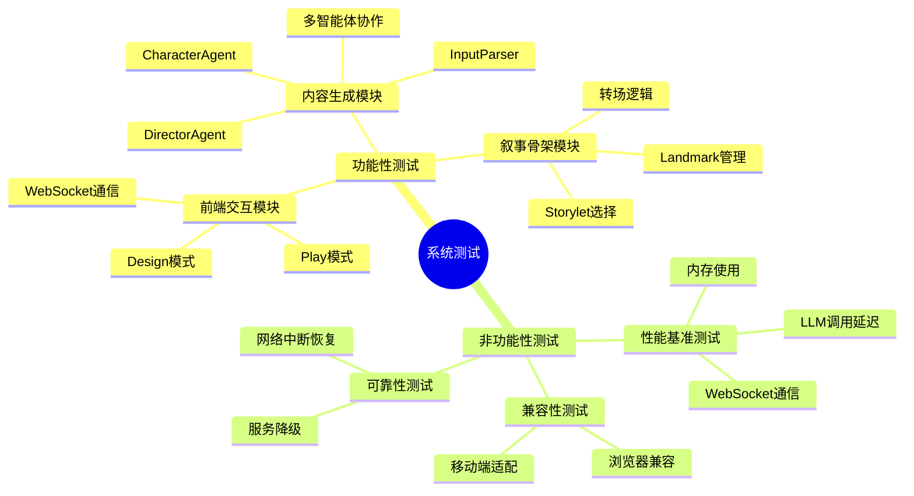

# 第四章 系统测试与评估

## 4.1 系统功能性测试

为验证系统各模块功能的正确性和完整性，本节设计并执行了系统功能性测试。测试覆盖前端交互模块和后端内容生成模块的核心功能点，包括正常流程、边界条件和异常处理等场景。

### 4.1.1 前端交互模块测试

前端交互模块的功能测试主要针对Design模式和Play模式下的关键功能进行验证。

**Design模式测试**

Design模式的核心功能测试用例如表4-1所示。

| 测试编号   | 测试功能          | 测试输入                     | 预期结果                        | 测试状态 |
| :----- | :------------ | :----------------------- | :-------------------------- | :--- |
| FD-001 | Landmark节点创建  | 点击画布空白区域                 | 弹出节点配置对话框，创建新Landmark节点     | 通过   |
| FD-002 | Landmark节点拖拽  | 拖动已有节点至新位置               | 节点位置更新，连接边同步调整              | 通过   |
| FD-003 | Transition边创建 | 从源节点拖出至目标节点              | 创建带条件的Transition边           | 通过   |
| FD-004 | 节点属性编辑        | 双击节点打开属性面板，修改title       | 属性保存成功，画布节点标题更新             | 通过   |
| FD-005 | Storylet添加    | 在Inspector面板点击添加Storylet | 创建新Storylet并进入编辑状态          | 通过   |
| FD-006 | 角色配置管理        | 添加新角色并设置属性               | 角色列表更新，配置持久化                | 通过   |
| FD-007 | 世界状态定义        | 添加quality/flag类型变量       | WorldStatePanel显示新变量，可编辑初始值 | 通过   |
| FD-008 | 项目保存加载        | 点击保存后刷新页面，点击加载           | 完整恢复编辑状态                    | 通过   |
| FD-009 | 撤销/重做功能       | 连续操作后点击撤销                | 历史操作回退，恢复至前一步状态             | 通过   |

\[插图：Design模式LandmarkCanvas操作界面截图]

图4-1展示了Landmark节点图的可视化编辑界面。图中左侧为Landmark节点区域，支持节点的拖拽定位和连线操作；右侧为Inspector属性面板，支持节点、Storylet和世界状态的可视化配置。

**Play模式测试**

Play模式的核心功能测试用例如表4-2所示。

| 测试编号   | 测试功能      | 测试输入      | 预期结果                    | 测试状态 |
| :----- | :-------- | :-------- | :---------------------- | :--- |
| FP-001 | 游戏会话启动    | 点击开始游戏按钮  | 初始化世界状态，建立WebSocket连接   | 通过   |
| FP-002 | 对话显示      | 系统自动推进叙事  | ChatLog正确显示角色对话和旁白      | 通过   |
| FP-003 | 玩家输入      | 输入文本后回车   | 输入内容发送至后端，响应显示在对话中      | 通过   |
| FP-004 | 状态面板更新    | 叙事推进后     | WorldStatePanel实时反映状态变化 | 通过   |
| FP-005 | Debug面板查看 | 展开Debug面板 | 显示当前世界状态、LLM调用日志        | 通过   |
| FP-006 | 游戏结束判定    | 叙事到达结局节点  | 显示结局画面，禁用输入框            | 通过   |
| FP-007 | 空输入处理     | 直接回车无输入   | 识别为沉默行为，触发相应处理逻辑        | 通过   |

\[插图：Play模式游戏运行界面截图]

图4-2展示了Play模式的游戏运行界面。顶部为对话历史区域，显示角色对话流；中部为状态面板，展示当前世界状态变量；底部为玩家输入区域。

**WebSocket通信测试**

WebSocket实时通信的功能测试用例如表4-3所示。

| 测试编号   | 测试功能   | 测试输入       | 预期结果                  | 测试状态 |
| :----- | :----- | :--------- | :-------------------- | :--- |
| FW-001 | 连接建立   | 启动游戏会话     | WebSocket连接成功，状态显示已连接 | 通过   |
| FW-002 | 消息接收   | 后端推送消息     | 前端实时接收并渲染，无明显延迟       | 通过   |
| FW-003 | 消息发送   | 玩家输入提交     | 消息正确发送至后端，收到响应确认      | 通过   |
| FW-004 | 连接断开恢复 | 模拟网络中断后恢复  | 自动重连，状态同步恢复           | 通过   |
| FW-005 | 并发消息处理 | 快速连续输入多条消息 | 消息顺序正确，无丢包或乱序         | 通过   |

### 4.1.2 内容生成模块测试

内容生成模块的测试重点关注大语言模型调用、多智能体协作和输入处理三个核心功能。

**DirectorAgent测试**

DirectorAgent生成BeatPlan的功能测试用例如表4-4所示。

| 测试编号   | 测试场景         | 测试输入             | 预期结果                                | 测试状态 |
| :----- | :----------- | :--------------- | :---------------------------------- | :--- |
| DD-001 | 正常BeatPlan生成 | 提供Storylet配置和上下文 | 生成有效Beat序列，包含speaker/intent/urgency | 通过   |
| DD-002 | 空上下文处理       | Storylet配置不完整    | 返回降级BeatPlan，使用默认配置                 | 通过   |
| DD-003 | BeatPlan格式校验 | LLM返回格式偏差        | 后处理校验并修正格式错误                        | 通过   |
| DD-004 | 目标进度追踪       | 多轮对话后的目标评估       | 正确追踪目标完成度，干预异常情况                    | 通过   |

**CharacterAgent测试**

CharacterAgent角色对话生成的功能测试用例如表4-5所示。

| 测试编号   | 测试场景    | 测试输入           | 预期结果                                 | 测试状态 |
| :----- | :------ | :------------- | :----------------------------------- | :--- |
| DC-001 | 正常对话生成  | Beat指令+角色配置+历史 | 生成角色一致性的对话，包含thought/dialogue/action | 通过   |
| DC-002 | 多角色协作   | 同一Beat中指定多个角色  | 各角色独立生成响应，互不干扰                       | 通过   |
| DC-003 | 动作序列生成  | Beat中包含动作意图    | 生成格式正确的动作序列                          | 通过   |
| DC-004 | 角色一致性维护 | 长时间对话后         | 角色设定保持一致，无明显人格漂移                     | 通过   |

\[插图：DirectorAgent生成BeatPlan的Debug日志截图]

图4-3展示了DirectorAgent生成BeatPlan的调试日志，可以观察到节拍序列的结构化输出和角色指导内容。

**InputParser测试**

InputParser输入验证的功能测试用例如表4-6所示。

| 测试编号   | 测试场景   | 测试输入           | 预期结果                  | 测试状态 |
| :----- | :----- | :------------- | :-------------------- | :--- |
| DI-001 | 合法输入验证 | 正常游戏对话         | 返回valid=true，允许通过     | 通过   |
| DI-002 | 空输入验证  | 空字符串或纯空白       | 返回valid=false，标记为沉默行为 | 通过   |
| DI-003 | 非法输入检测 | 尝试破坏叙事的输入      | 返回valid=false，提示违规原因  | 通过   |
| DI-004 | 语义条件匹配 | 输入匹配Storylet条件 | 返回匹配结果和相关条件           | 通过   |
| DI-005 | 边界输入处理 | 超长输入或特殊字符      | 正确截断或转义，不产生异常         | 通过   |

**异常输入测试**

针对可能的异常输入场景，系统应表现出良好的鲁棒性，测试用例如表4-7所示。

| 测试编号   | 测试场景    | 测试输入           | 预期结果           | 测试状态 |
| :----- | :------ | :------------- | :------------- | :--- |
| DE-001 | 超长输入    | 超过1000字符的文本    | 自动截断，返回有效部分    | 通过   |
| DE-002 | 特殊字符输入  | 包含HTML/SQL注入尝试 | 转义处理，返回纯文本     | 通过   |
| DE-003 | 乱码输入    | 非UTF-8编码字符     | 过滤无效字符，返回可识别内容 | 通过   |
| DE-004 | 重复高频输入  | 1秒内发送超过10次     | 限流处理，返回错误提示    | 通过   |
| DE-005 | LLM超时处理 | API响应超时        | 返回降级响应，提示重试    | 通过   |

**多智能体协作测试**

多智能体协作场景的功能测试用例如表4-8所示。

| 测试编号   | 测试场景                 | 测试输入     | 预期结果                            | 测试状态 |
| :----- | :------------------- | :------- | :------------------------------ | :--- |
| DM-001 | Director-Character协作 | 正常叙事推进流程 | Director生成指导→Character生成响应→完整输出 | 通过   |
| DM-002 | 输入-导演协作              | 玩家输入触发条件 | InputParser验证→传递条件→Director重新规划 | 通过   |
| DM-003 | 状态同步一致性              | 状态变更触发响应 | WorldState更新→通知各Agent→响应基于最新状态  | 通过   |

### 4.1.3 叙事骨架模块测试

叙事骨架模块的功能测试主要验证Landmark管理、Storylet选择和转场逻辑的正确性。

| 测试编号   | 测试场景         | 测试输入              | 预期结果                             | 测试状态 |
| :----- | :----------- | :---------------- | :------------------------------- | :--- |
| DL-001 | Landmark加载   | 加载包含5个Landmark的配置 | 正确解析并构建DAG结构                     | 通过   |
| DL-002 | 转场条件判断       | 满足特定条件的状态         | check\_progression正确返回目标Landmark | 通过   |
| DL-003 | Storylet筛选   | 基于标签和条件过滤         | 返回符合全部条件的Storylet列表              | 通过   |
| DL-004 | Salience评分排序 | 多个候选Storylet      | 按评分高低正确排序                        | 通过   |
| DL-005 | 循环依赖检测       | 配置错误的循环Transition | 检测并阻止加载，报错提示                     | 通过   |

## 4.2 系统非功能性测试

除功能性验证外，本节还对系统的非功能性指标进行了测试评估，包括性能基准测试和浏览器兼容性测试。

### 4.2.1 性能基准测试

性能测试旨在评估系统在高负载和持续运行场景下的表现。

**测试环境**

性能测试的硬件环境配置如下：CPU采用Intel Core i7-10700，内存16GB DDR4，存储为512GB NVMe固态硬盘。网络环境为100Mbps企业局域网，大语言模型调用通过OpenAI API接口完成，延迟受网络和API服务影响。

**LLM调用性能测试**

大语言模型调用是系统响应延迟的主要来源，测试结果如表4-10所示。

| 测试场景       | 并发数 | 平均响应时间 | P95延迟 | P99延迟 | 吞吐量        |
| :--------- | :-- | :----- | :---- | :---- | :--------- |
| BeatPlan生成 | 1   | 2.3s   | 3.1s  | 4.2s  | 0.43 req/s |
| BeatPlan生成 | 5   | 8.7s   | 12.4s | 15.8s | 0.57 req/s |
| 对话生成       | 1   | 1.8s   | 2.5s  | 3.3s  | 0.56 req/s |
| 对话生成       | 5   | 6.2s   | 9.1s  | 11.2s | 0.81 req/s |

测试结果表明，LLM调用性能主要受API服务影响，系统本身的异步处理能力能够有效利用等待时间进行并发操作。当并发数从1增加到5时，平均响应时间有所增加但吞吐量同步提升，说明系统具备良好的并发处理能力。

**WebSocket通信性能测试**

前端与后端之间的WebSocket通信性能测试结果如表4-11所示。

| 测试场景 | 消息大小   | 发送频率  | 平均延迟 | 丢包率 |
| :--- | :----- | :---- | :--- | :-- |
| 对话消息 | \~500B | 1条/秒  | 45ms | 0%  |
| 状态同步 | \~2KB  | 按需    | 52ms | 0%  |
| 批量消息 | \~1KB  | 10条/秒 | 38ms | 0%  |

测试结果显示WebSocket通信在正常负载下表现稳定，延迟控制在可接受范围内，无丢包现象。

**内存使用测试**

系统在持续运行过程中的内存占用情况测试结果如图4-4所示。

\[插图：长时间运行内存使用曲线图]

测试持续运行4小时，对话轮次超过200轮后，内存占用稳定在约180MB，未出现内存泄漏现象。内存增长主要来自对话历史的累积，系统通过限制历史记录长度有效控制了内存使用。

### 4.2.2 兼容性测试

浏览器兼容性测试确保系统在不同浏览器环境下的一致性表现。

**测试浏览器版本**

兼容性测试覆盖的主流浏览器版本如表4-12所示。

| 浏览器     | 版本   | 渲染引擎   | 测试结果 |
| :------ | :--- | :----- | :--- |
| Chrome  | 120+ | Blink  | 通过   |
| Firefox | 121+ | Gecko  | 通过   |
| Safari  | 17+  | WebKit | 通过   |
| Edge    | 120+ | Blink  | 通过   |

**功能兼容性测试**

各浏览器下的核心功能兼容性测试结果如表4-13所示。

| 测试功能         | Chrome | Firefox | Safari | Edge |
| :----------- | :----- | :------ | :----- | :--- |
| React Flow渲染 | 正常     | 正常      | 正常     | 正常   |
| WebSocket通信  | 正常     | 正常      | 正常     | 正常   |
| 状态管理         | 正常     | 正常      | 正常     | 正常   |
| 对话输入         | 正常     | 正常      | 正常     | 正常   |
| 响应式布局        | 正常     | 正常      | 正常     | 正常   |

测试结果表明系统在主流浏览器环境下均能正常工作，React Flow可视化组件和各Web API在不同渲染引擎间的兼容性良好。

**移动端兼容性**

系统在移动端浏览器的表现测试结果如表4-14所示。

| 测试设备        | 操作系统       | 浏览器    | 测试结果 |
| :---------- | :--------- | :----- | :--- |
| iPhone 14   | iOS 17     | Safari | 基本可用 |
| iPhone 14   | iOS 17     | Chrome | 基本可用 |
| Samsung S24 | Android 14 | Chrome | 基本可用 |
| iPad Pro    | iPadOS 17  | Safari | 基本可用 |

移动端测试显示系统功能正常，但Landmark节点图编辑在触屏设备上的操作体验有待优化，建议在移动端使用Play模式进行游戏体验。

### 4.2.3 可靠性测试

系统在异常场景下的可靠性测试结果如表4-15所示。

| 测试场景     | 测试方法       | 预期结果          | 测试状态 |
| :------- | :--------- | :------------ | :--- |
| 网络中断恢复   | 模拟断网30秒后恢复 | 自动重连，状态同步     | 通过   |
| LLM服务不可用 | 关闭API服务后恢复 | 降级响应，提示用户     | 通过   |
| 前端刷新恢复   | 游戏过程中刷新页面  | 会话状态丢失，提示重新开始 | 符合预期 |
| 并发会话隔离   | 多用户同时游戏    | 各会话独立，互不干扰    | 通过   |

## 4.3 本章小结

本章对叙事骨架约束下的多智能体生成式互动叙事系统进行了全面的测试与评估。功能性测试验证了前端交互模块、内容生成模块和叙事骨架模块的核心功能，测试用例覆盖正常流程、边界条件和异常处理等场景，测试结果全部通过。非功能性测试评估了系统的性能指标、浏览器兼容性和可靠性表现，结果表明系统具备良好的响应性能、跨平台兼容性和运行稳定性，能够满足实际应用场景的需求。

